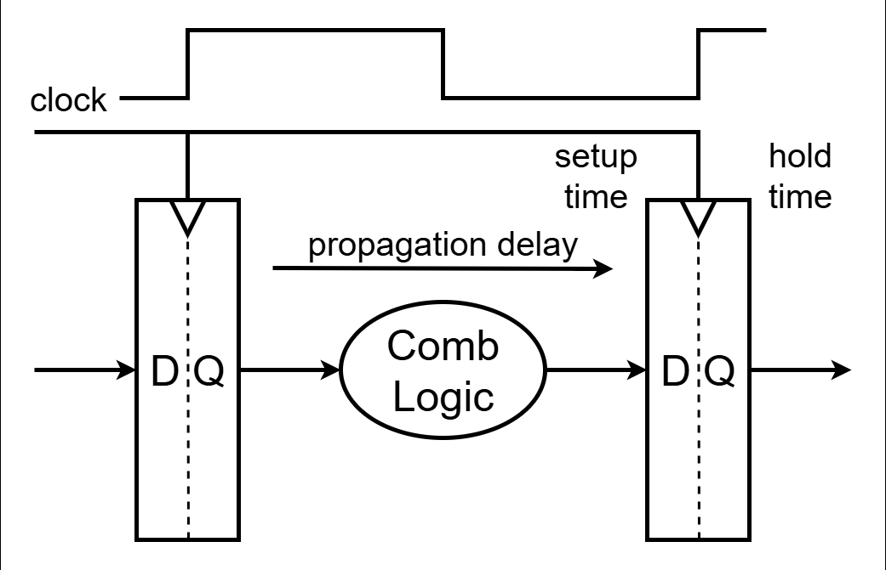
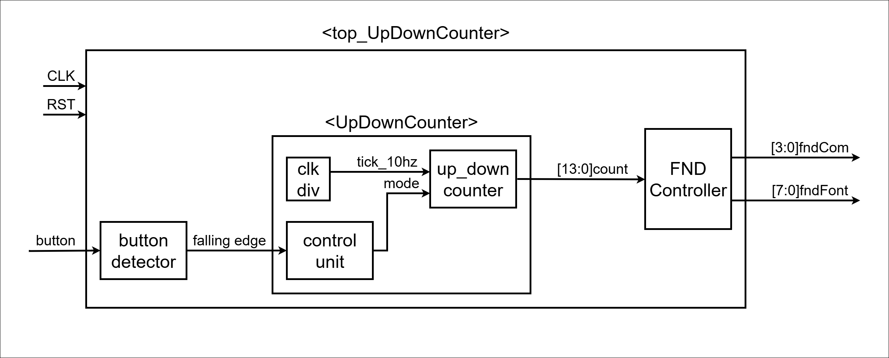
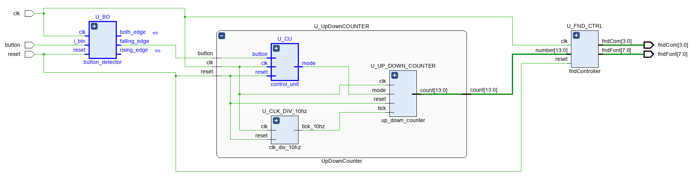
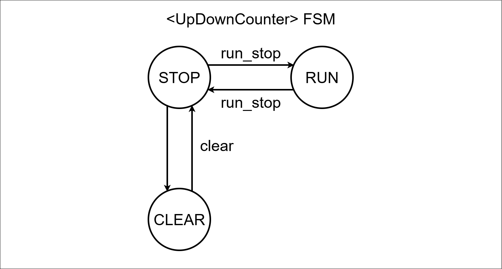
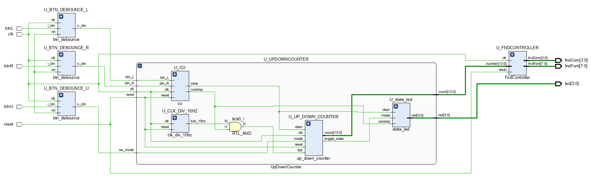

# 디지털 회로 기본 및 타이밍 특성
---
> **D-flip flop , Latch 차이**
> - 메모리 기능의 유무 → 둘 다 메모리 기능이 있지만, 동작 방식에 차이가 있음
> - Latch: 입력 신호가 활성화된 동안 값을 계속 반영함 (레벨 민감)
> - D Flip-Flop: 클록 상승/하강 에지에서만 값을 반영 (엣지 트리거)

> **조합회로 (Combinational Circuit)**
> - 현재 입력에 의해서만 출력이 결정됨
> - 과거 입력이나 상태와는 무관
> - 예시: AND, OR, MUX, Decoder 등

> **순차회로 (Sequential Circuit)**
> - 클록 신호에 따라 동작 (동기식 설계)
> - 출력은 현재 입력 + 이전 상태에 의존
> - 예시: D Flip-Flop, 레지스터, FSM 등

> **SR Latch**
> - S=0, R=0 → Q=유지, Q′=유지 → 정상 상태 (Hold)
> - S=0, R=1 → Q=0, Q′=1 → Reset 동작
> - S=1, R=0 → Q=1, Q′=0 → Set 동작
> - S=1, R=1 → Q=0, Q′=0 → 금지 상태 (Invalid)

> **D Latch**
> - D=0, S=0, R=1 → Reset
> - D=1, S=1, R=0 → Set

> **Gated D Latch**
> - Gate=0, D=x, Q=유지, Q'=유지 → Hold 상태
> - Gate=1, D=0, Q=0, Q'=1 → Reset 동작
> - Gate=1, D=1, Q=1, Q'=0 → Set 동작

> **D-Filp Flop**
> - D Flip-Flop은 Master-Slave 구조의 두 개의 D-Latch로 구성
>  - Master: 클록이 0일 때 입력 값을 저장
>  - Slave: 클록이 1일 때 Master의 값을 출력에 전달
>  - 따라서 클록의 상승/하강 엣지에만 출력이 바뀜 (엣지 트리거)

> **Metastability**
> - 클록 엣지 시점에 입력(D)이 변할 경우, 출력(Q)이 일정 시간 동안 정의되지 않은 상태에 머무를 수 있음
>  - Setup Time: 클록 엣지 이전 일정 시간 동안 D 입력이 안정적으로 유지되어야 함
>  - Hold Time: 클록 엣지 이후 일정 시간 동안도 D 입력이 유지되어야 함

> **Metastability 방지 방법 – 동기화 회로 (Synchronizer)**
> - 외부 신호(비동기 입력 등)는 클록 도메인에 따라 metastable 위험이 있음
> - D Flip-Flop을 2개 이상 직렬로 연결
>  - 첫 번째 F/F는 신호를 잠시 받아들이고
>  - 두 번째 F/F는 클록에 동기화된 안정된 출력을 생성

> **Glitch (순간 출력 오류)**
> - 조합 회로에서 입력이 동시에 변할 때, 내부 게이트의 전파 지연 차이로 인해 일시적인 잘못된 출력이 발생할 수 있음
> - 클록 엣지 직전까지 출력이 안정되지 않으면 시스템 오동작 가능성 존재



> **Propagation Delay (전파 지연)**
> - 입력 변화 이후 출력이 안정될 때까지의 시간 지연
> - 조합 회로가 복잡하거나 깊이가 깊을수록 지연 시간이 길어짐
> - 예: FFT filter 설계 시 곱셈 연산은 시간이 오래 걸리므로, 중간에 레지스터를 삽입하여 처리

> **Pipeline 처리**
> - 연산 중간에 레지스터를 추가하여 연산 단계를 여러 클록 사이클로 분할
> - 조합 논리의 길이를 줄여 glitch를 방지할 수 있음
> - 복잡한 연산을 분할 처리해 클록 타이밍 여유 확보 가능
> - 한 클럭 내에 연산이 끝나도록 회로를 구성하면 안정적인 시스템 설계 가능

# button_detector Design
---

### < Block Diagram >


### < Code : button_detector >
```verilog
`timescale 1ns / 1ps

module button_detector (
    input  logic clk,
    input  logic reset,
    input  logic i_btn,
    output logic rising_edge,
    output logic falling_edge,
    output logic both_edge
);

    logic                       clk_1khz;
    logic                       debounce;
    logic [                7:0] shift_reg;
    logic [$clog2(100_000)-1:0] div_counter;

    // create 1kHz pulse (for button sampling)
    always_ff @(posedge clk, posedge reset) begin
        if (reset) begin
            div_counter <= 0;
            clk_1khz    <= 1'b0;
        end else begin
            if (div_counter == 100_000 - 1) begin
                div_counter <= 0;
                clk_1khz    <= 1'b1;
            end else begin
                div_counter <= div_counter + 1;
                clk_1khz    <= 1'b0;
            end
        end
    end

    shift_register U_SHIFT_REG (
        .clk   (clk_1khz),
        .reset (reset),
        .i_data(i_btn),
        .o_data(shift_reg)
    );

    assign debounce = &shift_reg;
    // assign o_btn = debounce;

    logic [1:0] edge_reg;

    // edge detector (rising/falling/both)
    always_ff @(posedge clk, posedge reset) begin
        if (reset) begin
            edge_reg <= 0;
        end else begin
            edge_reg[0] <= debounce;
            edge_reg[1] <= edge_reg[0];
        end
    end

    assign rising_edge  = edge_reg[0] & ~edge_reg[1];
    assign falling_edge = ~edge_reg[0] & edge_reg[1];
    assign both_edge    = rising_edge | falling_edge;

endmodule


module shift_register (
    input  logic       clk,
    input  logic       reset,
    input  logic       i_data,
    output logic [7:0] o_data
);

    always_ff @(posedge clk, posedge reset) begin
        if (reset) begin
            o_data <= 0;
        end else begin
            o_data <= {i_data, o_data[7:1]};  // right shift
            //o_data <= {o_data[6:0], i_data};// left shift
        end
    end

endmodule
```

### < Comment >
> **shift_register**
> 시프트 레지스터의 기본 형태를 구현한 예시로, 구조와 동작 원리를 익혀두면 좋다.
> Right shift : 새로운 입력(i_data)이 MSB 위치로 들어가고, 기존 데이터는 오른쪽(LSB 방향)으로 한 비트씩 이동한다.
> Left shift : 새로운 입력(i_data)이 LSB 위치로 들어가고, 기존 데이터는 왼쪽(MSB 방향)으로 한 비트씩 이동한다.

> **edge detector**
> edge_reg를 통해 현재 debounce와 직전 상태를 저장.
> rising_edge : 0→1 변화를 검출.
> falling_edge : 1→0 변화를 검출.
> both_edge : 상승 또는 하강 변화를 모두 검출.

### < Code : UpDownCounter >
```verilog
`timescale 1ns / 1ps

module UpDownCounter (
    input  logic        clk,
    input  logic        reset,
    input  logic        button,
    output logic [13:0] count
);

    logic tick_10hz;
    logic mode;

    clk_div_10hz U_CLK_DIV_10hz (
        .clk      (clk),
        .reset    (reset),
        .tick_10hz(tick_10hz)
    );

    up_down_counter U_UP_DOWN_COUNTER (
        .clk  (clk),
        .reset(reset),
        .tick (tick_10hz),
        .mode (mode),
        .count(count)
    );

    control_unit U_CU (
        .clk(clk),
        .reset(reset),
        .button(button),
        .mode(mode)
    );

endmodule


module up_down_counter (
    input  logic        clk,
    input  logic        reset,
    input  logic        tick,
    input  logic        mode,
    output logic [13:0] count
);

    always_ff @(posedge clk, posedge reset) begin
        if (reset) begin
            count <= 0;
        end else begin
            if (mode == 1'b0) begin  // up counter
                if (tick) begin
                    if (count == 9999) begin
                        count <= 0;
                    end else begin
                        count <= count + 1;
                    end
                end
            end else begin  // down counter
                if (tick) begin
                    if (count == 0) begin
                        count <= 9999;
                    end else begin
                        count <= count - 1;
                    end
                end
            end
        end
    end

endmodule


module clk_div_10hz (
    input  logic clk,
    input  logic reset,
    output logic tick_10hz
);

    //logic [23:0] div_counter;
    logic [$clog2(10_000_000)-1:0] div_counter;

    always_ff @(posedge clk, posedge reset) begin
        if (reset) begin
            div_counter <= 0;
            tick_10hz   <= 1'b0;
        end else begin
            if (div_counter == 10_000_000 - 1) begin
                div_counter <= 0;
                tick_10hz   <= 1'b1;
            end else begin
                div_counter <= div_counter + 1;
                tick_10hz   <= 1'b0;
            end
        end
    end

endmodule


module control_unit (
    input  logic clk,
    input  logic reset,
    input  logic button,
    output logic mode
);

    typedef enum {
        UP,
        DOWN
    } state_e;

    state_e state, next_state;

    // transition logic
    always_ff @(posedge clk, posedge reset) begin
        if (reset) begin
            state <= UP;
        end else begin
            state <= next_state;
        end
    end

    // output logic
    always_comb begin
        next_state = state;
        case (state)
            UP: begin
                mode = 0;
                if (button) begin
                    next_state = DOWN;
                end
            end
            DOWN: begin
                mode = 1;
                if (button) begin
                    next_state = UP;
                end
            end
        endcase
    end

endmodule
```

### < Comment >
> **control_unit**
> 버튼 입력에 따라 UP, DOWN 상태를 전환하는 FSM을 구현
> typedef enum을 사용하여 상태 이름(UP, DOWN)을 열거형으로 선언

### < Schematic >


# Homework
---
### < Design Specification >
> button 3개 사용 : run_stop 버튼, clear 버튼, mode 버튼
> mode = 0 : up counting / mode = 1 : down counting
> up counter : led[0] on
> down counter : led[1] on
> stop : led[2] on
> run : led[3] on

### < FSM >


### < Code : UpDownCounter >
```verilog
//...
module up_down_counter (
    input  logic        clk,
    input  logic        reset,
    input  logic        tick,
    input  logic        mode,
    input  logic        clear,
    output logic        toggle_state,
    output logic [13:0] count
);

    always_ff @(posedge clk or posedge reset) begin
        if (reset) begin
            toggle_state <= 0;
        end else begin
            if (mode) begin
                toggle_state <= ~toggle_state;
            end
        end
    end

    always_ff @(posedge clk, posedge reset) begin
        if (reset | clear) begin
            count <= 0;
        end else begin
            if (toggle_state == 1'b0) begin  // up counter
                if (tick) begin
                    if (count == 9999) begin
                        count <= 0;
                    end else begin
                        count <= count + 1;
                    end
                end
            end else begin  // down counter
                if (tick) begin
                    if (count == 0) begin
                        count <= 9999;
                    end else begin
                        count <= count - 1;
                    end
                end
            end
        end
    end

endmodule


module cu (
    input  logic clk,
    input  logic reset,
    input  logic btn_L,
    input  logic btn_R,
    output logic runstop,
    output logic clear
);

    typedef enum {
        STOP,
        RUN,
        CLEAR
    } state_e;

    state_e state, next_state;

    always_ff @(posedge clk, posedge reset) begin
        if (reset) begin
            state <= STOP;
        end else begin
            state <= next_state;
        end
    end

    always_comb begin
        next_state = state;
        runstop = 0;
        clear = 0;

        case (state)
            STOP: begin
                runstop = 0;
                clear   = 0;
                if (btn_L) begin
                    next_state = CLEAR;
                end else if (btn_R) begin
                    next_state = RUN;
                end
            end
            CLEAR: begin
                clear = 1;
                if (btn_L) begin
                    next_state = STOP;
                end
            end
            RUN: begin
                runstop = 1;
                if (btn_R) begin
                    next_state = STOP;
                end
            end
        endcase
    end

endmodule


module state_led (
    input  logic       runstop,
    input  logic       clear,
    input  logic       mode,
    output logic [3:0] led
);  // (condition) ? true : false
    assign led[1:0] = mode ? 2'b10 : 2'b01;
    assign led[3:2] = runstop ? 2'b10 : 2'b01;

endmodule
```

### < Schematic >


### < Video >
<video controls src="../../assets/img/final/250807/6.mp4" style="max-width: 100%; height: auto;" title="Title"></video>

### < 고찰 >
> led 변수명을 led_mode, led_runstop처럼 의미를 명확히 알 수 있도록 개선해야 함
> 기능별로 분리하여 코드의 확장성을 확보할 필요가 있음
> 하나의 control_unit에서 상태를 구분하는 제어 신호들을 받아, 여러 개의 FSM을 동시에 처리하는 구조를 고려함. (mode FSM은 기존대로 유지)

### < 파일 >
> **sources** (Class)
> - [top_UpDownCounter.sv](<../../assets/source file/250807/250807_Class/top_UpDownCounter.sv>)
> - [button_detector.sv](<../../assets/source file/250807/250807_Class/button_detector.sv>)
> - [UpDownCounter.sv](<../../assets/source file/250807/250807_Class/UpDownCounter.sv>)
> - [fndController.sv](<../../assets/source file/250807/250807_Class/fndController.sv>)

> **constrs** (Class)
> - [Basys-3-Master.xdc](<../../assets/source file/250807/250807_Class/Basys-3-Master.xdc>)

> **sources** (Homework)
> - [top_UpDownCounter.sv](<../../assets/source file/250807/250807_HW/top_UpDownCounter.sv>)
> - [button_debounce.sv](<../../assets/source file/250807/250807_HW/button_debounce.sv>)
> - [UpDownCounter.sv](<../../assets/source file/250807/250807_HW/UpDownCounter.sv>)
> - [fndController.sv](<../../assets/source file/250807/250807_HW/fndController.sv>)

> **constrs** (Homework)
> - [Basys-3-Master.xdc](<../../assets/source file/250807/250807_HW/Basys-3-Master.xdc>)