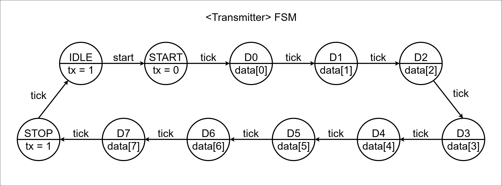

# Run_Stop_Clear_Counter Design
---
### < Code : UpDownCounter >
```verilog
`timescale 1ns / 1ps

module UpDownCounter (
    input  logic        clk,
    input  logic        reset,
    input  logic        btn_mode,
    input  logic        btn_run_stop,
    input  logic        btn_clear,
    output logic [ 1:0] led_mode,
    output logic [ 1:0] led_run_stop,
    output logic [13:0] count
);

    logic tick_10hz;
    logic mode, run_stop, clear;

    clk_div_10hz U_Clk_Div_10hz (
        .clk      (clk),
        .reset    (reset),
        .run_stop (run_stop),
        .clear    (clear),
        .tick_10hz(tick_10hz)
    );

    up_down_counter U_Up_Down_Counter (
        .clk  (clk),
        .reset(reset),
        .tick (tick_10hz),
        .mode (mode),
        .clear(clear),
        .count(count)
    );

    control_unit U_Control_Unit (
        .clk         (clk),
        .reset       (reset),
        .btn_mode    (btn_mode),
        .btn_run_stop(btn_run_stop),
        .btn_clear   (btn_clear),
        .mode        (mode),
        .run_stop    (run_stop),
        .clear       (clear),
        .led_mode    (led_mode),
        .led_run_stop(led_run_stop)
    );

endmodule


module clk_div_10hz (
    input  logic clk,
    input  logic reset,
    input  logic run_stop,
    input  logic clear,
    output logic tick_10hz
);

    //logic [23:0] div_counter;
    logic [$clog2(10_000_000)-1:0] div_counter;

    always_ff @(posedge clk, posedge reset) begin
        if (reset) begin
            div_counter <= 0;
            tick_10hz   <= 1'b0;
        end else begin
            if (run_stop) begin
                if (div_counter == 10_000_000 - 1) begin
                    div_counter <= 0;
                    tick_10hz   <= 1'b1;
                end else begin
                    div_counter <= div_counter + 1;
                    tick_10hz   <= 1'b0;
                end
            end
            if (clear) begin
                div_counter <= 0;
                tick_10hz   <= 1'b0;
            end
        end
    end

endmodule


module up_down_counter (
    input  logic        clk,
    input  logic        reset,
    input  logic        tick,
    input  logic        mode,
    input  logic        clear,
    output logic [13:0] count
);

    always_ff @(posedge clk, posedge reset) begin
        if (reset) begin
            count <= 0;
        end else begin
            if (clear) begin
                count <= 0;
            end
            if (mode == 1'b0) begin  // up counter
                if (tick) begin
                    if (count == 9999) begin
                        count <= 0;
                    end else begin
                        count <= count + 1;
                    end
                end
            end else begin  // down counter
                if (tick) begin
                    if (count == 0) begin
                        count <= 9999;
                    end else begin
                        count <= count - 1;
                    end
                end
            end
        end
    end

endmodule


module control_unit (
    input logic clk,
    input logic reset,
    input logic btn_mode,
    input logic btn_run_stop,
    input logic btn_clear,
    output logic mode,
    output logic run_stop,
    output logic clear,
    output logic [1:0] led_mode,
    output logic [1:0] led_run_stop
);
    /******************** MODE FSM ********************/

    typedef enum {
        UP,
        DOWN
    } state_mode_e;

    state_mode_e state_mode, next_state_mode;

    // state memory
    always_ff @(posedge clk, posedge reset) begin
        if (reset) begin
            state_mode <= UP;
        end else begin
            state_mode <= next_state_mode;
        end
    end

    // transition logic
    always_comb begin
        next_state_mode = state_mode;
        mode = 0;
        led_mode = 2'b00;
        case (state_mode)
            UP: begin
                led_mode = 2'b01;
                if (btn_mode) begin
                    next_state_mode = DOWN;
                end
            end
            DOWN: begin
                mode = 1;
                led_mode = 2'b10;
                if (btn_mode) begin
                    next_state_mode = UP;
                end
            end
        endcase
    end

    /******************** RUN STOP CLEAR FSM ********************/

    typedef enum {
        STOP,
        RUN,
        CLEAR
    } state_counter_e;

    state_counter_e state_counter, next_state_counter;

    always_ff @(posedge clk, posedge reset) begin
        if (reset) begin
            state_counter <= STOP;
        end else begin
            state_counter <= next_state_counter;
        end
    end

    always_comb begin
        next_state_counter = state_counter;
        run_stop = 0;
        clear = 0;
        led_run_stop = 2'b00;
        case (state_counter)
            STOP: begin
                led_run_stop = 2'b01;
                if (btn_run_stop) next_state_counter = RUN;
                else if (btn_clear) next_state_counter = CLEAR;
            end
            RUN: begin
                run_stop = 1;
                led_run_stop = 2'b10;
                if (btn_run_stop) next_state_counter = STOP;
            end
            CLEAR: begin
                clear = 1;
                next_state_counter = STOP;
            end
        endcase
    end

endmodule
```

### < Comment >
> **clk_div_10hz**
> run_stop과 clear 신호를 받아 상태에 따라 카운터 동작을 제어한다.

> **up_down_counter**
> clear 신호를 받아 카운터 값을 즉시 초기화한다.
> → 예기치 않은 상태에서도 원하는 시점에 카운터를 안정적으로 리셋할 수 있다.

> **control_unit**
> 하나의 control_unit에서 상태 구분용 제어 신호를 받아 여러 개의 FSM(mode, run/stop/clear)을 동시에 처리한다.
> 각 FSM에서 led_mode와 led_run_stop 출력을 직접 생성하도록 설계하여 가독성과 직관성이 향상된다.

### < 파일 >
> **sources** (Class)
> - [top_UpDownCounter.sv](<../../assets/source file/250808/250808_Class/top_UpDownCounter.sv>)
> - [button_detector.sv](<../../assets/source file/250808/250808_Class/button_detector.sv>)
> - [UpDownCounter.sv](<../../assets/source file/250808/250808_Class/UpDownCounter.sv>)
> - [fndController.sv](<../../assets/source file/250808/250808_Class/fndController.sv>)

> **constrs** (Class)
> - [Basys-3-Master.xdc](<../../assets/source file/250808/250808_Class/Basys-3-Master.xdc>)

# Serial 통신 프로토콜
---
### 1. UART
- **비동기(Asynchronous)** 통신 방식  
- **Baud rate**(bps, bit per second) 설정 값에 따라 송수신 속도 결정  
- 송·수신 양측의 속도 설정이 다르면 통신 불가  
- 동기 신호가 없어 에러율이 상대적으로 높음  
- 송수신 속도에 제한이 있음  
- 1:1 통신만 가능 (멀티포인트 불가)  
- 송·수신 측에서 **내부 클럭**을 생성하여 타이밍 유지

### 2. I²C
- **동기(Synchronous)** 통신 방식  
- SCL(클럭)과 SDA(데이터) 2선으로 동작  
- 슬레이브 주소(Address)를 지정해 통신 → SPI보다 속도가 느림  
- **N:N 통신** 가능 (하나의 버스에 여러 마스터·슬레이브 연결 가능)  
- **Chip Select** 신호선 불필요 (주소로 구분)  
- 송신 또는 수신 중 한 방향만 가능 (Half-duplex)

### 3. SPI
- **동기(Synchronous)** 통신 방식  
- SCLK(클럭), MOSI, MISO, CS(Chip Select) 신호 사용  
- 클럭에 맞춰 매우 빠른 데이터 전송 가능 → 세 방식 중 가장 빠름  
- **1:N 통신** (마스터 1개, 다수 슬레이브 가능)  
- 슬레이브 선택을 위해 **Chip Select** 신호선 사용  
- 송수신 동시 가능 (Full-duplex)

### UART / I²C / SPI 비교

| 구분 | UART | I²C | SPI |
| :--: | :--: | :--: | :--: |
| 통신 방식 | 비동기 | 동기 | 동기 |
| 데이터선 | Tx, Rx | SDA, SCL | MOSI, MISO, SCLK, CS |
| 속도 | 낮음 | 중간 | 빠름 |
| 통신 구조 | 1:1 | N:N | 1:N |
| Chip Select | X | X | O |
| Duplex | Full | Half | Full |
| 장점 | 간단, 배선 적음 | 배선 적음, 다중 지원 | 빠름, 동시 송수신 |
| 단점 | 느림, 멀티 불가 | SPI보다 느림 | 배선 많음, CS 관리 필요 |

# Uart (Transmitter) Design
---
### < Block Design >


### < FSM (Transmitter) >


### < ASM (Transmitter) >


### < Code : Uart (Transmitter) >
```verilog
`timescale 1ns / 1ps

module uart (
    input  logic       clk,
    input  logic       reset,
    input  logic       start,
    input  logic [7:0] tx_data,
    output logic       tx,
    output logic       tx_busy,
    output logic       tx_done
);

    logic br_tick;

    baudrate_gen U_Baudrate_Gen (
        .clk    (clk),
        .reset  (reset),
        .br_tick(br_tick)
    );

    transmitter U_Transmitter (
        .clk    (clk),
        .reset  (reset),
        .br_tick(br_tick),
        .start  (start),
        .tx_data(tx_data),
        .tx_busy(tx_busy),
        .tx_done(tx_done),
        .tx     (tx)
    );

endmodule


module baudrate_gen (
    input  logic clk,
    input  logic reset,
    output logic br_tick
);

    //logic [$clog2(100_000_000/9600/16)-1:0] br_counter;
    logic [3:0] br_counter;

    always_ff @(posedge clk, posedge reset) begin
        if (reset) begin
            br_counter <= 0;
            br_tick <= 1'b0;
        end else begin
            //if (br_counter == 100_000_000 / 9600 / 16 - 1) begin  // 9600hz 9600bps
            if (br_counter == 10 - 1) begin
                br_counter <= 0;
                br_tick <= 1'b1;
            end else begin
                br_counter <= br_counter + 1;
                br_tick <= 1'b0;
            end
        end
    end

endmodule


module transmitter (
    input  logic       clk,
    input  logic       reset,
    input  logic       br_tick,
    input  logic       start,
    input  logic [7:0] tx_data,
    output logic       tx_busy,
    output logic       tx_done,
    output logic       tx
);

    typedef enum {
        IDLE,
        START,
        DATA,
        STOP
    } tx_state_e;

    tx_state_e tx_state, tx_next_state;
    
    logic [7:0] temp_data_next, temp_data_reg;
    logic tx_reg, tx_next;
    logic [3:0] tick_cnt_reg, tick_cnt_next;
    logic [2:0] bit_cnt_reg, bit_cnt_next;
    logic tx_done_reg, tx_done_next;
    logic tx_busy_reg, tx_busy_next;

    assign tx = tx_reg;
    assign tx_busy = tx_busy_reg;
    assign tx_done = tx_done_reg;

    always_ff @(posedge clk, posedge reset) begin
        if (reset) begin
            tx_state      <= IDLE;
            temp_data_reg <= 0;
            tx_reg        <= 1'b1;
            tick_cnt_reg  <= 0;
            bit_cnt_reg   <= 0;
            tx_done_reg   <= 0;
            tx_busy_reg   <= 0;
        end else begin
            tx_state      <= tx_next_state;
            temp_data_reg <= temp_data_next;
            tx_reg        <= tx_next;
            tick_cnt_reg  <= tick_cnt_next;
            bit_cnt_reg   <= bit_cnt_next;
            tx_done_reg   <= tx_done_next;
            tx_busy_reg   <= tx_busy_next;
        end
    end

    always_comb begin
        tx_next_state  = tx_state;
        temp_data_next = temp_data_reg;
        tx_next        = tx_reg;
        tick_cnt_next  = tick_cnt_reg;
        bit_cnt_next   = bit_cnt_reg;
        tx_done_next   = tx_done_reg;
        tx_busy_next   = tx_busy_reg;
        case (tx_state)
            IDLE: begin
                tx_next = 1'b1;
                tx_done_next = 0;
                tx_busy_next = 0;
                if (start) begin
                    tx_next_state  = START;
                    temp_data_next = tx_data;
                    tick_cnt_next  = 0;
                    bit_cnt_next   = 0;
                    tx_busy_next   = 1;
                end
            end
            START: begin
                tx_next = 1'b0;
                if (br_tick) begin
                    if (tick_cnt_reg == 15) begin
                        tx_next_state = DATA;
                        tick_cnt_next = 0;
                    end else begin
                        tick_cnt_next = tick_cnt_reg + 1;
                    end
                end
            end
            DATA: begin
                tx_next = temp_data_reg[0];
                if (br_tick) begin
                    if (tick_cnt_reg == 15) begin
                        tick_cnt_next = 0;
                        if (bit_cnt_reg == 7) begin
                            tx_next_state = STOP;
                            bit_cnt_next  = 0;
                        end else begin
                            temp_data_next = {1'b0, temp_data_reg[7:1]};
                            bit_cnt_next   = bit_cnt_reg + 1;
                        end
                    end else begin
                        tick_cnt_next = tick_cnt_reg + 1;
                    end
                end
            end
            STOP: begin
                tx_next = 1'b1;
                if (br_tick) begin
                    if (tick_cnt_reg == 15) begin
                        tx_next_state = IDLE;
                        tx_done_next  = 1;
                        tx_busy_next  = 0;
                        tick_cnt_next = 0;
                    end else begin
                        tick_cnt_next = tick_cnt_reg + 1;
                    end
                end
            end
        endcase
    end

endmodule
```

### < Comment >
> **baudrate_gen**
> 시스템 클럭(100 MHz)에서 UART 통신 속도 9600bps, 16배 오버샘플링(표준 UART 수신 방식) 조건에 맞춰 br_tick을 생성하는 모듈이다.
> 카운터 최대값을 100_000_000 / 9600 / 16 - 1로 설정하여, 해당 주기마다 br_tick을 1클럭 동안 High로 만들어 transmitter와 receiver가 동일한 baudrate 클럭에 동기화되도록 한다.

> **transmitter**
> UART 송신기를 구현한 모듈로, start 신호 입력 시 데이터(tx_data)를 UART 프레임 구조(1 start bit + 8 data bits + 1 stop bit)로 직렬 전송한다.
> FSM(IDLE → START → DATA → STOP)으로 동작하며, 각 비트 전송은 baudrate 오버샘플링(16배) 기준 br_tick 신호에 맞춰 진행된다.
> 데이터 구동 시 LSB부터 순차적으로 전송하며, 모든 비트 전송이 완료되면 tx_done을 1로 설정하고 tx_busy를 0으로 복귀시켜 다음 전송을 준비한다.

### < 파일 >
> **sources** (Class)
> - [uart.sv](<../../assets/source file/250808/250808_Class/uart.sv>)

> **sim** (Class)
> - [uart_tb.sv](<../../assets/source file/250808/250808_Class/uart_tb.sv>)

# Homework
---
### < Design Specification >
> - receiver 설계 → uart 구현
> - uart + up down counter → PC 제어 (ComPortMaster)
> - "r" : run 상태
> - "s" : stop 상태
> - "c" : clear 상태
> - "m" : mode변경

### < Block Diagram >


### < FSM (receiver) >


### < ASM (receiver) >


### < Code : uart >
```verilog
`timescale 1ns / 1ps

module uart (
    input  logic       clk,
    input  logic       reset,
    input  logic       rx,
    output logic       tx,
    output logic [7:0] uart_data
);

    logic br_tick;
    logic rx_done;
    logic [7:0] rx_data;

    assign uart_data = rx_done ? rx_data : 8'b0;

    baudrate_gen U_Baudrate_Gen (
        .clk    (clk),
        .reset  (reset),
        .br_tick(br_tick)
    );

    receiver U_Receiver (
        .clk    (clk),
        .reset  (reset),
        .br_tick(br_tick),
        .rx     (rx),
        .rx_data(rx_data),
        .rx_done(rx_done)
    );

    transmitter U_Transmitter (
        .clk    (clk),
        .reset  (reset),
        .br_tick(br_tick),
        .start  (rx_done),
        .tx_data(rx_data),
        .tx_busy(),
        .tx_done(),
        .tx     (tx)
    );

endmodule


module baudrate_gen (
    input  logic clk,
    input  logic reset,
    output logic br_tick
);

    logic [$clog2(100_000_000/9600/16)-1:0] br_counter;
    // logic [3:0] br_counter;

    always_ff @(posedge clk, posedge reset) begin
        if (reset) begin
            br_counter <= 0;
            br_tick <= 1'b0;
        end else begin
            if (br_counter == 100_000_000 / 9600 / 16 - 1) begin  // 9600hz 9600bps
                // if (br_counter == 10 - 1) begin
                br_counter <= 0;
                br_tick    <= 1'b1;
            end else begin
                br_counter <= br_counter + 1;
                br_tick    <= 1'b0;
            end
        end
    end

endmodule


module receiver (
    input  logic       clk,
    input  logic       reset,
    input  logic       br_tick,
    input  logic       rx,
    output logic [7:0] rx_data,
    output logic       rx_done
);

    typedef enum {
        IDLE,
        START,
        DATA,
        STOP
    } rx_state_e;

    rx_state_e rx_state, rx_next_state;

    logic [7:0] rx_data_reg, rx_data_next;
    logic [4:0] tick_cnt_reg, tick_cnt_next;
    logic [2:0] bit_cnt_reg, bit_cnt_next;
    logic rx_done_reg, rx_done_next;

    assign rx_done = rx_done_reg;
    assign rx_data = rx_data_reg;

    always_ff @(posedge clk, posedge reset) begin
        if (reset) begin
            rx_state     <= IDLE;
            rx_data_reg  <= 0;
            tick_cnt_reg <= 0;
            bit_cnt_reg  <= 0;
            rx_done_reg  <= 0;
        end else begin
            rx_state     <= rx_next_state;
            rx_data_reg  <= rx_data_next;
            tick_cnt_reg <= tick_cnt_next;
            bit_cnt_reg  <= bit_cnt_next;
            rx_done_reg  <= rx_done_next;
        end
    end

    always_comb begin
        rx_next_state = rx_state;
        rx_data_next  = rx_data_reg;
        tick_cnt_next = tick_cnt_reg;
        bit_cnt_next  = bit_cnt_reg;
        rx_done_next  = rx_done_reg;
        case (rx_state)
            IDLE: begin
                rx_done_next = 0;
                if (rx == 0) begin
                    rx_next_state = START;
                    rx_data_next  = 0;
                    tick_cnt_next = 0;
                    bit_cnt_next  = 0;
                end
            end
            START: begin
                if (br_tick) begin
                    if (tick_cnt_reg == 7) begin
                        rx_next_state = DATA;
                        tick_cnt_next = 0;
                    end else begin
                        tick_cnt_next = tick_cnt_reg + 1;
                    end
                end
            end
            DATA: begin
                if (br_tick) begin
                    if (tick_cnt_reg == 15) begin
                        tick_cnt_next = 0;
                        rx_data_next  = {rx, rx_data_reg[7:1]};
                        if (bit_cnt_reg == 7) begin
                            rx_next_state = STOP;
                            bit_cnt_next  = 0;
                        end else begin
                            bit_cnt_next = bit_cnt_reg + 1;
                        end
                    end else begin
                        tick_cnt_next = tick_cnt_reg + 1;
                    end
                end
            end
            STOP: begin
                if (br_tick) begin
                    if (tick_cnt_reg == 23) begin
                        rx_next_state = IDLE;
                        rx_done_next  = 1;
                        tick_cnt_next = 0;
                    end else begin
                        tick_cnt_next = tick_cnt_reg + 1;
                    end
                end
            end
        endcase
    end

endmodule


module transmitter (
    input  logic       clk,
    input  logic       reset,
    input  logic       br_tick,
    input  logic       start,
    input  logic [7:0] tx_data,
    output logic       tx_busy,
    output logic       tx_done,
    output logic       tx
);

    typedef enum {
        IDLE,
        START,
        DATA,
        STOP
    } tx_state_e;

    tx_state_e tx_state, tx_next_state;

    logic [7:0] temp_data_next, temp_data_reg;
    logic tx_reg, tx_next;
    logic [3:0] tick_cnt_reg, tick_cnt_next;
    logic [2:0] bit_cnt_reg, bit_cnt_next;
    logic tx_done_reg, tx_done_next;
    logic tx_busy_reg, tx_busy_next;

    assign tx = tx_reg;
    assign tx_busy = tx_busy_reg;
    assign tx_done = tx_done_reg;

    always_ff @(posedge clk, posedge reset) begin
        if (reset) begin
            tx_state      <= IDLE;
            temp_data_reg <= 0;
            tx_reg        <= 1'b1;
            tick_cnt_reg  <= 0;
            bit_cnt_reg   <= 0;
            tx_done_reg   <= 0;
            tx_busy_reg   <= 0;
        end else begin
            tx_state      <= tx_next_state;
            temp_data_reg <= temp_data_next;
            tx_reg        <= tx_next;
            tick_cnt_reg  <= tick_cnt_next;
            bit_cnt_reg   <= bit_cnt_next;
            tx_done_reg   <= tx_done_next;
            tx_busy_reg   <= tx_busy_next;
        end
    end

    always_comb begin
        tx_next_state  = tx_state;
        temp_data_next = temp_data_reg;
        tx_next        = tx_reg;
        tick_cnt_next  = tick_cnt_reg;
        bit_cnt_next   = bit_cnt_reg;
        tx_done_next   = tx_done_reg;
        tx_busy_next   = tx_busy_reg;
        case (tx_state)
            IDLE: begin
                tx_next = 1'b1;
                tx_done_next = 0;
                tx_busy_next = 0;
                if (start) begin
                    tx_next_state  = START;
                    temp_data_next = tx_data;
                    tick_cnt_next  = 0;
                    bit_cnt_next   = 0;
                    tx_busy_next   = 1;
                end
            end
            START: begin
                tx_next = 1'b0;
                if (br_tick) begin
                    if (tick_cnt_reg == 15) begin
                        tx_next_state = DATA;
                        tick_cnt_next = 0;
                    end else begin
                        tick_cnt_next = tick_cnt_reg + 1;
                    end
                end
            end
            DATA: begin
                tx_next = temp_data_reg[0];
                if (br_tick) begin
                    if (tick_cnt_reg == 15) begin
                        tick_cnt_next = 0;
                        if (bit_cnt_reg == 7) begin
                            tx_next_state = STOP;
                            bit_cnt_next  = 0;
                        end else begin
                            temp_data_next = {1'b0, temp_data_reg[7:1]};
                            bit_cnt_next   = bit_cnt_reg + 1;
                        end
                    end else begin
                        tick_cnt_next = tick_cnt_reg + 1;
                    end
                end
            end
            STOP: begin
                tx_next = 1'b1;
                if (br_tick) begin
                    if (tick_cnt_reg == 15) begin
                        tx_next_state = IDLE;
                        tx_done_next  = 1;
                        tx_busy_next  = 0;
                        tick_cnt_next = 0;
                    end else begin
                        tick_cnt_next = tick_cnt_reg + 1;
                    end
                end
            end
        endcase
    end

endmodule
```

### < Comment >
> **uart**
> Baudrate Generator: 시스템 클럭(예: 100 MHz)에서 UART 속도(9600 bps, 16배 오버샘플링)에 맞춘 br_tick 생성. 송·수신 모듈 모두 이 신호로 타이밍 동기화.
> Receiver: rx 입력을 샘플링해 8비트 데이터(rx_data) 복원, 수신 완료 시 rx_done=1 출력.
> Transmitter: rx_done 신호를 start로 받아, 수신한 데이터를 그대로 직렬 송신(tx).
> uart_data: rx_done 시점에만 유효 데이터를 출력, 그 외에는 0 유지. 전체적으로 수신한 데이터를 즉시 재전송(Echo)하는 구조이며, 모든 시퀀스는 br_tick 기반으로 송·수신 동기를 유지한다.

> **receiver**
> UART 수신기. rx의 start-bit(낙하) 감지 후 16배 오버샘플링 기준 br_tick에 맞춰 비트 중앙에서 샘플링한다.

### < Code : top_Uart_UpDownCounter >
```verilog
`timescale 1ns / 1ps

module top_Uart_UpDownCounter (
    input  logic       clk,
    input  logic       reset,
    input  logic [2:0] btn,
    input  logic       rx,
    output logic       tx,
    output logic [1:0] led_mode,
    output logic [1:0] led_run_stop,
    output logic [3:0] fndCom,
    output logic [7:0] fndFont
);

    logic [7:0] uart_data;

    uart U_Uart (
        .clk      (clk),
        .reset    (reset),
        .rx       (rx),
        .tx       (tx),
        .uart_data(uart_data)
    );

    top_UpDownCounter U_Top_UpDownCounter (
        .clk         (clk),
        .reset       (reset),
        .btn         (btn),
        .uart_data   (uart_data),
        .led_mode    (led_mode),
        .led_run_stop(led_run_stop),
        .fndCom      (fndCom),
        .fndFont     (fndFont)
    );

endmodule
```

### < Code : UpDownCounter (control_unit) >
```verilog
// ...
module control_unit (
    input  logic       clk,
    input  logic       reset,
    input  logic       btn_mode,
    input  logic       btn_run_stop,
    input  logic       btn_clear,
    input  logic [7:0] uart_data,
    output logic       mode,
    output logic       run_stop,
    output logic       clear,
    output logic [1:0] led_mode,
    output logic [1:0] led_run_stop
);
    /******************** MODE FSM ********************/

    typedef enum {
        UP,
        DOWN
    } state_mode_e;

    state_mode_e state_mode, next_state_mode;

    // state memory
    always_ff @(posedge clk, posedge reset) begin
        if (reset) begin
            state_mode <= UP;
        end else begin
            state_mode <= next_state_mode;
        end
    end

    // transition logic
    always_comb begin
        next_state_mode = state_mode;
        mode = 0;
        led_mode = 2'b00;
        case (state_mode)
            UP: begin
                led_mode = 2'b01;
                if (btn_mode || (uart_data == "m")) begin
                    next_state_mode = DOWN;
                end
            end
            DOWN: begin
                mode = 1;
                led_mode = 2'b10;
                if (btn_mode || (uart_data == "m")) begin
                    next_state_mode = UP;
                end
            end
        endcase
    end

    /******************** RUN STOP CLEAR FSM ********************/

    typedef enum {
        STOP,
        RUN,
        CLEAR
    } state_counter_e;

    state_counter_e state_counter, next_state_counter;

    always_ff @(posedge clk, posedge reset) begin
        if (reset) begin
            state_counter <= STOP;
        end else begin
            state_counter <= next_state_counter;
        end
    end

    always_comb begin
        next_state_counter = state_counter;
        run_stop = 0;
        clear = 0;
        led_run_stop = 2'b00;
        case (state_counter)
            STOP: begin
                led_run_stop = 2'b01;
                if (btn_run_stop || (uart_data == "r"))
                    next_state_counter = RUN;
                else if (btn_clear || (uart_data == "c"))
                    next_state_counter = CLEAR;
            end
            RUN: begin
                run_stop = 1;
                led_run_stop = 2'b10;
                if (btn_run_stop || (uart_data == "s"))
                    next_state_counter = STOP;
            end
            CLEAR: begin
                clear = 1;
                next_state_counter = STOP;
            end
        endcase
    end

endmodule
```

### < Schematic >


### < Video >
<video controls src="../../assets/img/final/250808/9.mp4" style="max-width: 100%; height: auto;" title="Title"></video>

### < 고찰 >
> control_unit에서 UART 데이터를 입력받아 상태 변경 사항을 업데이트하도록 설계 → 확장성 확보

### < 파일 >
> **sources** (Homework)
> - [top_Uart_UpDownCounter.sv](<../../assets/source file/250808/250808_HW/top_Uart_UpDownCounter.sv>)
> - [uart.sv](<../../assets/source file/250808/250808_HW/uart.sv>)
> - [top_UpDownCounter.sv](<../../assets/source file/250808/250808_HW/top_UpDownCounter.sv>)
> - [button_detector.sv](<../../assets/source file/250808/250808_HW/button_detector.sv>)
> - [UpDownCounter.sv](<../../assets/source file/250808/250808_HW/UpDownCounter.sv>)
> - [fndController.sv](<../../assets/source file/250808/250808_HW/fndController.sv>)

> **constrs** (Homework)
> - [Basys-3-Master.xdc](<../../assets/source file/250808/250808_HW/Basys-3-Master.xdc>)
