# Uart + UpDownCounter Design
---
### < Block Design >
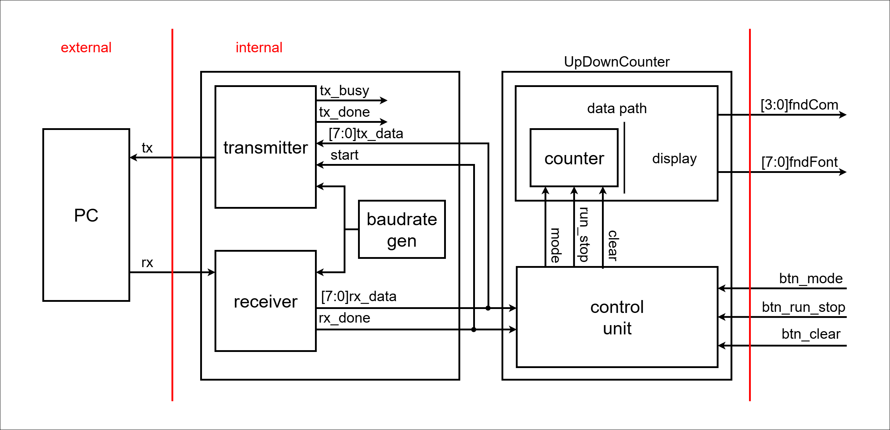

### < Code : uart >
```verilog
`timescale 1ns / 1ps

module uart (
    // global signal
    input  logic       clk,
    input  logic       reset,
    // transmitter signal
    input  logic       start,
    input  logic [7:0] tx_data,
    output logic       tx_busy,
    output logic       tx_done,
    output logic       tx,
    // receiver signal
    output logic [7:0] rx_data,
    output logic       rx_done,
    input  logic       rx
);

    logic br_tick;

    baudrate_gen U_BRAUD_GEN (
        .clk    (clk),
        .reset  (reset),
        .br_tick(br_tick)
    );

    transmitter U_Transmitter (
        .clk    (clk),
        .reset  (reset),
        .br_tick(br_tick),
        .start  (start),
        .tx_data(tx_data),
        .tx_busy(tx_busy),
        .tx_done(tx_done),
        .tx     (tx)
    );

    receiver U_Receiver (
        .clk    (clk),
        .reset  (reset),
        .br_tick(br_tick),
        .rx_data(rx_data),
        .rx_done(rx_done),
        .rx     (rx)
    );

endmodule


module baudrate_gen (
    input  logic clk,
    input  logic reset,
    output logic br_tick
);

    logic [$clog2(100_000_000 / 9600 / 16)-1:0] br_counter;
    //logic [3:0] br_counter;

    always_ff @(posedge clk, posedge reset) begin
        if (reset) begin
            br_counter <= 0;
            br_tick <= 1'b0;
        end else begin
            if (br_counter == 100_000_000 / 9600 / 16 - 1) begin
            //if (br_counter == 10 - 1) begin
                br_counter <= 0;
                br_tick <= 1'b1;
            end else begin
                br_counter <= br_counter + 1;
                br_tick <= 1'b0;
            end
        end
    end

endmodule


module transmitter (
    input  logic       clk,
    input  logic       reset,
    input  logic       br_tick,
    input  logic       start,
    input  logic [7:0] tx_data,
    output logic       tx_busy,
    output logic       tx_done,
    output logic       tx
);

    typedef enum {
        IDLE,
        START,
        DATA,
        STOP
    } tx_state_e;

    tx_state_e tx_state, tx_next_state;
    logic [7:0] temp_data_reg, temp_data_next;
    logic tx_reg, tx_next;
    logic [3:0] tick_cnt_reg, tick_cnt_next;
    logic [2:0] bit_cnt_reg, bit_cnt_next;
    logic tx_done_reg, tx_done_next;
    logic tx_busy_reg, tx_busy_next;

    assign tx = tx_reg;
    assign tx_busy = tx_busy_reg;
    assign tx_done = tx_done_reg;

    always_ff @(posedge clk, posedge reset) begin
        if (reset) begin
            tx_state <= IDLE;
            temp_data_reg <= 0;
            tx_reg <= 1'b1;
            tick_cnt_reg <= 0;
            bit_cnt_reg <= 0;
            tx_done_reg <= 0;
            tx_busy_reg <= 0;
        end else begin
            tx_state <= tx_next_state;
            temp_data_reg <= temp_data_next;
            tx_reg <= tx_next;
            tick_cnt_reg <= tick_cnt_next;
            bit_cnt_reg <= bit_cnt_next;
            tx_done_reg <= tx_done_next;
            tx_busy_reg <= tx_busy_next;
        end
    end

    always_comb begin
        tx_next_state = tx_state;
        temp_data_next = temp_data_reg;
        tx_next = tx_reg;
        tick_cnt_next = tick_cnt_reg;
        bit_cnt_next = bit_cnt_reg;
        tx_done_next = tx_done_reg;
        tx_busy_next = tx_busy_reg;
        case (tx_state)
            IDLE: begin
                tx_next = 1'b1;
                tx_done_next = 0;
                tx_busy_next = 0;
                if (start) begin
                    tx_next_state  = START;
                    temp_data_next = tx_data;
                    tick_cnt_next  = 0;
                    bit_cnt_next   = 0;
                    tx_busy_next   = 1;
                end
            end
            START: begin
                tx_next = 1'b0;
                if (br_tick) begin
                    if (tick_cnt_reg == 15) begin
                        tx_next_state = DATA;
                        tick_cnt_next = 0;
                    end else begin
                        tick_cnt_next = tick_cnt_reg + 1;
                    end
                end
            end
            DATA: begin
                tx_next = temp_data_reg[0];
                if (br_tick) begin
                    if (tick_cnt_reg == 15) begin
                        tick_cnt_next = 0;
                        if (bit_cnt_reg == 7) begin
                            tx_next_state = STOP;
                            bit_cnt_next  = 0;
                        end else begin
                            temp_data_next = {1'b0, temp_data_reg[7:1]};
                            bit_cnt_next   = bit_cnt_reg + 1;
                        end
                    end else begin
                        tick_cnt_next = tick_cnt_reg + 1;
                    end
                end
            end
            STOP: begin
                tx_next = 1'b1;
                if (br_tick) begin
                    if (tick_cnt_reg == 15) begin
                        tx_next_state = IDLE;
                        tx_done_next  = 1;
                        tx_busy_next  = 0;
                        tick_cnt_next = 0;
                    end else begin
                        tick_cnt_next = tick_cnt_reg + 1;
                    end
                end
            end
        endcase
    end

endmodule


module receiver (
    input  logic       clk,
    input  logic       reset,
    input  logic       br_tick,
    output logic [7:0] rx_data,
    output logic       rx_done,
    input  logic       rx
);

    typedef enum {
        IDLE,
        START,
        DATA,
        STOP
    } rx_state_e;

    rx_state_e rx_state, rx_next_state;

    logic [4:0] tick_cnt_reg, tick_cnt_next;
    logic [2:0] bit_cnt_reg, bit_cnt_next;
    logic [7:0] rx_data_reg, rx_data_next;
    logic rx_done_next, rx_done_reg;

    assign rx_data = rx_data_reg;
    assign rx_done = rx_done_reg;

    always_ff @(posedge clk, posedge reset) begin
        if (reset) begin
            rx_state     <= IDLE;
            tick_cnt_reg <= 0;
            bit_cnt_reg  <= 0;
            rx_data_reg  <= 0;
            rx_done_reg  <= 0;

        end else begin
            rx_state     <= rx_next_state;
            tick_cnt_reg <= tick_cnt_next;
            bit_cnt_reg  <= bit_cnt_next;
            rx_data_reg  <= rx_data_next;
            rx_done_reg  <= rx_done_next;
        end
    end

    always_comb begin
        rx_next_state = rx_state;
        rx_done_next  = rx_done;
        tick_cnt_next = tick_cnt_reg;
        bit_cnt_next  = bit_cnt_reg;
        rx_data_next  = rx_data_reg;
        case (rx_state)
            IDLE: begin
                rx_done_next = 0;
                if (rx == 1'b0) begin
                    rx_next_state = START;
                    tick_cnt_next = 0;
                    bit_cnt_next  = 0;
                    rx_data_next  = 0;
                end
            end
            START: begin
                if (br_tick) begin
                    if (tick_cnt_reg == 7) begin
                        tick_cnt_next = 0;
                        rx_next_state = DATA;
                    end else begin
                        tick_cnt_next = tick_cnt_reg + 1;
                    end
                end
            end
            DATA: begin
                if (br_tick) begin
                    if (tick_cnt_reg == 15) begin
                        tick_cnt_next = 0;
                        rx_data_next  = {rx, rx_data_reg[7:1]};
                        if (bit_cnt_reg == 7) begin
                            bit_cnt_next  = 0;
                            rx_next_state = STOP;
                        end else begin
                            bit_cnt_next = bit_cnt_reg + 1;
                        end
                    end else begin
                        tick_cnt_next = tick_cnt_reg + 1;
                    end
                end
            end
            STOP: begin
                if (br_tick) begin
                    if (tick_cnt_reg == 23) begin
                        tick_cnt_next = 0;
                        rx_done_next  = 1;
                        rx_next_state = IDLE;
                    end else begin
                        tick_cnt_next = tick_cnt_reg + 1;
                    end
                end
            end
        endcase
    end

endmodule
```

### < Simulation : uart >
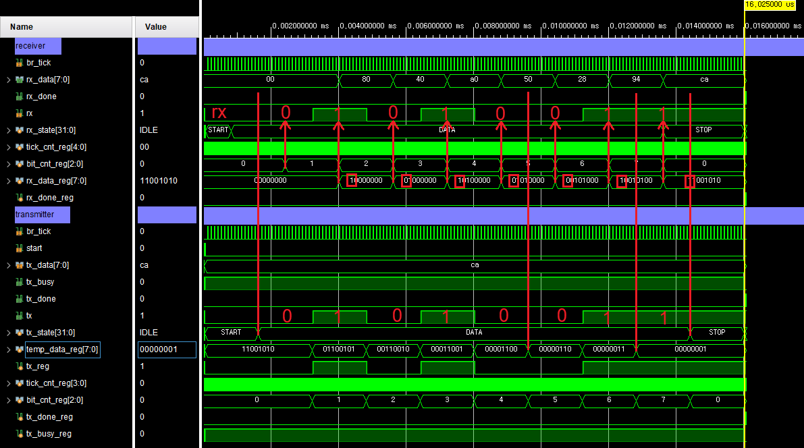

### < Code : UpDownCounter >
```verilog
`timescale 1ns / 1ps

module UpDownCounter (
    input  logic        clk,
    input  logic        reset,
    input  logic        btn_mode,
    input  logic        btn_run_stop,
    input  logic        btn_clear,
    input  logic [ 7:0] rx_data,
    input  logic        rx_done,
    output logic [ 1:0] led_mode,
    output logic [ 1:0] led_run_stop,
    output logic [13:0] count
);

    logic tick_10hz;
    logic mode, run_stop, clear;

    clk_div_10hz U_CLK_DIV_10hz (
        .clk      (clk),
        .reset    (reset),
        .run_stop (run_stop),
        .clear    (clear),
        .tick_10hz(tick_10hz)
    );

    up_down_counter U_UP_DOWN_COUNTER (
        .clk  (clk),
        .reset(reset),
        .tick (tick_10hz),
        .mode (mode),
        .clear(clear),
        .count(count)
    );

    control_unit U_CU (
        .clk         (clk),
        .reset       (reset),
        .btn_mode    (btn_mode),
        .btn_run_stop(btn_run_stop),
        .btn_clear   (btn_clear),
        .rx_data     (rx_data),
        .rx_done     (rx_done),
        .mode        (mode),
        .run_stop    (run_stop),
        .clear       (clear),
        .led_mode    (led_mode),
        .led_run_stop(led_run_stop)
    );

endmodule

// ...

module control_unit (
    input  logic       clk,
    input  logic       reset,
    input  logic       btn_mode,
    input  logic       btn_run_stop,
    input  logic       btn_clear,
    input  logic [7:0] rx_data,
    input  logic       rx_done,
    output logic       mode,
    output logic       run_stop,
    output logic       clear,
    output logic [1:0] led_mode,
    output logic [1:0] led_run_stop
);

    /************************** MODE FSM **************************/

    typedef enum {
        UP,
        DOWN
    } state_mode_e;

    state_mode_e state_mode, next_state_mode;

    // transition logic
    always_ff @(posedge clk, posedge reset) begin
        if (reset) begin
            state_mode <= UP;
        end else begin
            state_mode <= next_state_mode;
        end
    end

    // output logic
    always_comb begin
        next_state_mode = state_mode;
        mode = 0;
        led_mode = 2'b00;
        case (state_mode)
            UP: begin
                led_mode = 2'b01;
                mode = 0;
                if (btn_mode) begin
                    next_state_mode = DOWN;
                end
                if (rx_done) begin
                    if (rx_data == 8'h4d || rx_data == 8'h6d) begin  // M, m
                        next_state_mode = DOWN;
                    end
                end
            end
            DOWN: begin
                led_mode = 2'b10;
                mode = 1;
                if (btn_mode) begin
                    next_state_mode = UP;
                end
                if (rx_done) begin
                    if (rx_data == 8'h4d || rx_data == 8'h6d) begin  // M, m
                        next_state_mode = UP;
                    end
                end
            end
        endcase
    end

    /********************* RUN STOP CLEAR FSM *********************/

    typedef enum {
        STOP,
        RUN,
        CLEAR
    } state_counter_e;

    state_counter_e state_counter, next_state_counter;

    always_ff @(posedge clk, posedge reset) begin
        if (reset) begin
            state_counter <= STOP;
        end else begin
            state_counter <= next_state_counter;
        end
    end

    always_comb begin
        next_state_counter = state_counter;
        run_stop = 0;
        clear = 0;
        led_run_stop = 2'b00;
        case (state_counter)
            STOP: begin
                led_run_stop = 2'b01;
                if (btn_run_stop) next_state_counter = RUN;
                else if (btn_clear) next_state_counter = CLEAR;
                if (rx_done) begin
                    if (rx_data == 8'h52 || rx_data == 8'h72) begin  // R, r
                        next_state_counter = RUN;
                    end
                end
                if (rx_done) begin
                    if (rx_data == 8'h43 || rx_data == 8'h63) begin  // C, c
                        next_state_counter = CLEAR;
                    end
                end
            end
            RUN: begin
                run_stop = 1;
                led_run_stop = 2'b10;
                if (btn_run_stop) next_state_counter = STOP;
                if (rx_done) begin
                    if (rx_data == 8'h53 || rx_data == 8'h73) begin  // S, s
                        next_state_counter = STOP;
                    end
                end
            end
            CLEAR: begin
                clear = 1;
                next_state_counter = STOP;
            end
        endcase
    end

endmodule
```

### < Schematic >
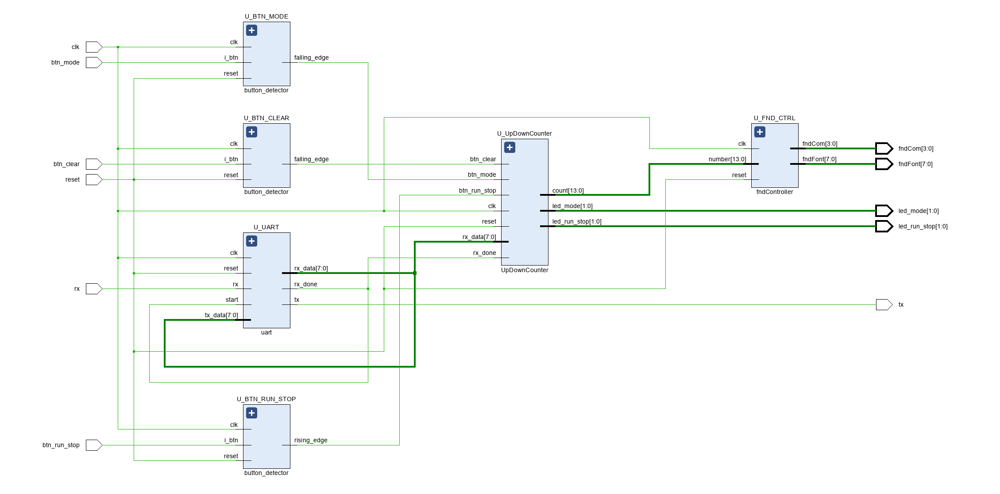

### < 파일 >
> **sources** (Class)
> - [top_UpDownCounter.sv](<../../assets/source file/250811/250811_Class/top_UpDownCounter.sv>)
> - [uart.sv](<../../assets/source file/250811/250811_Class/uart.sv>)
> - [button_detector.sv](<../../assets/source file/250811/250811_Class/button_detector.sv>)
> - [UpDownCounter.sv](<../../assets/source file/250811/250811_Class/UpDownCounter.sv>)
> - [tfndController.svext](<../../assets/source file/250811/250811_Class/fndController.sv>)

> **simulation** (Class)
> - [uart_tb.sv](<../../assets/source file/250811/250811_Class/uart_tb.sv>)

> **constrs** (Class)
> - [Basys-3-Master.xdc](<../../assets/source file/250811/250811_Class/Basys-3-Master.xdc>)

# CPU
---
### CISC(Complex Instruction Set Computer)
- micro processor에게 명령을 내리는데 **필요한 모든 명령어** 셋을 갖추고 있는 processor이다. 따라서 복잡하고 기능이 많은 명령어로 구성되어있다.
- 과거에는 컴퓨터 **메모리 용량**이 크지 않아서 sw 프로그램의 용량을 줄이기 위해 하나의 명령어로 여러 작업을 수행하도록 했기 때문에 CISC를 많이 사용하였다.
- 장점: 복합적이고 기능이 많기 때문에 하위 호환성?이 좋다. 따라서 호환성이 절대적으로 필요한 PC 환경에서는 CISC를 사용하는 것이 좋다.
- 단점: 하지만 트랜지스터 집적에 있어서 효율성이 떨어지기 때문에 성능 향상을 방해하는 요인이 될 수 있으며, **전력 소모가 크고**, **가격이 비싸다**는 등의 단점이 있다.
- 용도: 다양한 명령어를 포함하고 있어 일반적으로 우리가 사용하는 **범용 컴퓨터**(general purpose computer)의 CPU로 많이 사용된다.

### RISC(Reduced Instruction Set Computer)
- CISC 내부에 갖추어진 모든 명령어들 중 불과 20%에 해당하는 명령어들만이 전체 80% 이상의 일을 처리한다. 따라서 CISC와 같이 필요한 모든 명령어 셋을 갖고 있는 것은 비효율적일 수 있다. 이를 극복하기 위해 등장한 것이 RISC이다.
- 장점: RISC는 적은 수의 명령어들(사용 빈도가 높은 20%의 명령어들)로 구성된 processor이다. 따라서 CISC보다 더 빠른 속도?로 동작할 수 있으며, 단순하고, **전력소모가 적고**, **가격도 저렴하다**. (Tr 갯수 ↓)
- 단점: 하지만 하드웨어가 간단한 대신 소프트웨어(Compiler)가 크고 복잡해졌으며, 하위 호환성이 부족하다는 단점이 있다.
- 용도: RISC 구조는 **파이프라인 중첩이 가능**해서 같은 수의 명령어에 대해 적은 clock으로 처리가 가능하며 발열과 전력 소모도 줄일 수 있다. 따라서 임베디드 프로세서에서는 RISC 구조를 많이 사용한다. (MIPS, ARM)

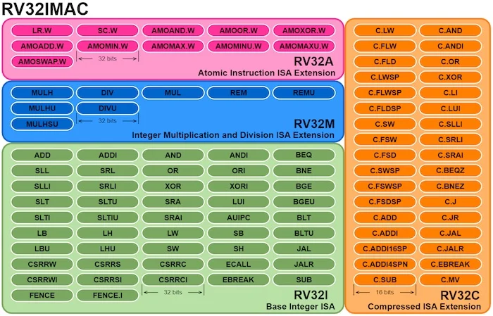

### 앞으로의 학습 및 구현 계획
- RISC-V Instruction Set 이해
- RV32I (Base Integer ISA) 구현
- 1. Single-Cycle Processor (모든 명령어를 1 클럭 내에 실행)
- 2. Multi-Cycle Processor (명령어 종류에 따라 실행 클럭 수가 다름)
- 3. Pipeline 구조 CPU (선택 사항 / 미구현 예정)

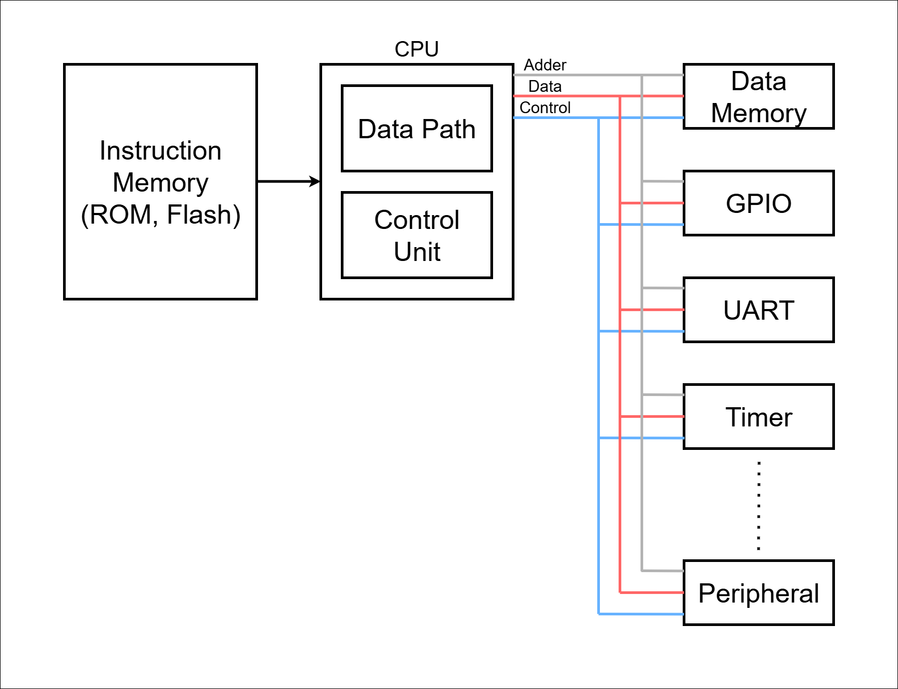

# DedicatedProcessor_Counter Design
---
### < Design Specification >
> - 0~9 까지 카운트하는 Processor를 설계
> - A = 0 (Data)

### < C 언어 >
```c
A = 0;
while (A < 10) {
    output = A;
    A = A + 1;
}
halt;
```

### < Block Diagram >
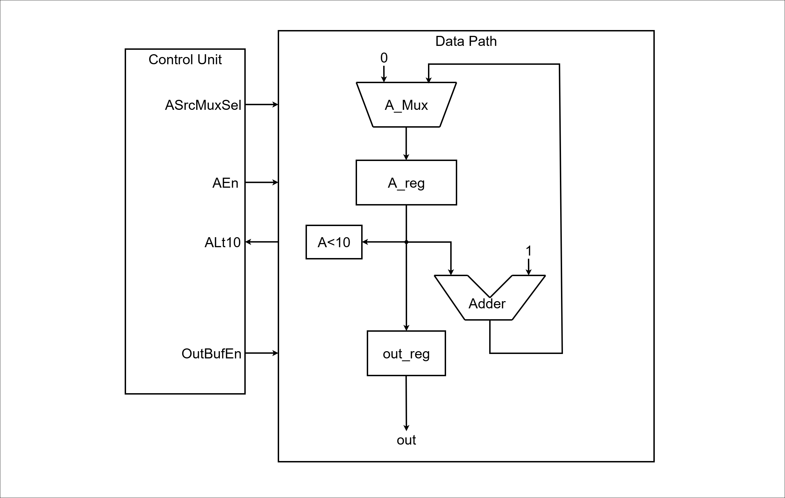

### < ASM >
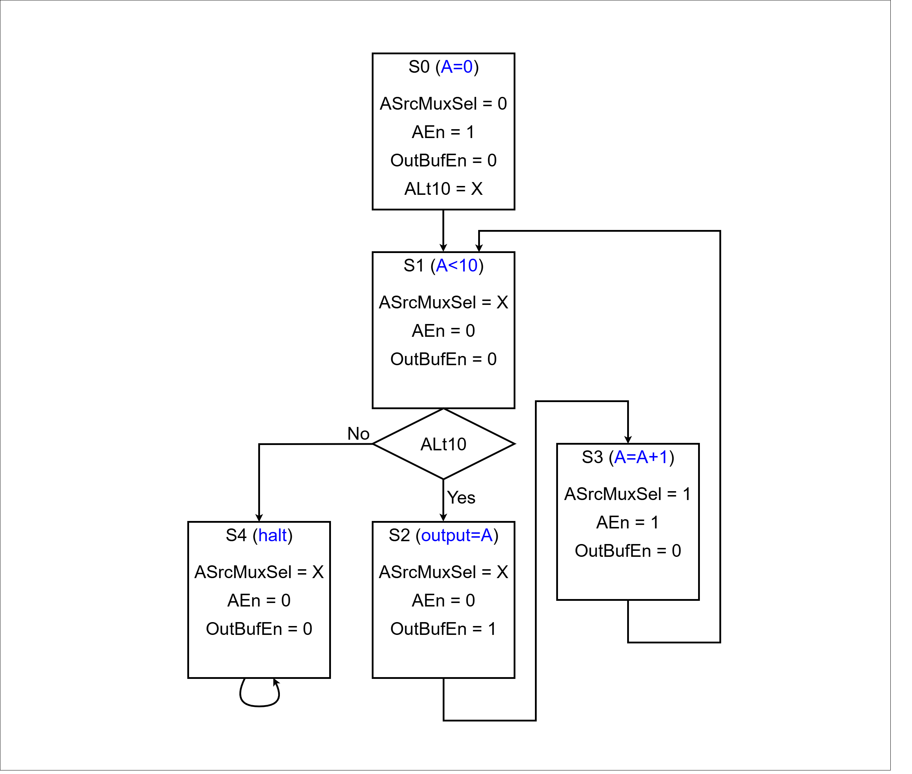

### < Code : DedicatedProcessor_Counter >
```verilog
`timescale 1ns / 1ps

module DedicatedProcessor_Counter (
    input  logic       clk,
    input  logic       reset,
    output logic [7:0] OutBuffer
);

    logic ASrcMuxSel;
    logic AEn;
    logic ALt10;
    logic OutBufEn;
    logic [$clog2(10_000_000)-1:0] div_counter;
    logic clk_10hz;

    always_ff @(posedge clk, posedge reset) begin
        if (reset) begin
            div_counter <= 0;
        end else begin
            if (div_counter == 10_000_000 - 1) begin
                div_counter <= 0;
                clk_10hz    <= 1'b1;
            end else begin
                div_counter <= div_counter + 1;
                clk_10hz    <= 1'b0;
            end
        end
    end

    ControlUnit U_ControlUnit (
        .clk(clk_10hz), // bitstream
        .*
    );

    DataPath U_DataPath (
        .clk(clk_10hz), // bitstream
        .*
    );

endmodule


module Register (
    input  logic       clk,
    input  logic       reset,
    input  logic       en,
    input  logic [7:0] d,
    output logic [7:0] q
);

    always_ff @(posedge clk, posedge reset) begin
        if (reset) begin
            q <= 0;
        end else begin
            if (en) begin
                q <= d;
            end
        end
    end

endmodule


module Mux_2x1 (
    input  logic       sel,
    input  logic [7:0] x0,
    input  logic [7:0] x1,
    output logic [7:0] y
);

    always_comb begin
        y = 8'b0;
        case (sel)
            1'b0: y = x0;
            1'b1: y = x1;
        endcase
    end

endmodule


module Adder (
    input  logic [7:0] a,
    input  logic [7:0] b,
    output logic [7:0] sum
);

    assign sum = a + b;

endmodule


module Comparator (
    input  logic [7:0] a,
    input  logic [7:0] b,
    output logic       lt
);

    assign lt = a < b;

endmodule


module OutBuf (
    input  logic       en,
    input  logic [7:0] x,
    output logic [7:0] y
);

    assign y = en ? x : 8'bx;

endmodule


module ControlUnit (
    input  logic clk,
    input  logic reset,
    input  logic ALt10,
    output logic ASrcMuxSel,
    output logic AEn,
    output logic OutBufEn
);

    typedef enum {
        S0,
        S1,
        S2,
        S3,
        S4
    } state_e;

    state_e state, next_state;

    always_ff @(posedge clk, posedge reset) begin
        if (reset) begin
            state <= S0;
        end else begin
            state <= next_state;
        end
    end

    always_comb begin
        ASrcMuxSel = 0;
        AEn        = 0;
        OutBufEn   = 0;
        next_state = state;
        case (state)
            S0: begin
                ASrcMuxSel = 0;
                AEn        = 1;
                OutBufEn   = 0;
                next_state = S1;
            end
            S1: begin
                ASrcMuxSel = 1;
                AEn        = 0;
                OutBufEn   = 0;
                if (ALt10) next_state = S2;
                else next_state = S4;
            end
            S2: begin
                ASrcMuxSel = 1;
                AEn        = 0;
                OutBufEn   = 1;
                next_state = S3;
            end
            S3: begin
                ASrcMuxSel = 1;
                AEn        = 1;
                OutBufEn   = 0;
                next_state = S1;
            end
            S4: begin
                ASrcMuxSel = 1;
                AEn        = 0;
                OutBufEn   = 0;
                next_state = S4;
            end
        endcase
    end

endmodule


module DataPath (
    input  logic       clk,
    input  logic       reset,
    input  logic       ASrcMuxSel,
    input  logic       AEn,
    input  logic       OutBufEn,
    output logic       ALt10,
    output logic [7:0] OutBuffer
);

    logic [7:0] AdderResult, ASrcMuxOut, ARegOut;

    Mux_2x1 U_ASrcMux (
        .sel(ASrcMuxSel),
        .x0 (8'b0),
        .x1 (AdderResult),
        .y  (ASrcMuxOut)
    );

    Register U_A_Reg (
        .clk  (clk),
        .reset(reset),
        .en   (AEn),
        .d    (ASrcMuxOut),
        .q    (ARegOut)
    );

    Comparator U_ALt10 (
        .a (ARegOut),
        .b (8'd10),
        .lt(ALt10)
    );

    Adder U_Adder (
        .a  (ARegOut),
        .b  (8'd1),
        .sum(AdderResult)
    );

    // OutBuf U_OutBuf (
    //     .en(OutBufEn),
    //     .x (ARegOut),
    //     .y (OutBuffer)
    // );

    Register U_OutReg (
        .clk  (clk),
        .reset(reset),
        .en   (OutBufEn),
        .d    (ARegOut),
        .q    (OutBuffer)
    );

endmodule
```

### < Comment >
> **DataPath**
> 써야대

### < Schematic >
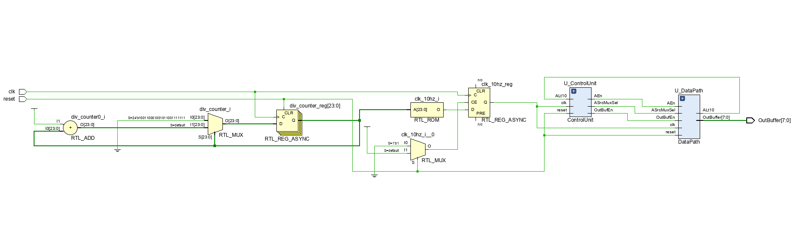

### < Simulation >
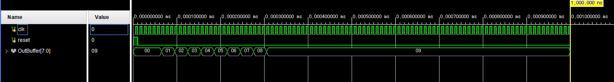

### < 파일 >
> **sources** (Class)
> - [DedicatedProcessor_Counter.sv](<../../assets/source file/250811/250811_Class/DedicatedProcessor_Counter.sv>)

> **simulation** (Class)
> - [DedicatedProcessor_Counter_tb.sv](<../../assets/source file/250811/250811_Class/DedicatedProcessor_Counter_tb.sv>)

> **constrs** (Class)
> - [Basys-3-Master.xdc](<../../assets/source file/250811/250811_Class/Basys-3-Master(2).xdc>)

# Homework
---
### < Design Specification >
> - 0+1+2+3+...+9+10 = 55 와 같이 누적으로 덧셈 결과 출력이 되도록 구현
> - FND에 누적 값을 출력

### < C 언어 >
```c
a = 0;
b = 0;
while (a <= 10) {
    b = b + a;   // 누적
    a = a + 1;   // 증가
}
output = b;      // 55
```

### < ASM >
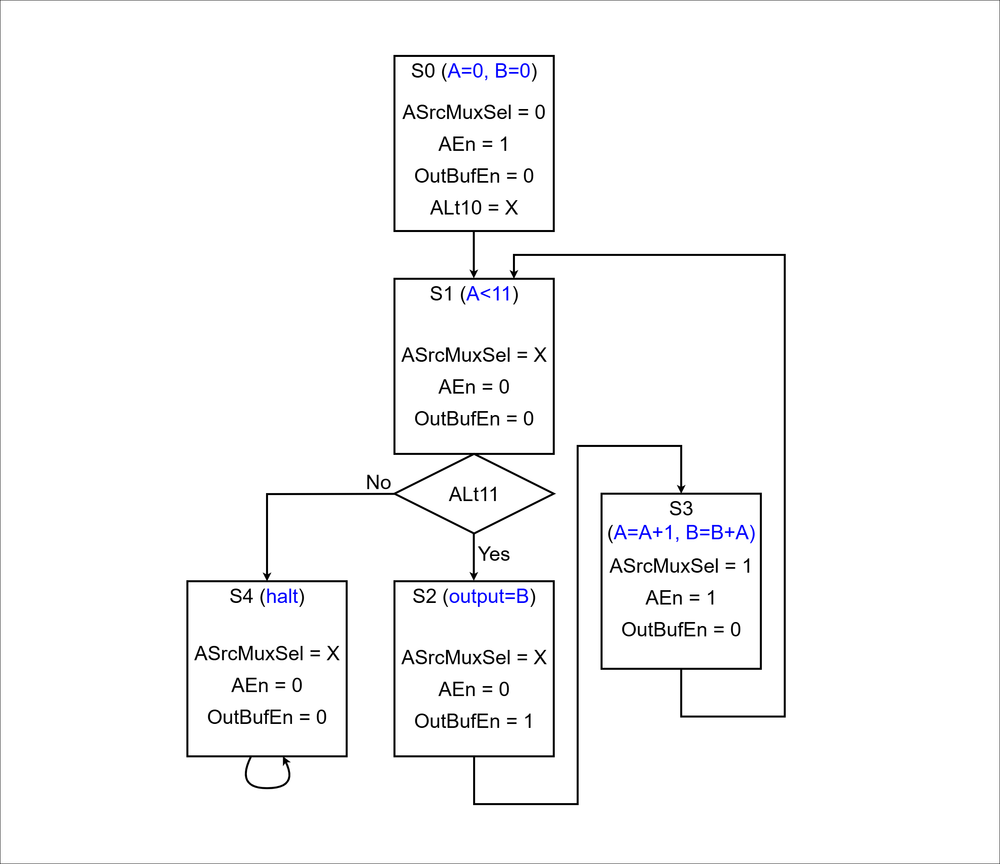

### < Data Path >
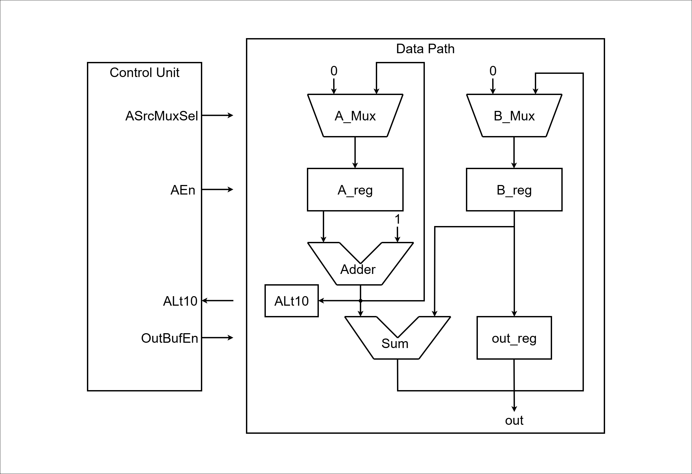

### < Code : top >
```verilog
`timescale 1ns / 1ps

module top (
    input  logic       clk,
    input  logic       reset,
    output logic [3:0] fndCom,
    output logic [7:0] fndFont
);

    logic [7:0] data;

    DedicatedProcessor U_DedicatedProcessor (
        .clk(clk),
        .reset(reset),
        .OutBuffer(data)
    );

    fndController U_fndController (
        .clk(clk),
        .reset(reset),
        .number(data),
        .fndCom(fndCom),
        .fndFont(fndFont)
    );

endmodule
```

### < Code : DedicatedProcessor (DataPath) >
```verilog
//...
module DataPath (
    input  logic       clk,
    input  logic       reset,
    input  logic       ASrcMuxSel,
    input  logic       AEn,
    input  logic       OutBufEn,
    output logic       ALt10,
    output logic [7:0] OutBuffer
);

    logic [7:0] AdderResult, ASrcMuxOut, ARegOut;
    logic [7:0] SumResult, BSrcMuxOut, BRegOut;

    Mux_2x1 U_ASrcMux (
        .sel(ASrcMuxSel),
        .x0 (8'b0),
        .x1 (AdderResult),
        .y  (ASrcMuxOut)
    );

    Register U_A_Reg (
        .clk  (clk),
        .reset(reset),
        .en   (AEn),
        .d    (ASrcMuxOut),
        .q    (ARegOut)
    );

    Comparator U_ALt10 (
        .a (ARegOut),
        .b (8'd11),    // 8'd11
        .lt(ALt10)
    );

    Adder U_Adder (
        .a  (ARegOut),
        .b  (8'd1),
        .sum(AdderResult)
    );

    // OutBuf U_OutBuf (
    //     .en(OutBufEn),
    //     .x (ARegOut),
    //     .y (OutBuffer)
    // );

    // Register U_OutReg (
    //     .clk  (clk),
    //     .reset(reset),
    //     .en   (OutBufEn),
    //     .d    (ARegOut),
    //     .q    (OutBuffer)
    // );

    /*************** B ***************/
    Mux_2x1 U_BSrcMux (
        .sel(ASrcMuxSel),
        .x0 (8'b0),
        .x1 (SumResult),
        .y  (BSrcMuxOut)
    );

    Register U_B_Reg (
        .clk  (clk),
        .reset(reset),
        .en   (AEn),
        .d    (BSrcMuxOut),
        .q    (BRegOut)
    );

    Adder U_Sum (
        .a  (AdderResult),
        .b  (BRegOut),
        .sum(SumResult)
    );

    Register U_OutReg (
        .clk  (clk),
        .reset(reset),
        .en   (OutBufEn),
        .d    (BRegOut),
        .q    (OutBuffer)
    );

endmodule
//...
```

### < Comment >
> **DataPath**
> 먹스 추가

### < simulation >
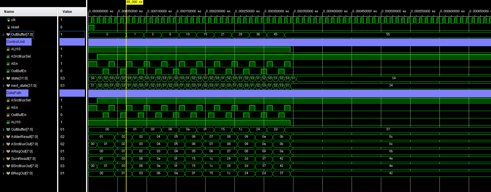

### < Video >
<video controls src="../../assets/img/final/250811/13.mp4" style="max-width: 100%; height: auto;" title="Title"></video>

### < 고찰 >
> 써야대

### < 파일 >
> **sources** (Homework)
> - [top.sv](<../../assets/source file/250811/250811_HW/top.sv>)
> - [DedicatedProcessor.sv](<../../assets/source file/250811/250811_HW/DedicatedProcessor.sv>)
> - [fndController.sv](<../../assets/source file/250811/250811_HW/fndController.sv>)

> **simulation** (Homework)
> - [DedicatedProcessor_tb.sv](<../../assets/source file/250811/250811_HW/DedicatedProcessor_tb.sv>)

> **constrs** (Homework)
> - [Basys-3-Master.xdc](<../../assets/source file/250811/250811_HW/Basys-3-Master.xdc>)
