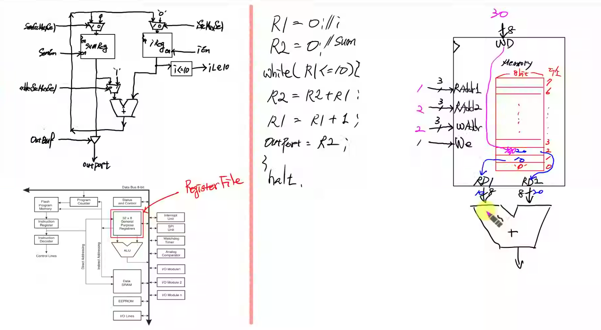

# Dedicated Processor Sum Counter Design
---
### < C언어 >
```c
i = 0;
sum = 0;
while (i <= 10) {
    sum = sum + i
    i = i + 1;
    outport = sum;
}
halt;
```

### < Design Specification >
> - i 저장 → Register 1개
> - sum 저장할 → Register 1개
> - 출력을 저장할 → Register 1게
> - while 문 → Comparator
> - 덧셈 연산 → Adder

### < Data Path >


### < ASM >
사진 2

### < Code : DataPath >
```verilog
`timescale 1ns / 1ps

module DataPath (
    input  logic       clk,
    input  logic       reset,
    input  logic       SumSrcMuxSel,
    input  logic       ISrcMuxSel,
    input  logic       SumEn,
    input  logic       IEn,
    input  logic       AdderSrcMuxSel,
    input  logic       OutPortEn,
    output logic       ILe10,
    output logic [7:0] OutPort

);

    logic [7:0] SumSrcMuxOut, ISrcMuxOut;
    logic [7:0] SumRegOut, IRegOut;
    logic [7:0] AdderResult, AdderSrcMuxOut;

    Mux_2x1 U_SumSrcMux (
        .sel(SumSrcMuxSel),
        .x0 (0),
        .x1 (AdderResult),
        .y  (SumSrcMuxOut)
    );

    Mux_2x1 U_ISrcMux (
        .sel(ISrcMuxSel),
        .x0 (0),
        .x1 (AdderResult),
        .y  (ISrcMuxOut)
    );

    Register U_SumReg (
        .clk  (clk),
        .reset(reset),
        .en   (SumEn),
        .d    (SumSrcMuxOut),
        .q    (SumRegOut)
    );

    Register U_IReg (
        .clk  (clk),
        .reset(reset),
        .en   (IEn),
        .d    (ISrcMuxOut),
        .q    (IRegOut)
    );

    Comparator U_ILe10 (
        .a (IRegOut),
        .b (10),
        .lt(ILe10)
    );

    Mux_2x1 U_AdderSrcMux (
        .sel(AdderSrcMuxSel),
        .x0 (SumRegOut),
        .x1 (1),
        .y  (AdderSrcMuxOut)
    );

    Adder U_Adder (
        .a  (AdderSrcMuxOut),
        .b  (IRegOut),
        .sum(AdderResult)
    );

    Register U_OutPort (
        .clk  (clk),
        .reset(reset),
        .en   (OutPortEn),
        .d    (SumRegOut),
        .q    (OutPort)
    );

endmodule


module Register (
    input  logic       clk,
    input  logic       reset,
    input  logic       en,
    input  logic [7:0] d,
    output logic [7:0] q
);

    always_ff @(posedge clk, posedge reset) begin
        if (reset) begin
            q <= 0;
        end else begin
            if (en) begin
                q <= d;
            end
        end
    end

endmodule


module Mux_2x1 (
    input  logic       sel,
    input  logic [7:0] x0,
    input  logic [7:0] x1,
    output logic [7:0] y
);

    always_comb begin
        y = 8'b0;
        case (sel)
            1'b0: y = x0;
            1'b1: y = x1;
        endcase
    end

endmodule


module Adder (
    input  logic [7:0] a,
    input  logic [7:0] b,
    output logic [7:0] sum
);

    assign sum = a + b;

endmodule


module Comparator (
    input  logic [7:0] a,
    input  logic [7:0] b,
    output logic       lt
);

    assign lt = a < b;

endmodule


module OutBuf (
    input  logic       en,
    input  logic [7:0] x,
    output logic [7:0] y
);

    assign y = en ? x : 8'bx;

endmodule
```

### < Schematic >


### < Code : ControlUnit >
```verilog
`timescale 1ns / 1ps

module ControlUnit (
    input  logic clk,
    input  logic reset,
    input  logic ILe10,
    output logic SumSrcMuxSel,
    output logic ISrcMuxSel,
    output logic SumEn,
    output logic IEn,
    output logic AdderSrcMuxSel,
    output logic OutPortEn
);

    typedef enum {
        S0,
        S1,
        S2,
        S3,
        S4,
        S5
    } state_e;

    state_e state, next_state;

    always_ff @(posedge clk, posedge reset) begin
        if (reset) begin
            state <= S0;
        end else begin
            state <= next_state;
        end
    end

    always_comb begin
        next_state = state;
        SumSrcMuxSel = 0;
        ISrcMuxSel = 0;
        SumEn = 0;
        IEn = 0;
        AdderSrcMuxSel = 0;
        OutPortEn = 0;
        case (state)
            S0: begin
                SumSrcMuxSel = 0;
                ISrcMuxSel = 0;
                SumEn = 1;
                IEn = 1;
                AdderSrcMuxSel = 0;  // X
                OutPortEn = 0;
                next_state = S1;
            end
            S1: begin
                SumSrcMuxSel = 0;
                ISrcMuxSel = 0;
                SumEn = 0;
                IEn = 0;
                AdderSrcMuxSel = 0;
                OutPortEn = 0;
                if (ILe10) next_state = S2;
                else next_state = S5;
            end
            S2: begin
                SumSrcMuxSel = 1;
                ISrcMuxSel = 1;
                SumEn = 1;
                IEn = 0;
                AdderSrcMuxSel = 0;
                OutPortEn = 0;
                next_state = S3;
            end
            S3: begin
                SumSrcMuxSel = 1;
                ISrcMuxSel = 1;
                SumEn = 0;
                IEn = 1;
                AdderSrcMuxSel = 1;
                OutPortEn = 0;
                next_state = S4;
            end
            S4: begin
                SumSrcMuxSel = 1;
                ISrcMuxSel = 1;
                SumEn = 0;
                IEn = 0;
                AdderSrcMuxSel = 0;
                OutPortEn = 1;
                next_state = S1;
            end
            S5: begin
                SumSrcMuxSel = 1;
                ISrcMuxSel = 1;
                SumEn = 0;
                IEn = 0;
                AdderSrcMuxSel = 0;
                OutPortEn = 0;
                next_state = S5;
            end
        endcase
    end

endmodule
```

### < Code : DedicatedProcessor >
```verilog
`timescale 1ns / 1ps

module DedicatedProcessor (
    input logic clk,
    input logic reset,
    output logic [7:0] OutPort

);

    logic SumSrcMuxSel;
    logic ISrcMuxSel;
    logic SumEn;
    logic IEn;
    logic AdderSrcMuxSel;
    logic OutPortEn;
    logic ILe10;

    DataPath U_DataPath (.*);
    ControlUnit U_ControlUnit (.*);

endmodule
```

### < Comment >
김치

### < Simulation >


### < Code : top >
```verilog
`timescale 1ns / 1ps

module top (
    input  logic       clk,
    input  logic       reset,
    output logic [3:0] fndCom,
    output logic [7:0] fndFont
);

    logic clk_10hz;
    logic [7:0] OutPort;

    clk_div_10hz U_ClkDiv (
        .clk     (clk),
        .reset   (reset),
        .clk_10hz(clk_10hz)
    );

    DedicatedProcessor U_DedicatedProcessor (
        .clk    (clk_10hz),
        .reset  (reset),
        .OutPort(OutPort)
    );

    fndController U_FndController (
        .clk    (clk),
        .reset  (reset),
        .number ({6'b0, OutPort}),
        .fndCom (fndCom),
        .fndFont(fndFont)
    );

endmodule


module clk_div_10hz (
    input  logic clk,
    input  logic reset,
    output logic clk_10hz
);

    //logic [23:0] div_counter;
    logic [$clog2(10_000_000)-1:0] div_counter;

    always_ff @(posedge clk, posedge reset) begin
        if (reset) begin
            div_counter <= 0;
            clk_10hz <= 1'b0;
        end else begin
            if (div_counter == 10_000_000 - 1) begin
                div_counter <= 0;
                clk_10hz <= 1'b1;
            end else begin
                div_counter <= div_counter + 1;
                clk_10hz <= 1'b0;
            end
        end
    end

endmodule
```

### < Schematic >


### < 파일 >
> **sources** (Class)
> - [top.sv](<../../assets/source file/250812/250812_Class/top.sv>)
> - [DedicatedProcessor.sv](<../../assets/source file/250812/250812_Class/DedicatedProcessor.sv>)
> - [DataPath.sv](<../../assets/source file/250812/250812_Class/DataPath.sv>)
> - [ControlUnit.sv](<../../assets/source file/250812/250812_Class/ControlUnit.sv>)
> - [fndController.sv](<../../assets/source file/250812/250812_Class/fndController.sv>)

> **simulation** (Class)
> - [DedicatedProcessor_tb.sv](<../../assets/source file/250812/250812_Class/DedicatedProcessor_tb.sv>)

> **constrs** (Class)
> - [Basys-3-Master.xdc](<../../assets/source file/250812/250812_Class/Basys-3-Master.xdc>)


# Register File Design



Data 출력 2개가 ALU로 들어감
Memory 주소가 존재, RD1로 나가는 데이터를 선택할려면 read 메모리의 주소를 주면 됨
0~7까지의 주소를 줌, 0을 넣으면 주소0번지의 데이터가 나감
레지스터 2번 값을 출력으로 RD2의 데이터로 나가게 하고 싶음. 레지스터2의 주소를 주면 주소의 데이터가 나감
레지스터 3번에 저장하고 싶으면 write address 3를 주고 write_en신호를 1로 주면 클럭에 맞게 저장됨
read_enable 없이 계속 출력은 계속 나감
주소를 넣어준 대로 데이터가 나감


