# Dedicated Processor Sum Counter Design
---
### < C언어 >
```c
i = 0;
sum = 0;
while (i <= 10) {
    sum = sum + i
    i = i + 1;
    outport = sum;
}
halt;
```

### < Design Specification >
> - i 저장 → Register 1개
> - sum 저장할 → Register 1개
> - 출력을 저장할 → Register 1게
> - while 문 → Comparator
> - 덧셈 연산 → Adder

### < Data Path >
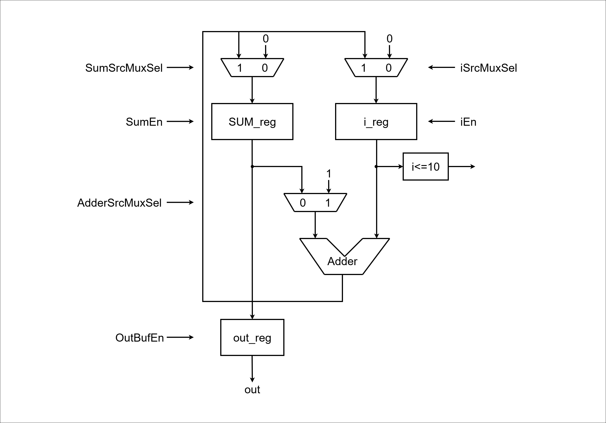

### < ASM >
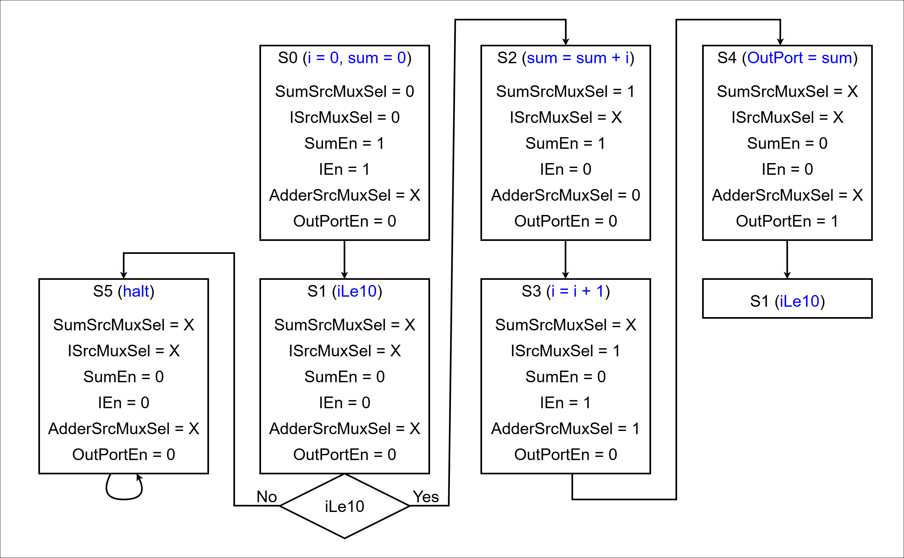

### < Code : DataPath >
```verilog
`timescale 1ns / 1ps

module DataPath (
    input  logic       clk,
    input  logic       reset,
    input  logic       SumSrcMuxSel,
    input  logic       ISrcMuxSel,
    input  logic       SumEn,
    input  logic       IEn,
    input  logic       AdderSrcMuxSel,
    input  logic       OutPortEn,
    output logic       ILe10,
    output logic [7:0] OutPort

);

    logic [7:0] SumSrcMuxOut, ISrcMuxOut;
    logic [7:0] SumRegOut, IRegOut;
    logic [7:0] AdderResult, AdderSrcMuxOut;

    Mux_2x1 U_SumSrcMux (
        .sel(SumSrcMuxSel),
        .x0 (0),
        .x1 (AdderResult),
        .y  (SumSrcMuxOut)
    );

    Mux_2x1 U_ISrcMux (
        .sel(ISrcMuxSel),
        .x0 (0),
        .x1 (AdderResult),
        .y  (ISrcMuxOut)
    );

    Register U_SumReg (
        .clk  (clk),
        .reset(reset),
        .en   (SumEn),
        .d    (SumSrcMuxOut),
        .q    (SumRegOut)
    );

    Register U_IReg (
        .clk  (clk),
        .reset(reset),
        .en   (IEn),
        .d    (ISrcMuxOut),
        .q    (IRegOut)
    );

    Comparator U_ILe10 (
        .a (IRegOut),
        .b (10),
        .lt(ILe10)
    );

    Mux_2x1 U_AdderSrcMux (
        .sel(AdderSrcMuxSel),
        .x0 (SumRegOut),
        .x1 (1),
        .y  (AdderSrcMuxOut)
    );

    Adder U_Adder (
        .a  (AdderSrcMuxOut),
        .b  (IRegOut),
        .sum(AdderResult)
    );

    Register U_OutPort (
        .clk  (clk),
        .reset(reset),
        .en   (OutPortEn),
        .d    (SumRegOut),
        .q    (OutPort)
    );

endmodule


module Register (
    input  logic       clk,
    input  logic       reset,
    input  logic       en,
    input  logic [7:0] d,
    output logic [7:0] q
);

    always_ff @(posedge clk, posedge reset) begin
        if (reset) begin
            q <= 0;
        end else begin
            if (en) begin
                q <= d;
            end
        end
    end

endmodule


module Mux_2x1 (
    input  logic       sel,
    input  logic [7:0] x0,
    input  logic [7:0] x1,
    output logic [7:0] y
);

    always_comb begin
        y = 8'b0;
        case (sel)
            1'b0: y = x0;
            1'b1: y = x1;
        endcase
    end

endmodule


module Adder (
    input  logic [7:0] a,
    input  logic [7:0] b,
    output logic [7:0] sum
);

    assign sum = a + b;

endmodule


module Comparator (
    input  logic [7:0] a,
    input  logic [7:0] b,
    output logic       lt
);

    assign lt = a < b;

endmodule


module OutBuf (
    input  logic       en,
    input  logic [7:0] x,
    output logic [7:0] y
);

    assign y = en ? x : 8'bx;

endmodule
```

### < Schematic >
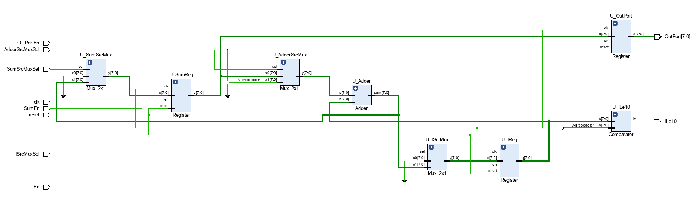

### < Code : ControlUnit >
```verilog
`timescale 1ns / 1ps

module ControlUnit (
    input  logic clk,
    input  logic reset,
    input  logic ILe10,
    output logic SumSrcMuxSel,
    output logic ISrcMuxSel,
    output logic SumEn,
    output logic IEn,
    output logic AdderSrcMuxSel,
    output logic OutPortEn
);

    typedef enum {
        S0,
        S1,
        S2,
        S3,
        S4,
        S5
    } state_e;

    state_e state, next_state;

    always_ff @(posedge clk, posedge reset) begin
        if (reset) begin
            state <= S0;
        end else begin
            state <= next_state;
        end
    end

    always_comb begin
        next_state = state;
        SumSrcMuxSel = 0;
        ISrcMuxSel = 0;
        SumEn = 0;
        IEn = 0;
        AdderSrcMuxSel = 0;
        OutPortEn = 0;
        case (state)
            S0: begin // i = 0, sum = 0
                SumSrcMuxSel = 0;
                ISrcMuxSel = 0;
                SumEn = 1;
                IEn = 1;
                AdderSrcMuxSel = 0;  // X
                OutPortEn = 0;
                next_state = S1;
            end
            S1: begin // iLe10
                SumSrcMuxSel = 0;
                ISrcMuxSel = 0;
                SumEn = 0;
                IEn = 0;
                AdderSrcMuxSel = 0;
                OutPortEn = 0;
                if (ILe10) next_state = S2;
                else next_state = S5;
            end
            S2: begin // sum = sum + i
                SumSrcMuxSel = 1;
                ISrcMuxSel = 1;
                SumEn = 1;
                IEn = 0;
                AdderSrcMuxSel = 0;
                OutPortEn = 0;
                next_state = S3;
            end
            S3: begin // i = i + 1
                SumSrcMuxSel = 1;
                ISrcMuxSel = 1;
                SumEn = 0;
                IEn = 1;
                AdderSrcMuxSel = 1;
                OutPortEn = 0;
                next_state = S4;
            end
            S4: begin // OutPort = sum
                SumSrcMuxSel = 1;
                ISrcMuxSel = 1;
                SumEn = 0;
                IEn = 0;
                AdderSrcMuxSel = 0;
                OutPortEn = 1;
                next_state = S1;
            end
            S5: begin // halt
                SumSrcMuxSel = 1;
                ISrcMuxSel = 1;
                SumEn = 0;
                IEn = 0;
                AdderSrcMuxSel = 0;
                OutPortEn = 0;
                next_state = S5;
            end
        endcase
    end

endmodule
```

### < Code : DedicatedProcessor >
```verilog
`timescale 1ns / 1ps

module DedicatedProcessor (
    input logic clk,
    input logic reset,
    output logic [7:0] OutPort

);

    logic SumSrcMuxSel;
    logic ISrcMuxSel;
    logic SumEn;
    logic IEn;
    logic AdderSrcMuxSel;
    logic OutPortEn;
    logic ILe10;

    DataPath U_DataPath (.*);
    ControlUnit U_ControlUnit (.*);

endmodule
```

### < Comment >
> IReg와 SumReg 두 개의 레지스터로 각각 i 값과 **누적합(sum)**을 저장한다.
> OutPort 레지스터는 최종 출력값을 클럭 경계에서 안정적으로 내보낸다.
> 각 연산에 필요한 피연산자 선택은 MUX를 통해 이루어지며, 하나의 Adder를 공유한다.
> Comparator(ILe10)는 i ≤ 10 조건을 하드웨어 신호로 변환해 Control Unit이 루프 종료를 판단하도록 한다.

### < 고찰 >
> 하나의 Adder로 두 연산을 번갈아 처리하므로 하드웨어 자원 절약
> MUX와 Enable 신호로 동작 타이밍과 데이터 경로를 완전히 제어 가능

### < Simulation >
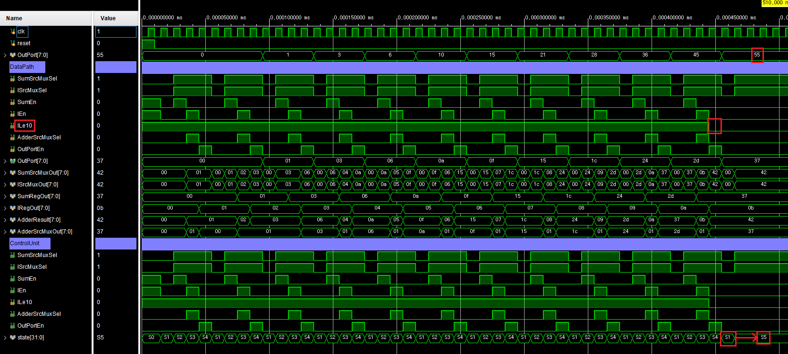

### < Code : top >
```verilog
`timescale 1ns / 1ps

module top (
    input  logic       clk,
    input  logic       reset,
    output logic [3:0] fndCom,
    output logic [7:0] fndFont
);

    logic clk_10hz;
    logic [7:0] OutPort;

    clk_div_10hz U_ClkDiv (
        .clk     (clk),
        .reset   (reset),
        .clk_10hz(clk_10hz)
    );

    DedicatedProcessor U_DedicatedProcessor (
        .clk    (clk_10hz),
        .reset  (reset),
        .OutPort(OutPort)
    );

    fndController U_FndController (
        .clk    (clk),
        .reset  (reset),
        .number ({6'b0, OutPort}),
        .fndCom (fndCom),
        .fndFont(fndFont)
    );

endmodule


module clk_div_10hz (
    input  logic clk,
    input  logic reset,
    output logic clk_10hz
);

    //logic [23:0] div_counter;
    logic [$clog2(10_000_000)-1:0] div_counter;

    always_ff @(posedge clk, posedge reset) begin
        if (reset) begin
            div_counter <= 0;
            clk_10hz <= 1'b0;
        end else begin
            if (div_counter == 10_000_000 - 1) begin
                div_counter <= 0;
                clk_10hz <= 1'b1;
            end else begin
                div_counter <= div_counter + 1;
                clk_10hz <= 1'b0;
            end
        end
    end

endmodule
```

### < Schematic >
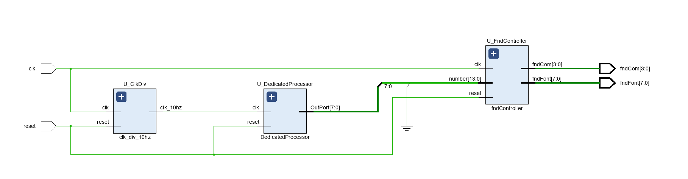

### < 파일 >
> **sources** (Class)
> - [top.sv](<../../assets/source file/250812/250812_Class/top.sv>)
> - [DedicatedProcessor.sv](<../../assets/source file/250812/250812_Class/DedicatedProcessor.sv>)
> - [DataPath.sv](<../../assets/source file/250812/250812_Class/DataPath.sv>)
> - [ControlUnit.sv](<../../assets/source file/250812/250812_Class/ControlUnit.sv>)
> - [fndController.sv](<../../assets/source file/250812/250812_Class/fndController.sv>)

> **simulation** (Class)
> - [DedicatedProcessor_tb.sv](<../../assets/source file/250812/250812_Class/DedicatedProcessor_tb.sv>)

> **constrs** (Class)
> - [Basys-3-Master.xdc](<../../assets/source file/250812/250812_Class/Basys-3-Master.xdc>)

# Register File Design
---
### < Design Specification >
> - 데이터 출력: 2개의 Read Port(RD1, RD2)를 통해 ALU로 데이터 전달
> - 주소 지정:
> - 각 Read Port는 별도의 Read Address 입력을 가짐
> - 예: RD1 주소 입력에 0을 주면, 레지스터 0번 데이터 출력
> - RD2 주소 입력에 2를 주면, 레지스터 2번 데이터 출력
> - 데이터 쓰기:
> - Write Address 입력에 저장할 레지스터 번호 지정
> - write_en 신호를 1로 하고 클럭 엣지에 맞춰 데이터 저장
> - 예: Write Address = 3, write_en = 1 → 레지스터 3번에 데이터 저장
> - 출력 특성:
> - 별도의 read_enable 없이, 주소가 유효하면 항상 해당 데이터 출력
> - 주소 변경 시 즉시 해당 레지스터 값 출력

### < C언어 >
```c
R1 = 0; // i
R2 = 0; // sum
R3 = 1;
while (R1 <= 10) {
    R2 = R2 + R1
    R1 = R1 + R3;
    outport = R2;
}
halt;
```

### < Data Path >
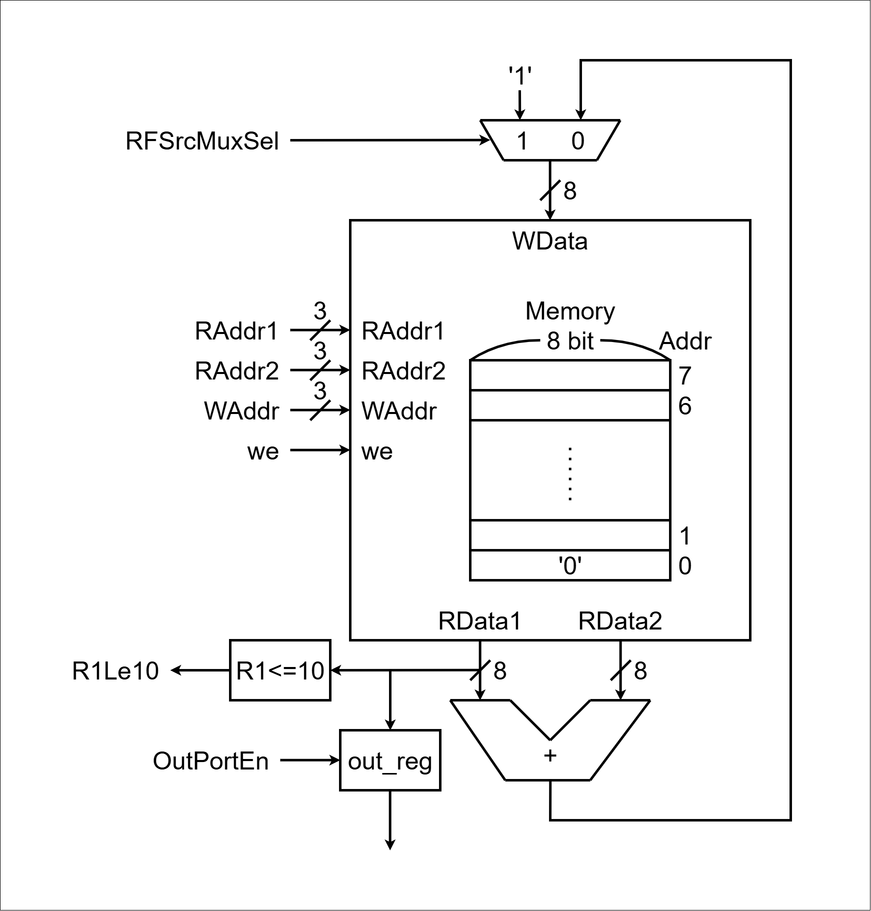

### < Code : DataPath >
```verilog
`timescale 1ns / 1ps

module DataPath (
    input  logic       clk,
    input  logic       reset,
    input  logic       RFSrcMuxSel,
    input  logic [2:0] RAddr1,
    input  logic [2:0] RAddr2,
    input  logic [2:0] WAddr,
    input  logic       we,
    input  logic       OutPortEn,
    output logic       R1Le10,
    output logic [7:0] OutPort
);

    logic [7:0] AddrResult, RFSrcMuxOut;
    logic [7:0] RData1, RData2;

    Mux_2x1 U_RFSrcMux (
        .sel(RFSrcMuxSel),
        .x0 (AddrResult),
        .x1 (8'b1),
        .y  (RFSrcMuxOut)
    );

    RegFile U_RegFile (
        .clk   (clk),
        .RAddr1(RAddr1),
        .RAddr2(RAddr2),
        .WAddr (WAddr),
        .we    (we),
        .Wdata (RFSrcMuxOut),
        .RData1(RData1),
        .RData2(RData2)
    );

    Comparator U_R1Le10 (
        .a  (RData1),
        .b  (8'd10),
        .lte(R1Le10)
    );

    Adder U_Adder (
        .a  (RData1),
        .b  (RData2),
        .sum(AddrResult)
    );

    Register U_Register (
        .clk  (clk),
        .reset(reset),
        .en   (OutPortEn),
        .d    (RData1),
        .q    (OutPort)
    );

endmodule


module RegFile (
    input  logic       clk,
    input  logic [2:0] RAddr1,
    input  logic [2:0] RAddr2,
    input  logic [2:0] WAddr,
    input  logic       we,
    input  logic [7:0] Wdata,
    output logic [7:0] RData1,
    output logic [7:0] RData2
);

    logic [7:0] mem[0:2**3-1];  // [0:2**(Number of addresses)-1]

    always_ff @(posedge clk) begin
        if (we) begin
            mem[WAddr] <= Wdata;
        end
    end

    assign RData1 = (RAddr1 == 0) ? 8'b0 : mem[RAddr1];
    assign RData2 = (RAddr2 == 0) ? 8'b0 : mem[RAddr2];

endmodule


module Register (
    input  logic       clk,
    input  logic       reset,
    input  logic       en,
    input  logic [7:0] d,
    output logic [7:0] q
);

    always_ff @(posedge clk, posedge reset) begin
        if (reset) begin
            q <= 0;
        end else begin
            if (en) begin
                q <= d;
            end
        end
    end

endmodule


module Mux_2x1 (
    input  logic       sel,
    input  logic [7:0] x0,
    input  logic [7:0] x1,
    output logic [7:0] y
);

    always_comb begin
        y = 8'b0;
        case (sel)
            1'b0: y = x0;
            1'b1: y = x1;
        endcase
    end

endmodule


module Adder (
    input  logic [7:0] a,
    input  logic [7:0] b,
    output logic [7:0] sum
);

    assign sum = a + b;

endmodule


module Comparator (
    input  logic [7:0] a,
    input  logic [7:0] b,
    output logic       lte
);

    assign lte = a <= b;

endmodule
```

### < Schematic >
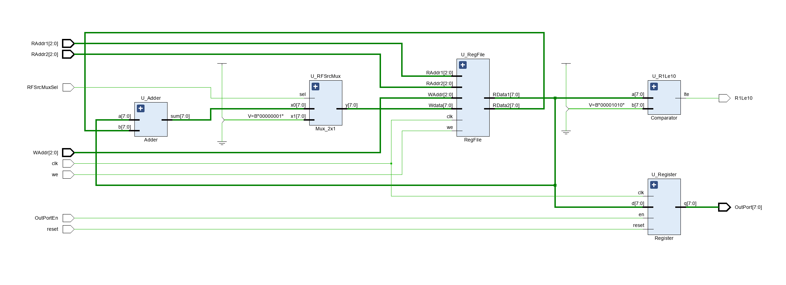

# Homework_1
---
### < Design Specification >
> - Register File 의 Data Path 이어서
> - ControlUnit, DedicatedProcessor 설계
> - 동작: RegisterFile 을 이용하여  0 ~ 10 누적 합을 fnd에 출력

### < ASM >
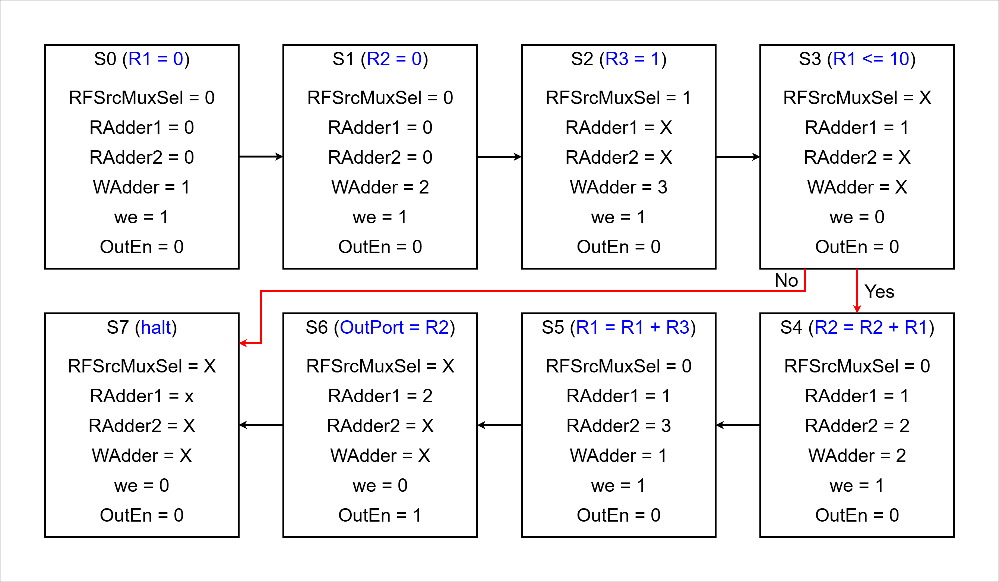

### < Code : ControlUnit >
```verilog
`timescale 1ns / 1ps

module ControlUnit (
    input  logic       clk,
    input  logic       reset,
    input  logic       R1Le10,
    output logic       RFSrcMuxSel,
    output logic [2:0] RAddr1,
    output logic [2:0] RAddr2,
    output logic [2:0] WAddr,
    output logic       we,
    output logic       OutPortEn
);

    typedef enum {
        S0,
        S1,
        S2,
        S3,
        S4,
        S5,
        S6,
        S7
    } state_e;

    state_e state, next_state;

    always_ff @(posedge clk, posedge reset) begin
        if (reset) begin
            state <= S0;
        end else begin
            state <= next_state;
        end
    end

    always_comb begin
        next_state  = state;
        RFSrcMuxSel = 0;
        RAddr1      = 0;
        RAddr2      = 0;
        WAddr       = 0;
        we          = 0;
        OutPortEn   = 0;
        case (state)
            S0: begin
                RFSrcMuxSel = 0;
                RAddr1      = 4'd0;
                RAddr2      = 4'd0;
                WAddr       = 4'd1;
                we          = 1;
                OutPortEn   = 0;
                next_state  = S1;
            end
            S1: begin
                RFSrcMuxSel = 0;
                RAddr1      = 4'd0;
                RAddr2      = 4'd0;
                WAddr       = 4'd2;
                we          = 1;
                OutPortEn   = 0;
                next_state = S2;
            end
            S2: begin
                RFSrcMuxSel = 1;
                RAddr1      = 4'd0;
                RAddr2      = 4'd0;
                WAddr       = 4'd3;
                we          = 1;
                OutPortEn   = 0;
                next_state  = S3;                
            end
            S3: begin
                RFSrcMuxSel = 0;
                RAddr1      = 4'd1;
                RAddr2      = 4'd0;
                WAddr       = 4'd0;
                we          = 0;
                OutPortEn   = 0;
                if (R1Le10) next_state = S4;
                else next_state = S7;                
            end
            S4: begin
                RFSrcMuxSel = 0;
                RAddr1      = 4'd1;
                RAddr2      = 4'd2;
                WAddr       = 4'd2;
                we          = 1;
                OutPortEn   = 0;
                next_state  = S5;
            end
            S5: begin
                RFSrcMuxSel = 0;
                RAddr1      = 4'd1;
                RAddr2      = 4'd3;
                WAddr       = 4'd1;
                we          = 1;
                OutPortEn   = 0;
                next_state  = S6;
            end
            S6: begin
                RFSrcMuxSel = 0;
                RAddr1      = 4'd2;
                RAddr2      = 4'd0;
                WAddr       = 4'd0;
                we          = 0;
                OutPortEn   = 1;
                next_state  = S3;
            end
            S7: begin
                RFSrcMuxSel = 0;
                RAddr1      = 4'd0;
                RAddr2      = 4'd0;
                WAddr       = 4'd0;
                we          = 0;
                OutPortEn   = 0;
                next_state  = S7;
            end
        endcase
    end

endmodule
```

### < Code : DedicatedProcessor >
```verilog
`timescale 1ns / 1ps

module DedicatedProcessor (
    input  logic       clk,
    input  logic       reset,
    output logic [7:0] OutPort
);

    logic       RFSrcMuxSel;
    logic [2:0] RAddr1;
    logic [2:0] RAddr2;
    logic [2:0] WAddr;
    logic       we;
    logic       OutPortEn;
    logic       R1Le10;

    DataPath U_DataPath (.*);
    ControlUnit U_ControlUnit (.*);

endmodule
```

### < Commnet >
> RegFile에 i, sum, (필요 시) 상수 레지스터를 배치하고, RAddr1/2로 두 피연산자를 선택, WAddr로 연산 결과의 목적지를 지정한다.
> RFSrcMux는 연산 결과(AddrResult) 또는 즉치값 1 중 하나를 Wdata로 선택해 초기화/증가를 모두 하나의 Adder로 처리할 수 있게 한다.
> OutPort는 RData1을 샘플/홀드하여 외부로 안정적으로 출력한다(Enable로 출력 타이밍 제어).

### < 고찰 >
> 유연성: 주소만 바꿔 i, sum, 상수 등 다양한 조합을 같은 하드웨어로 처리
> 자원 공유: Adder 1개로 증가와 누적을 모두 수행 → 면적 절약
> 가독성/확장성: 상수 0은 주소 0로, 상수 1은 한 번 기록 후 재사용하는 패턴으로 컨트롤이 단순

### < Video >
<video controls src="../../assets/img/final/250812/9.mp4" style="max-width: 100%; height: auto;" title="Title"></video>

### < 파일 >
> **sources** (Homework)
> - [top.sv](<../../assets/source file/250812/250812_HW/top.sv>)
> - [ControlUnit.sv](<../../assets/source file/250812/250812_HW/ControlUnit.sv>)
> - [DataPath.sv](<../../assets/source file/250812/250812_HW/DataPath.sv>)
> - [DedicatedProcessor.sv](<../../assets/source file/250812/250812_HW/DedicatedProcessor.sv>)
> - [fndController.sv](<../../assets/source file/250812/250812_HW/fndController.sv>)

> **constrs** (Homework)
> - [Basys-3-Master.xdc](<../../assets/source file/250812/250812_HW/Basys-3-Master.xdc>)

# Homework_2
---
### < Design Specification >
> - ALU를 만들어 DedicatedProcessor 설계

```c
R1 = 1, R2 = 0, R3 = 0, R4 = 0
R2 = R1 + R1
R3 = R2 + R1
R4 = R3 - R1
R1 = R1 | R2
R4 < R2; // Yes: R4 = R3 - R1; // No: R4 = R4 & R3;
R4 = R4 & R3
R4 = R2 + R3
R2 < R4 // Yes: R2 = R1 + R1; // No: hlat
hlat
```

### < Data Path >
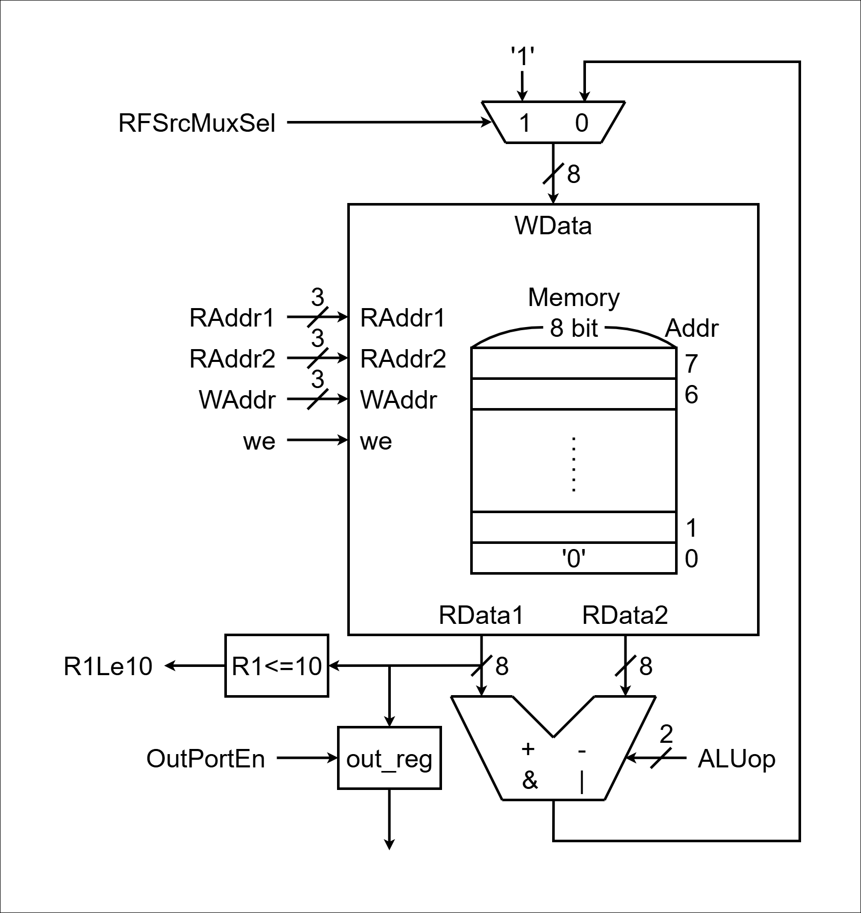

### < ASM >
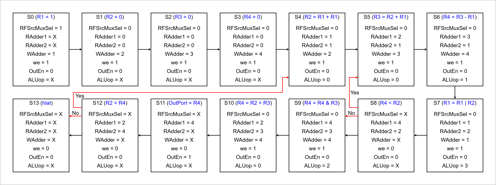

### < Code : ControlUnit >
```verilog
`timescale 1ns / 1ps

module ControlUnit (
    input  logic       clk,
    input  logic       reset,
    input  logic       lte,
    output logic       RFSrcMuxSel,
    output logic [2:0] RAddr1,
    output logic [2:0] RAddr2,
    output logic [2:0] WAddr,
    output logic       we,
    output logic       OutPortEn,
    output logic [1:0] ALUop
);

    typedef enum {
        S0,
        S1,
        S2,
        S3,
        S4,
        S5,
        S6,
        S7,
        S8,
        S9,
        S10,
        S11,
        S12,
        S13
    } state_e;

    state_e state, next_state;

    always_ff @(posedge clk, posedge reset) begin
        if (reset) begin
            state <= S0;
        end else begin
            state <= next_state;
        end
    end

    always_comb begin
        next_state  = state;
        RFSrcMuxSel = 0;
        RAddr1      = 4'd0;
        RAddr2      = 4'd0;
        WAddr       = 4'd0;
        we          = 0;
        OutPortEn   = 0;
        ALUop       = 4'd0;
        case (state)
            S0: begin  // R1 = 1
                RFSrcMuxSel = 1;
                RAddr1      = 4'd0;
                RAddr2      = 4'd0;
                WAddr       = 4'd1;
                we          = 1;
                OutPortEn   = 0;
                ALUop       = 4'd0;
                next_state  = S1;
            end
            S1: begin  // R2 = 0
                RFSrcMuxSel = 0;
                RAddr1      = 4'd0;
                RAddr2      = 4'd0;
                WAddr       = 4'd2;
                we          = 1;
                OutPortEn   = 0;
                ALUop       = 4'd0;
                next_state  = S2;
            end
            S2: begin  // R3 = 0
                RFSrcMuxSel = 0;
                RAddr1      = 4'd0;
                RAddr2      = 4'd0;
                WAddr       = 4'd3;
                we          = 1;
                OutPortEn   = 0;
                ALUop       = 4'd0;
                next_state  = S3;
            end
            S3: begin  // R4 = 0
                RFSrcMuxSel = 0;
                RAddr1      = 4'd0;
                RAddr2      = 4'd0;
                WAddr       = 4'd4;
                we          = 1;
                OutPortEn   = 0;
                ALUop       = 4'd0;
                next_state  = S4;
            end
            S4: begin  // R2 = R1 + R1
                RFSrcMuxSel = 0;
                RAddr1      = 4'd1;
                RAddr2      = 4'd1;
                WAddr       = 4'd2;
                we          = 1;
                OutPortEn   = 0;
                ALUop       = 4'd0;
                next_state  = S5;
            end
            S5: begin  // R3 = R2 + R1
                RFSrcMuxSel = 0;
                RAddr1      = 4'd2;
                RAddr2      = 4'd1;
                WAddr       = 4'd3;
                we          = 1;
                OutPortEn   = 0;
                ALUop       = 4'd0;
                next_state  = S6;
            end
            S6: begin  // R4 = R3 = R1
                RFSrcMuxSel = 0;
                RAddr1      = 4'd3;
                RAddr2      = 4'd1;
                WAddr       = 4'd4;
                we          = 1;
                OutPortEn   = 0;
                ALUop       = 4'd1;
                next_state  = S7;
            end
            S7: begin  // R1 = R1 | R2
                RFSrcMuxSel = 0;
                RAddr1      = 4'd1;
                RAddr2      = 4'd2;
                WAddr       = 4'd1;
                we          = 1;
                OutPortEn   = 0;
                ALUop       = 4'd3;
                next_state  = S8;
            end
            S8: begin  // R4 < R2
                RFSrcMuxSel = 0;
                RAddr1      = 4'd4;
                RAddr2      = 4'd2;
                WAddr       = 4'd0;
                we          = 0;
                OutPortEn   = 0;
                ALUop       = 4'd0;
                if (lte) next_state = S5;
                else next_state = S9;
            end
            S9: begin  // R4 = R4 & R3
                RFSrcMuxSel = 0;
                RAddr1      = 4'd4;
                RAddr2      = 4'd3;
                WAddr       = 4'd4;
                we          = 1;
                OutPortEn   = 0;
                ALUop       = 4'd2;
                next_state  = S10;
            end
            S10: begin  // R4 = R2 + R3
                RFSrcMuxSel = 0;
                RAddr1      = 4'd2;
                RAddr2      = 4'd3;
                WAddr       = 4'd4;
                we          = 1;
                OutPortEn   = 0;
                ALUop       = 4'd0;
                next_state  = S11;
            end
            S11: begin  // OutProt = R4
                RFSrcMuxSel = 0;
                RAddr1      = 4'd4;
                RAddr2      = 4'd0;
                WAddr       = 4'd0;
                we          = 0;
                OutPortEn   = 1;
                ALUop       = 4'd0;
                next_state  = S12;
            end
            S12: begin  // R2 < R4
                RFSrcMuxSel = 0;
                RAddr1      = 4'd2;
                RAddr2      = 4'd4;
                WAddr       = 4'd0;
                we          = 0;
                OutPortEn   = 0;
                ALUop       = 4'd0;
                if (lte) next_state = S4;
                else next_state = S13;
            end
            S13: begin  // half
                RFSrcMuxSel = 0;
                RAddr1      = 4'd0;
                RAddr2      = 4'd0;
                WAddr       = 4'd0;
                we          = 0;
                OutPortEn   = 0;
                ALUop       = 4'd0;
                next_state  = S13;
            end
        endcase
    end

endmodule
```

### < Code : Data Path >
```verilog
//...
module ALU (
    input  logic [1:0] sel,
    input  logic [7:0] a,
    input  logic [7:0] b,
    output logic [7:0] alu_result
);

    always_comb begin
        alu_result = a + b;
        case (sel)
            2'd0: alu_result = a + b;
            2'd1: alu_result = a - b;
            2'd2: alu_result = a & b;
            2'd3: alu_result = a | b;
        endcase
    end

endmodule
//...
```

### < Schematic >
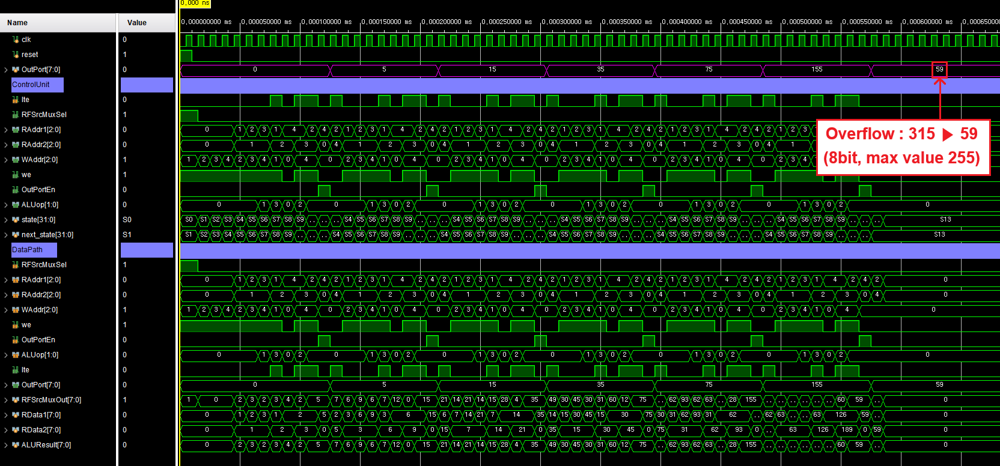

### < Comment >
**반복별 레지스터 값**
> 1회: R1=3,   R2=2,   R3=3,   R4=5   → Yes
> 2회: R1=7,   R2=6,   R3=9,   R4=15  → Yes
> 3회: R1=15,  R2=14,  R3=21,  R4=35  → Yes
> 4회: R1=31,  R2=30,  R3=45,  R4=75  → Yes
> 5회: R1=63,  R2=62,  R3=93,  R4=155 → Yes
> 6회: R1=127, R2=126, R3=189, R4=59  → **No ⇒ halt**

**첫 번째 반복**
> - 시작 값: (R1, R2, R3, R4) = (1, 0, 0, 0)
> - 계산 순서:
> R2 = R1 + R1 (1 + 1 = 2) ➞ (1, **2**, 0, 0)
> R3 = R2 + R1 (2 + 1 = 3) ➞ (1, 2, **3**, 0)
> R4 = R3 - R1 (3 - 1 = 2) ➞ (1, 2, 3, **2**)
> R1 = R1 | R2 (1 | 2 = 3) ➞ (**3**, 2, 3, 2)
> R4 = R4 & R3 (2 & 3 = 2) ➞ (3, 2, 3, **2**)
> R4 = R2 + R3 (2 + 3 = 5) ➞ (3, 2, 3, **5**)
> - 조건 확인: R4 > R2 (5 > 2) ➞ **Yes, 계속 진행**

**두 번째 반복**
> - 시작 값: (R1, R2, R3, R4) = (3, 2, 3, 5)
> - 계산 순서:
> R2 = R1 + R1 (3 + 3 = 6) ➞ (3, **6**, 3, 5)
> R3 = R2 + R1 (6 + 3 = 9) ➞ (3, 6, **9**, 5)
> R4 = R3 - R1 (9 - 3 = 6) ➞ (3, 6, 9, **6**)
> R1 = R1 | R2 (3 | 6 = 7) ➞ (**7**, 6, 9, 6)
> R4 = R4 & R3 (6 & 9 = 0) ➞ (7, 6, 9, **0**)
> R4 = R2 + R3 (6 + 9 = 15) ➞ (7, 6, 9, **15**)
> - 조건 확인: R4 > R2 (15 > 6) ➞ **Yes, 계속 진행**

**세 번째 반복**
> - 시작 값: (R1, R2, R3, R4) = (7, 6, 9, 15)
> - 계산 순서:
> R2 = R1 + R1 (7 + 7 = 14) ➞ (7, **14**, 9, 15)
> R3 = R2 + R1 (14 + 7 = 21) ➞ (7, 14, **21**, 15)
> R4 = R3 - R1 (21 - 7 = 14) ➞ (7, 14, 21, **14**)
> R1 = R1 | R2 (7 | 14 = 15) ➞ (**15**, 14, 21, 14)
> R4 = R4 & R3 (14 & 21 = 4) ➞ (15, 14, 21, **4**)
> R4 = R2 + R3 (14 + 21 = 35) ➞ (15, 14, 21, **35**)
> - 조건 확인: R4 > R2 (35 > 14) ➞ **Yes, 계속 진행**

**네 번째 반복**
> - 시작 값: (R1, R2, R3, R4) = (15, 14, 21, 35)
> - 계산 순서:
> R2 = R1 + R1 (15 + 15 = 30) ➞ (15, **30**, 21, 35)
> R3 = R2 + R1 (30 + 15 = 45) ➞ (15, 30, **45**, 35)
> R4 = R3 - R1 (45 - 15 = 30) ➞ (15, 30, 45, **30**)
> R1 = R1 | R2 (15 | 30 = 31) ➞ (**31**, 30, 45, 30)
> R4 = R4 & R3 (30 & 45 = 12) ➞ (31, 30, 45, **12**)
> R4 = R2 + R3 (30 + 45 = 75) ➞ (31, 30, 45, **75**)
> - 조건 확인: R4 > R2 (75 > 30) ➞ **Yes, 계속 진행**

**다섯 번째 반복**
> - 시작 값: (R1, R2, R3, R4) = (31, 30, 45, 75)
> - 계산 순서:
> R2 = R1 + R1 (31 + 31 = 62) ➞ (31, **62**, 45, 75)
> R3 = R2 + R1 (62 + 31 = 93) ➞ (31, 62, **93**, 75)
> R4 = R3 - R1 (93 - 31 = 62) ➞ (31, 62, 93, **62**)
> R1 = R1 | R2 (31 | 62 = 63) ➞ (**63**, 62, 93, 62)
> R4 = R4 & R3 (62 & 93 = 28) ➞ (63, 62, 93, **28**)
> R4 = R2 + R3 (62 + 93 = 155) ➞ (63, 62, 93, **155**)
> - 조건 확인: R4 > R2 (155 > 62) ➞ **Yes, 계속 진행**

**여섯 번째 반복 (마지막)**
- 시작 값: (R1, R2, R3, R4) = (63, 62, 93, 155)
- 계산 순서
> R2 = R1 + R1 (63 + 63 = 126) ➞ (63, **126**, 93, 155)
> R3 = R2 + R1 (126 + 63 = 189) ➞ (63, 126, **189**, 155)
> R4 = R3 - R1 (189 - 63 = 126) ➞ (63, 126, 189, **126**)
> R1 = R1 | R2 (63 | 126 = 127) ➞ (**127**, 126, 189, 126)
> R4 = R4 & R3 (126 & 189 = 120) ➞ (127, 126, 189, **120**)
> R4 = R2 + R3 (126 + 189 = 315) ➞ (127, 126, 189, **59**)
> - 조건 확인: R4 > R2 (59 > 126) ➞ **No, 중단 (Halt)**
> - 8bit Wrapping (오버플로우): 8비트 레지스터는 255까지만 표현 가능하므로, 315는 256을 뺀 나머지 값인 59가 된다.

### < 파일 >
> **sources** (Homework)
> - [ControlUnit.sv](<../../assets/source file/250812/250812_HW#2/ControlUnit.sv>)
> - [DataPath.sv](<../../assets/source file/250812/250812_HW#2/DataPath.sv>)
> - [DedicatedProcessor.sv](<../../assets/source file/250812/250812_HW#2/DedicatedProcessor.sv>)

> **simulation** (Homework)
> - [DedicatedProcessor_tb.sv](<../../assets/source file/250812/250812_HW#2/DedicatedProcessor_tb.sv>)
