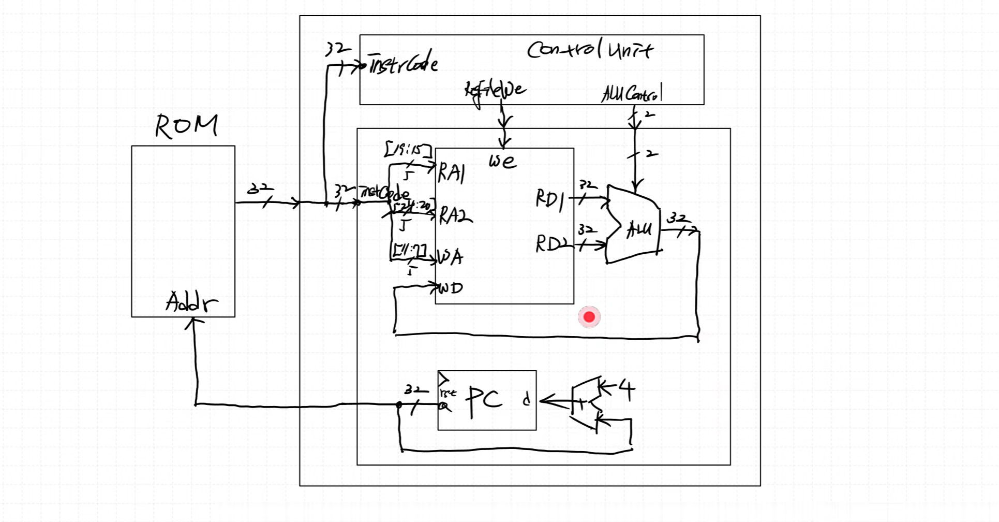
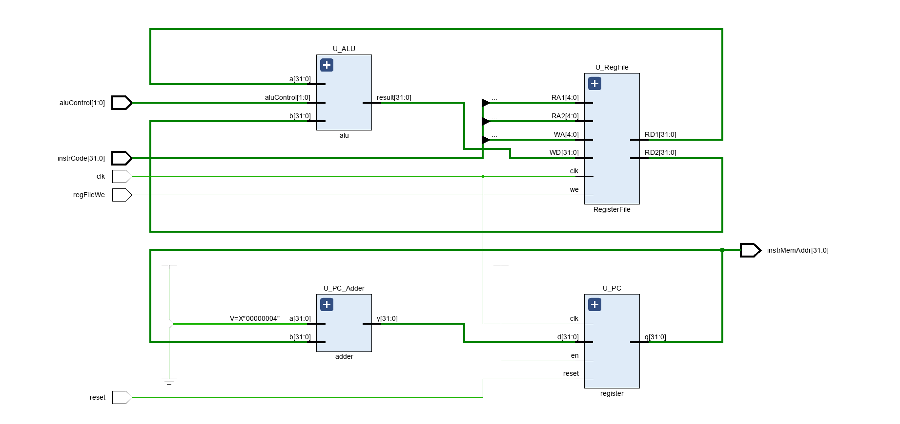
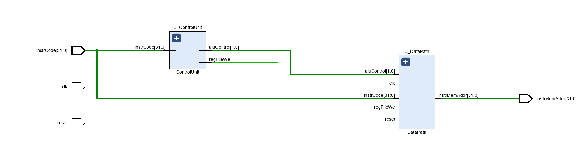
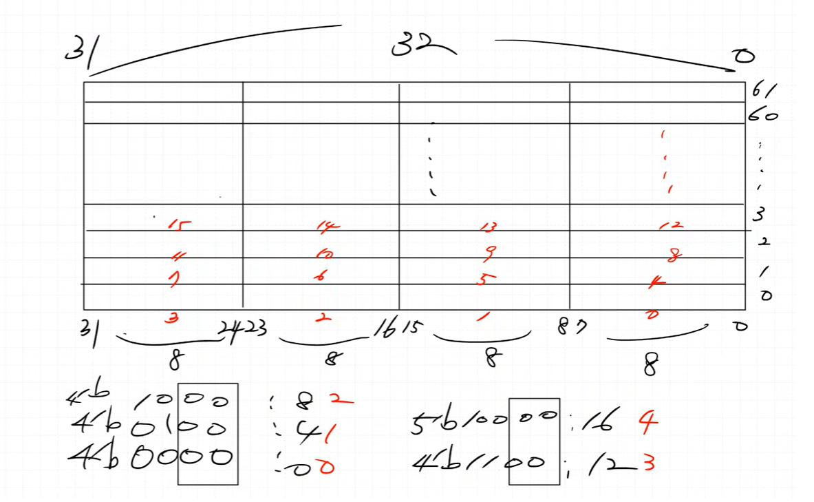
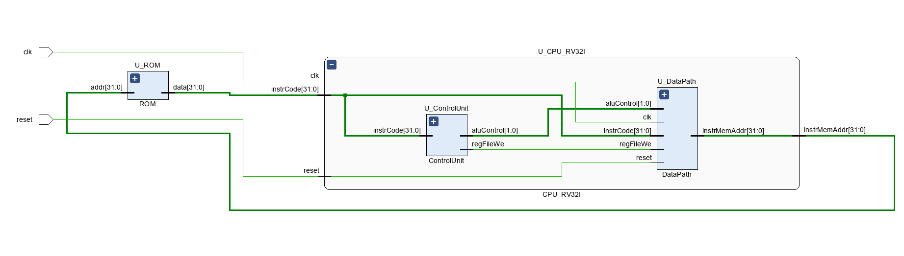
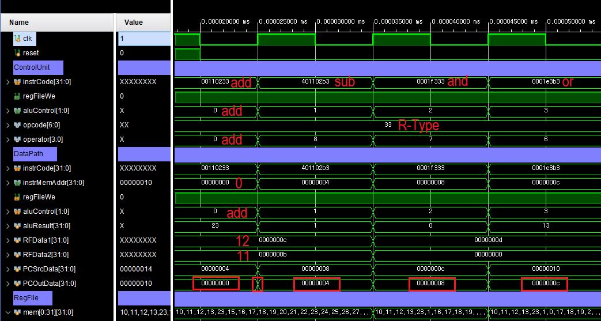
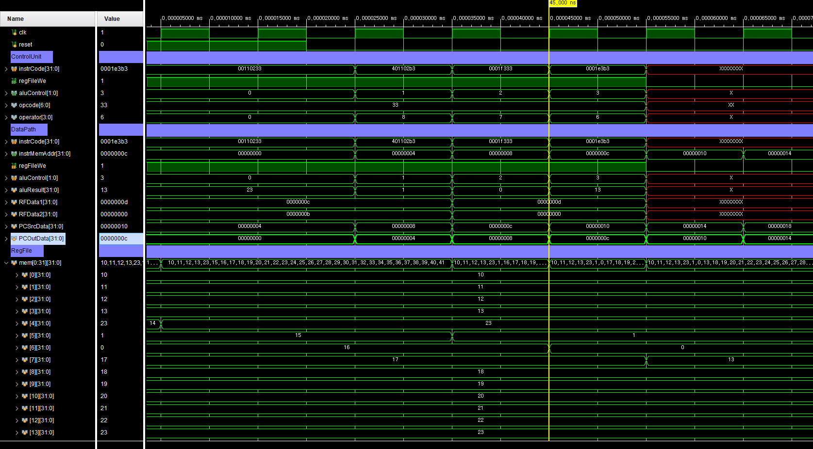
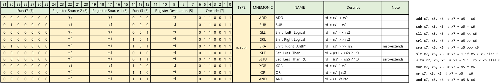
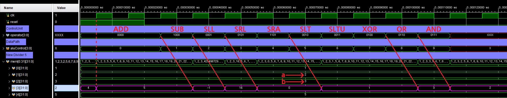

# RISC-V Design
---
### RISC-V (리스크 파이브)
2010년부터 미국 UC 버클리에서 개발 중인 무료 오픈 소스 RISC 명령어셋 아키텍처
- Base: RV32I
- Version: 2.0

### 1. Single-Cycle Architecture
- 모든 명령어가 **1 clock**에 동작
- 가장 시간이 오래 걸리는 명령어를 기준으로 클럭 주기를 설계해야 함
- 장점: 구조가 매우 단순함
- 단점: 전체 실행 속도가 느림

### 2. Multi-Cycle Architecture
- 명령어 유형(type)에 따라 필요한 clock 수가 다름
- 명령어에 따라 실행 시간을 단축할 수 있음
- 장점: Single-Cycle보다 빠름
- 단점: 구조가 다소 복잡함

### 구현 목표
① Single-Cycle로 먼저 구현 및 이해
② Multi-Cycle로 전환 + ARMA BUS + 주변장치(Peripherals) 연동

### 3. Pipeline Architecture (현재 구현 X)
- 장점: Single-Cycle보다 훨씬 빠름
- 단점: 구조가 매우 복잡함


- x0 → zero : 항상 0 값을 가지는 레지스터
- x1 → ra (Return Address) : 함수 호출 후 복귀 주소 저장
- x2 → sp (Stack Pointer) : 스택의 최상단 주소 저장
- x3 → gp (Global Pointer) : 전역 변수 접근용 포인터
- ... (이후 x31까지 각자 용도 지정)
→ 어셈블리어에서는 x0, x1 대신 zero, ra, sp, gp 등의 별칭(alias)으로 표기됨


### CPU 기본 모듈 (하버드 구조)
- Register File
→ CPU 내부 레지스터 집합, 연산 및 데이터 임시 저장
- ALU (Arithmetic Logic Unit)
→ 산술 및 논리 연산 수행
- ROM / Flash (Instruction Memory)
→ 프로그램 명령어 저장
※ ROM은 한 번 쓰면 지울 수 없으므로, 대부분 Flash 메모리(비휘발성) 사용
- RAM (Data Memory)
→ 프로그램 실행 중 데이터 임시 저장 (휘발성)
- PC (Program Counter)
→ 현재 실행 중인 명령어의 주소를 가리키는 레지스터


Instruction, CPU, RAM 까지 Single-Cycle 구현
Peri는 Multi-Cycle 이후 구현

### Block Diagram


### Signal 이해


- Register Source 1 (5) : 5bit RS1
- Register Source 2 (5) : 5bit RS2
- Register Destination (5) : 5bit RD
- Opcode (7) : 7bit type 구분
- Funct7 (7) : 7bit 연산 구분
- Funct3 (3) : 3bit 연산 구분


ADD : rd(WAddr) = rs1(RA1) + rs2(RA2) / add : x7(rd), x5(rs1), x6(rs2) = x7 = x5(Data) + x6(Data)


### < Data Path >


### < Code : Data Path >
```verilog
`timescale 1ns / 1ps

module DataPath (
    input  logic        clk,
    input  logic        reset,
    input  logic [31:0] instrCode,
    input  logic        regFileWe,
    input  logic [ 1:0] aluControl,
    output logic [31:0] instrMemAddr
);

    logic [31:0] aluResult, RFData1, RFData2;
    logic [31:0] PCSrcData, PCOutData;

    assign instrMemAddr = PCOutData;

    RegisterFile U_RegFile (
        .clk(clk),
        .we (regFileWe),
        .RA1(instrCode[19:15]),
        .RA2(instrCode[24:20]),
        .WA (instrCode[11:7]),
        .WD (aluResult),
        .RD1(RFData1),
        .RD2(RFData2)
    );

    alu U_ALU (
        .aluControl(aluControl),
        .a         (RFData1),
        .b         (RFData2),
        .result    (aluResult)
    );

    register U_PC (
        .clk  (clk),
        .reset(reset),
        .en   (1'b1),
        .d    (PCSrcData),
        .q    (PCOutData)
    );

    adder U_PC_Adder (
        .a(32'd4),
        .b(PCOutData),
        .y(PCSrcData)
    );

endmodule


module alu (
    input  logic [ 1:0] aluControl,
    input  logic [31:0] a,
    input  logic [31:0] b,
    output logic [31:0] result
);

    always_comb begin
        result = a + b;
        case (aluControl)
            2'b00: result = a + b;
            2'b01: result = a - b;
            2'b10: result = a & b;
            2'b11: result = a | b;
        endcase
    end

endmodule


module RegisterFile (
    input  logic        clk,
    input  logic        we,
    input  logic [ 4:0] RA1,
    input  logic [ 4:0] RA2,
    input  logic [ 4:0] WA,
    input  logic [31:0] WD,
    output logic [31:0] RD1,
    output logic [31:0] RD2
);

    logic [31:0] mem[0:2**5-1];

    always_ff @(posedge clk) begin
        if (we) mem[WA] <= WD;
    end

    assign RD1 = (RA1 != 0) ? mem[RA1] : 32'b0;
    assign RD2 = (RA2 != 0) ? mem[RA2] : 32'b0;

endmodule


module register (
    input  logic        clk,
    input  logic        reset,
    input  logic        en,
    input  logic [31:0] d,
    output logic [31:0] q
);

    always_ff @(posedge clk, posedge reset) begin
        if (reset) begin
            q <= 0;
        end else begin
            if (en) q <= d;
        end
    end

endmodule


module adder (
    input  logic [31:0] a,
    input  logic [31:0] b,
    output logic [31:0] y
);

    assign y = a + b;

endmodule
```

### < Schematic : DataPath >


### < Code : Control Unit >
```verilog
`timescale 1ns / 1ps

module ControlUnit (
    input  logic [31:0] instrCode,
    output logic        regFileWe,
    output logic [ 1:0] aluControl
);

    // logic 은 선언하면서 연결이 안되기 때문에 wire 사용 (logic 사용시 assign 필요)
    wire [6:0] opcode = instrCode[6:0];
    wire [3:0] operator = {instrCode[30], instrCode[14:12]};

    always_comb begin
        regFileWe = 1'b0;
        case (opcode)
            7'b0110011: regFileWe = 1'b1; 
        endcase
    end

    always_comb begin
        aluControl = 2'bx;
        case (opcode)
            7'b0110011: begin // R-Type
                aluControl = 2'bx;
                case (operator)
                    4'b0000: aluControl = 2'b00; // add
                    4'b1000: aluControl = 2'b01; // sub
                    4'b0111: aluControl = 2'b10; // and 
                    4'b0110: aluControl = 2'b11; // or
                endcase
            end 
        endcase
    end

endmodule
```

### < Code : CPU_RV32I >
```verilog
`timescale 1ns / 1ps

module CPU_RV32I (
    input  logic        clk,
    input  logic        reset,
    input  logic [31:0] instrCode,
    output logic [31:0] instrMemAddr
);

    logic       regFileWe;
    logic [1:0] aluControl;

    ControlUnit U_ControlUnit (.*);
    DataPath U_DataPath (.*);

endmodule
```

### < Schematic : CPU_RV32I >


### < Code : ROM >


```verilog
`timescale 1ns / 1ps

module ROM (
    input  logic [31:0] addr,
    output logic [31:0] data
);

    logic [31:0] rom[0:61];

    initial begin
        //rom[x]=32'b func7 _ rs2 _ rs1 _f3 _ rd  _  op
        rom[0] = 32'b0000000_00001_00010_000_00100_0110011;  // add x4, x2, x1
        rom[1] = 32'b0100000_00001_00010_000_00101_0110011;  // sub x5, x2, x1
        rom[2] = 32'b0000000_00000_00011_111_00110_0110011;  // and x6, x3, x0
        rom[3] = 32'b0000000_00000_00011_110_00111_0110011;  // or  x7, x3, x0
    end

    // 하위 2bit 를 없애면 4(2^2)의 배수로 표현이 됨, 4byte 단위로 이동 가능
    assign data = rom[addr[31:2]];

endmodule
```

### < Code : MCU >
```verilog
`timescale 1ns / 1ps

module MCU (
    input logic clk,
    input logic reset
);

    logic [31:0] instrCode;
    logic [31:0] instrMemAddr;

    ROM U_ROM (
        .addr(instrMemAddr),
        .data(instrCode)
    );

    CPU_RV32I U_CPU_RV32I (.*);

endmodule
```

### < Schematic : MCU >


### < Simulation >



### < 파일 >
> **sources** (Class)
> - [MCU.sv](<../../assets/source file/250814/250814_Class/MCU.sv>)
> - [ROM.sv](<../../assets/source file/250814/250814_Class/ROM.sv>)
> - [CPU_RV32I.sv](<../../assets/source file/250814/250814_Class/CPU_RV32I.sv>)
> - [ControlUnit.sv](<../../assets/source file/250814/250814_Class/ControlUnit.sv>)
> - [DataPath.sv](<../../assets/source file/250814/250814_Class/DataPath.sv>)

> **sim** (Class)
> - [RV32I_tb.sv](<../../assets/source file/250814/250814_Class/RV32I_tb.sv>)

# HW
---
### < Design Specification >


> - RISC-V RV32I R-Type 명령어 설계

### < Code : DataPath (alu) >
```verilog
//...
module alu (
    input  logic [ 3:0] aluControl,
    input  logic [31:0] a,
    input  logic [31:0] b,
    output logic [31:0] result
);

    always_comb begin
        result = 32'b0;
        case (aluControl)
            4'b0000: result = a + b;
            4'b0001: result = a - b;
            4'b0010: result = a << b;
            4'b0011: result = a >> b;
            4'b0100: result = a >>> b;
            4'b0101: result = ($signed(a) < $signed(b)) ? 1 : 0;
            4'b0110: result = (a < b) ? 1 : 0;
            4'b0111: result = a ^ b;
            4'b1000: result = a | b;
            4'b1001: result = a & b;
        endcase
    end

endmodule
//...
```

### < Code : ControlUnit >
```verilog
`timescale 1ns / 1ps

module ControlUnit (
    input  logic [31:0] instrCode,
    output logic        regFileWe,
    output logic [ 3:0] aluControl
);

    // logic 은 선언하면서 연결이 안되기 때문에 wire 사용 (logic 사용시 assign 필요)
    wire [6:0] opcode = instrCode[6:0];
    wire [3:0] operator = {instrCode[30], instrCode[14:12]};

    always_comb begin
        regFileWe = 1'b0;
        case (opcode)
            7'b0110011: regFileWe = 1'b1; 
        endcase
    end

    always_comb begin
        aluControl = 4'bx;
        case (opcode)
            7'b0110011: begin // R-Type
                aluControl = 4'bx;
                case (operator)
                    4'b0000: aluControl = 4'b0000; // ADD
                    4'b1000: aluControl = 4'b0001; // SUB
                    4'b0001: aluControl = 4'b0010; // SLL
                    4'b0101: aluControl = 4'b0011; // SRL
                    4'b1101: aluControl = 4'b0100; // SRA
                    4'b0010: aluControl = 4'b0101; // SLT
                    4'b0011: aluControl = 4'b0110; // SLTU
                    4'b0100: aluControl = 4'b0111; // XOR
                    4'b0110: aluControl = 4'b1000; // OR
                    4'b0111: aluControl = 4'b1001; // AND
                endcase
            end 
        endcase
    end

endmodule
```

### < Code : ROM >
```verilog
`timescale 1ns / 1ps

module ROM (
    input  logic [31:0] addr,
    output logic [31:0] data
);

    logic [31:0] rom[0:61];

    initial begin
        //rom[x]=32'b func7 _ rs2 _ rs1 _f3 _ rd  _  op
        rom[0] = 32'b0000000_00010_00001_000_00011_0110011;  // add  x3, x1, x2
        rom[1] = 32'b0100000_00010_00001_000_00011_0110011;  // sub  x3, x1, x2
        rom[2] = 32'b0000000_00010_00001_001_00011_0110011;  // sll  x3, x1, x2
        rom[3] = 32'b0000000_00010_00001_101_00011_0110011;  // srl  x3, x1, x2
        rom[4] = 32'b0100000_00010_00001_101_00011_0110011;  // sra  x3, x1, x2
        rom[5] = 32'b0000000_00010_00001_010_00011_0110011;  // slt  x3, x1, x2
        rom[6] = 32'b0000000_00010_00001_011_00011_0110011;  // sltu x3, x1, x2
        rom[7] = 32'b0000000_00010_00001_100_00011_0110011;  // xor  x3, x1, x2
        rom[8] = 32'b0000000_00010_00001_110_00011_0110011;  // or   x3, x1, x2
        rom[9] = 32'b0000000_00010_00001_111_00011_0110011;  // and  x3, x1, x2
    end


    // 하위 2bit 를 없애면 4(2^2)의 배수로 표현이 됨, 4byte 단위로 이동 가능
    assign data = rom[addr[31:2]];

endmodule
```

### < Simulation >


### < 파일 >
> **sources** (HW)
> - [MCU](<../../assets/source file/250814/250814_HW/MCU.sv>)
> - [ROM](<../../assets/source file/250814/250814_HW/ROM.sv>)
> - [CPU_RV32I](<../../assets/source file/250814/250814_HW/CPU_RV32I.sv>)
> - [ControlUnit](<../../assets/source file/250814/250814_HW/ControlUnit.sv>)
> - [DataPath](<../../assets/source file/250814/250814_HW/DataPath.sv>)

> **sim** (HW)
> - [RV32I_tb](<../../assets/source file/250814/250814_HW/RV32I_tb.sv>)