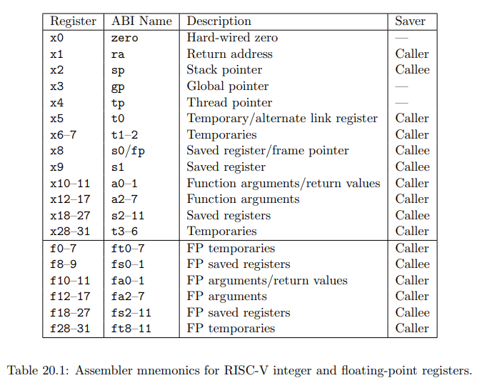
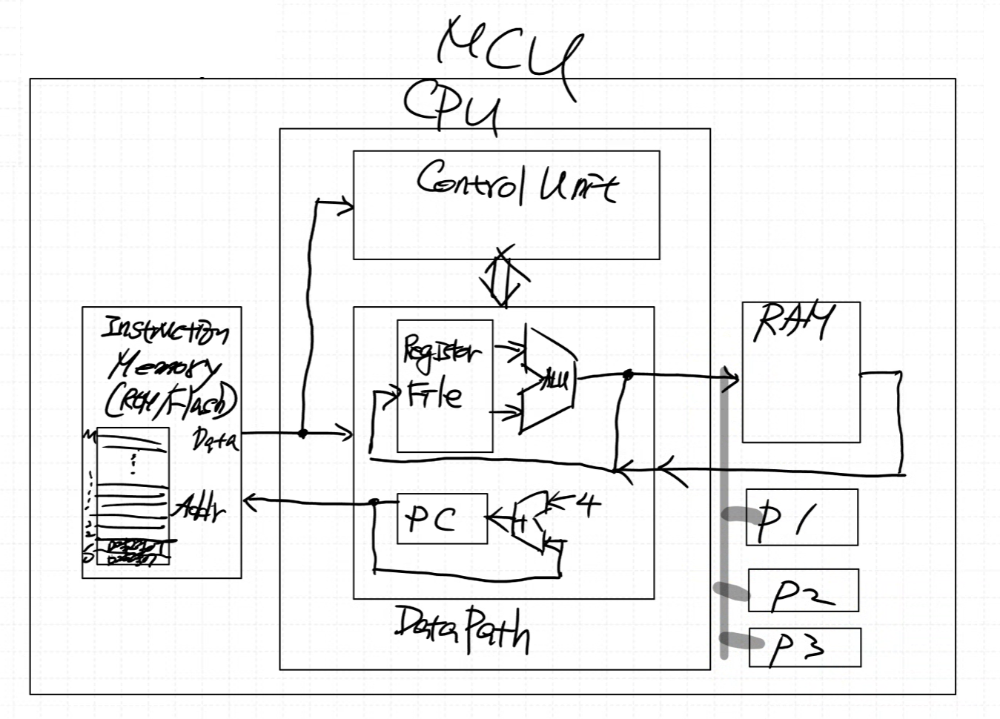
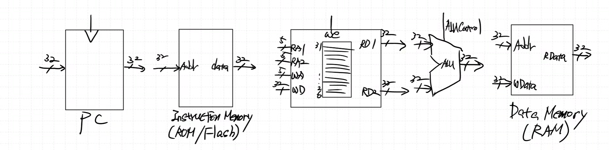
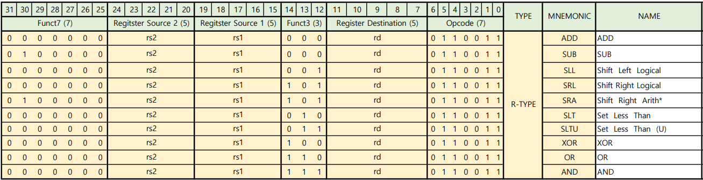
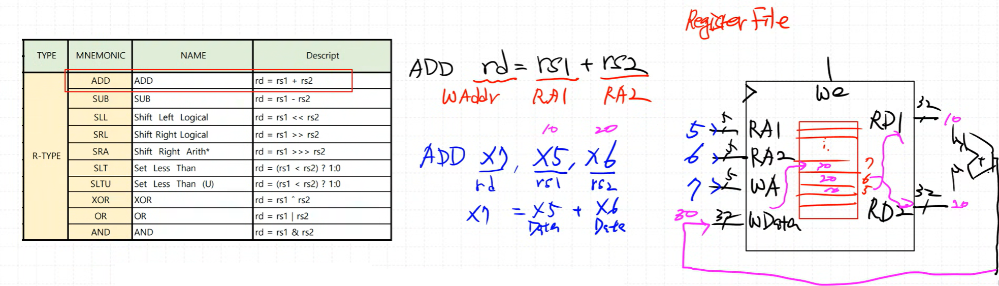
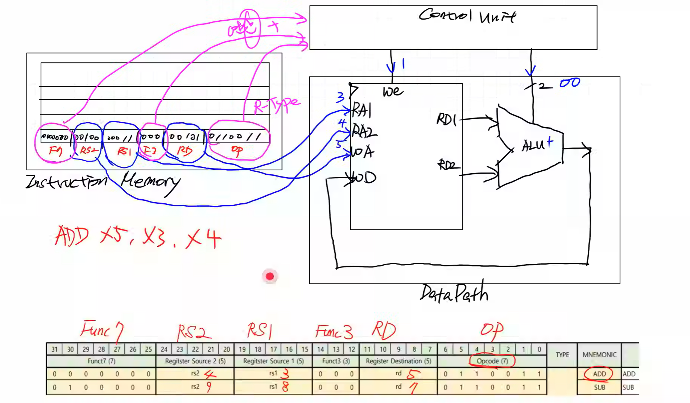

### RISC-V (리스크 파이브)
2010년부터 미국 UC 버클리에서 개발 중인 무료 오픈 소스 RISC 명령어셋 아키텍처
- Base: RV32I
- Version: 2.0

### 1. Single-Cycle Architecture
- 모든 명령어가 **1 clock**에 동작
- 가장 시간이 오래 걸리는 명령어를 기준으로 클럭 주기를 설계해야 함
- 장점: 구조가 매우 단순함
- 단점: 전체 실행 속도가 느림

### 2. Multi-Cycle Architecture
- 명령어 유형(type)에 따라 필요한 clock 수가 다름
- 명령어에 따라 실행 시간을 단축할 수 있음
- 장점: Single-Cycle보다 빠름
- 단점: 구조가 다소 복잡함

### 구현 목표
① Single-Cycle로 먼저 구현 및 이해
② Multi-Cycle로 전환 + ARMA BUS + 주변장치(Peripherals) 연동

### 3. Pipeline Architecture (현재 구현 X)
- 장점: Single-Cycle보다 훨씬 빠름
- 단점: 구조가 매우 복잡함

- x0 → zero : 항상 0 값을 가지는 레지스터
- x1 → ra (Return Address) : 함수 호출 후 복귀 주소 저장
- x2 → sp (Stack Pointer) : 스택의 최상단 주소 저장
- x3 → gp (Global Pointer) : 전역 변수 접근용 포인터
- ... (이후 x31까지 각자 용도 지정)
→ 어셈블리어에서는 x0, x1 대신 zero, ra, sp, gp 등의 별칭(alias)으로 표기됨

### CPU 기본 모듈 (하버드 구조)
- Register File
→ CPU 내부 레지스터 집합, 연산 및 데이터 임시 저장
- ALU (Arithmetic Logic Unit)
→ 산술 및 논리 연산 수행
- ROM / Flash (Instruction Memory)
→ 프로그램 명령어 저장
※ ROM은 한 번 쓰면 지울 수 없으므로, 대부분 Flash 메모리(비휘발성) 사용
- RAM (Data Memory)
→ 프로그램 실행 중 데이터 임시 저장 (휘발성)
- PC (Program Counter)
→ 현재 실행 중인 명령어의 주소를 가리키는 레지스터

Instruction, CPU, RAM 까지 Single-Cycle
Peri는 Multi-Cycle 이후

### Block Diagram

### Signal 이해

- Register Source 1 (5) : 5bit RS1
- Register Source 2 (5) : 5bit RS2
- Register Destination (5) : 5bit RD
- Opcode (7) : 7bit type 구분
- Funct7 (7) : 7bit
- Funct3 (3) : 3bit 

ADD : rd(WAddr) = rs1(RA1) + rs2(RA2) / add : x7(rd), x5(rs1), x6(rs2) = x7 = x5(Data) + x6(Data)

### Data Path

