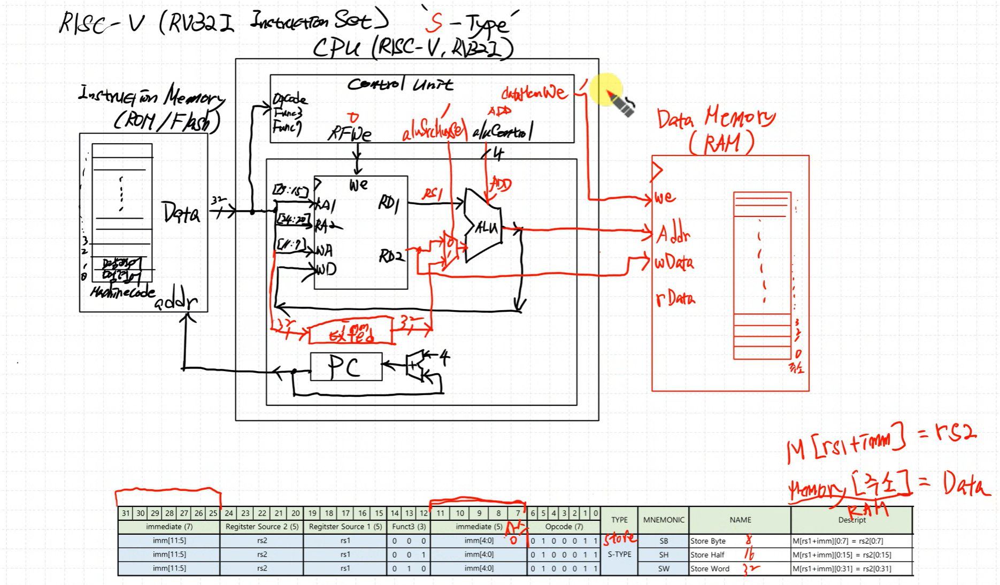

### RISC-V (RV32I Instruction Set) 'R-Type'
RA1 : “Read Address 1” — 읽을 레지스터의 주소(번호). rs1(명령어 [19:15])가 들어감. 5비트.
RA2 : “Read Address 2” — 읽을 레지스터의 주소(번호). rs2(명령어 [24:20])가 들어감. 5비트.
WA : “Write Address” — 쓸 레지스터의 주소(번호). rd(명령어 [11:7]). 5비트.
RD1 : “Read Data 1” — x[rs1]에서 읽혀 나온 데이터. ALU 피연산자 a로 연결.
RD2 : “Read Data 2” — x[rs2]에서 읽혀 나온 데이터. ALU 피연산자 b로 연결.
WD : “Write Data” — 쓸 데이터. R-type이면 보통 ALU 결과(aluResult).
we : “Write Enable” — 클록 상승엣지에 we=1이면 x[WA] ← WD로 기록.

Instruction Memory(ROM/Flash) : 명령어를 저장하고 PC가 지정한 주소의 명령어를 읽어준다.
PC(Program Counter) : 현재 명령어의 주소를 보관하고 다음 주소(보통 PC+4 또는 분기/점프)를 제시한다.
Control Unit : opcode(+funct3/7)를 해독해 ALU·레지스터·메모리·PC 제어 신호(aluControl 등)를 생성한다.

효율적이고 범용적인 명령어를 만들기 위해 교수님과 같이 R-Type 설계
I_Type과 동일한 funtion 부분이 몇 군데 보임

ControlUnit 에서 operator 값과 aluControl 신호가 동일하므로 R-Type 이면 aluControl = operator
→ 7'b0110011: aluControl = operator;

가독성을 높이기 위해 defines.sv 생성
→ `include "defines.sv"

### S-Type (Store) 설계, RAM 필요
- R-Type(산술/논리): 레지스터끼리만 연산해 결과를 다시 레지스터에 씀. 실행 중 “데이터 메모리”를 읽거나 쓰지 않음. 필요한 메모리는 **명령을 읽어오는 Instruction Memory(보통 ROM/Flash)**뿐.
- S-Type(Store): 레지스터 값을 데이터 메모리로 저장(쓰기) 해야 함. 실행 중 내용이 바뀌어야 하므로 **쓰기 가능한 메모리(RAM)**가 필수.

Descript : Memory[주소] = Data ↔ M[rs1+imm] = rs2 (Memory[주소]=RAM, imm=상수)
imm exted : 부호비트를 생각해서 처리, imm=opset 값, 해당 주소로부터 올라갈(+) 수도 있고 내려갈(-) 수도 있음, 비트부호 확장 필요, 최상위 비트를 20번 copy 