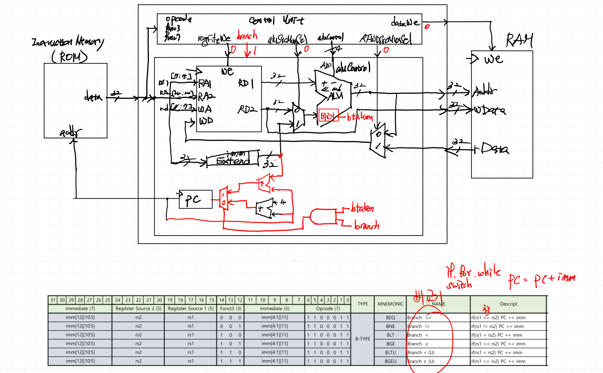
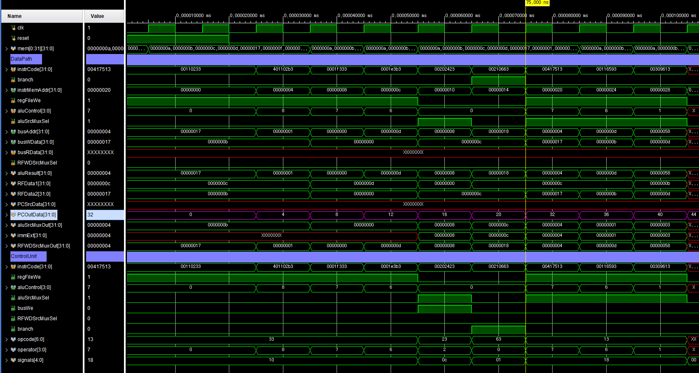

### RISC-V I-TYPE Review


funct3 를 통해 SLTI, SLTIU 구분 해야함
SLTI 경우 부호비트를 생각해서 늘려줘야 함
shift 는 전부 unsigned, 그래서 SLTIU 도 immExtend 에서 같이 처리

```verilog
/*** immExtend ***/

    `OP_TYPE_I: begin
        case (func3)
            3'b001: immExt = {27'b0, instrCode[24:20]}; // SLLI
            3'b011: immExt = {20'b0, instrCode[31:20]}; // SRLI, SRAI
            3'b101: immExt = {27'b0, instrCode[24:20]}; // SLTIU
            default:immExt = {{20{instrCode[31]}}, instrCode[31:20]};
        endcase                
    end 
```

```verilog
/*** ROM ***/

    //rom[x]=32'b imm12      _ rs1 _f3 _ rd  _ op // I-Type
    rom[6] = 32'b000000000001_00001_000_01001_0010011;// addi x9, x1, 1 
    rom[7] = 32'b000000000100_00010_111_01010_0010011;// andi x10, x2, 4 
    rom[8] = 32'b000000000001_00010_110_01011_0010011;// ori x11, x2, 1 
    rom[9] = 32'b000000000011_00001_001_01100_0010011;// slli x12, x1, 1 → 2b00001000 << 3 = 11 * 2^3  = 88
```

왼쪽 쉬프트: x << n = x × 2ⁿ
오른쪽 쉬프트: x >> n = floor(x ÷ 2ⁿ)


### RISC-V B-TYPE


비교해서 점프하겠다. 결국 명령어의 주소를 바꾸겠다는 뜻.
PC의 값을 바꾸면 나오는 명령어가 바뀜 = Branch (C언어: if, for, while, switch 등)
(rs1, rs2로 연산하기 위해) ALU 안에 비교기 처리

```verilog
/*** ControlUnit ***/

    `OP_TYPE_B: aluControl = operator;
```

```verilog
/*** alu ***/

    always_comb begin : branch
        btaken = 1'b0;
        case (aluControl[2:0])
            `BEQ:  btaken = (a == b);
            `BNE:  btaken = (a != b);
            `BLT:  btaken = ($signed(a) < $signed(b));
            `BGE:  btaken = ($signed(a) >= $signed(b));
            `BLTU: btaken = (a < b);
            `BGEU: btaken = (a >= b);
        endcase
    end
```

```verilog
/*** DataPath ***/
    logic [3:0] PC_4_AdderResult, PC_Imm_AdderResult, PCSrcMuxOut;
    logic PCSrcMuxSel;
    logic btaken;

    adder U_PC_Imm_Adder (
        .a(immExt),
        .b(PCOutData),
        .y(PC_Imm_AdderResult)
    );

    adder U_PC_4_Adder (
        .a(32'd4),
        .b(PCOutData),
        .y(PC_4_AdderResult)
    );

    assign PCSrcMuxSel = btaken & branch;

    mux_2x1 U_PCSrcMux (
        .sel(PCSrcMuxSel),
        .x0 (PC_4_AdderResult),
        .x1 (PC_Imm_AdderResult),
        .y  (PCSrcMuxOut)
    );
```

> ROM[n] : n*4 씩 이동

### ROM[5] 참 -> rom[8] 점프 (20->32) 
```verilog
/*** ROM ***/

    //rom[x]=32'b imm7  _ rs2 _ rs1 _f3 _ imm5_ op // B-Type
    rom[5] = 32'b0000000_00010_00010_000_01100_1100011;  // beq x2, x2, 12 
    //rom[x]=32'b imm12      _ rs1 _f3 _ rd  _ op // L-Type
    rom[6] = 32'b000000001000_00000_010_01000_0000011;  // lw x8, 8(x0)
    //rom[x]=32'b imm12      _ rs1 _f3 _ rd  _ op // I-Type
    rom[7] = 32'b000000000001_00001_000_01001_0010011;  // addi x9, x1, 1 
    rom[8] = 32'b000000000100_00010_111_01010_0010011;  // andi x10, x2, 4 
```



### ROM[5] 거짓 -> rom[8] (20->24)
```verilog
/*** ROM ***/

    //rom[x]=32'b imm7  _ rs2 _ rs1 _f3 _ imm5_ op // B-Type
    rom[5] = 32'b0000000_00010_00000_000_01100_1100011;  // beq x2, x0, 12 
    //rom[x]=32'b imm12      _ rs1 _f3 _ rd  _ op // L-Type
    rom[6] = 32'b000000001000_00000_010_01000_0000011;  // lw x8, 8(x0)
```


### 규칙성


Imm의 공통 bit를 최대한 똑같은 위치에 맞춘다.
L, I, S, B, J, JL Type 에서 최대한 같은 위치의 Imm bit 위치를 같게 한다.
H/W 최적화에 도움이 된다.
B, J Type의 경우 Imm값이 ROM(PC)주소의 offset값이 된다.
ROM의 주소는 항상 짝수가 되므로 imm[0]은 항상 '0'값이 된다.
그러므로 B, J Type에서 imm[0]이 없이 강제로 '0'을 넣어줘도 된다.
그 효과는 offset 범위값을 넓힐 수 있다.
명령어가 입력된 ROM의 주소 특징은 4의 배수이다.
imm 12bit 고정. 최대값 주소범위를 넓히고 싶다.

### RISC-V LU, AU, J, JL-TYPE
C언어로 if문 해서 점프, 컴파일러에서 만들어줌

