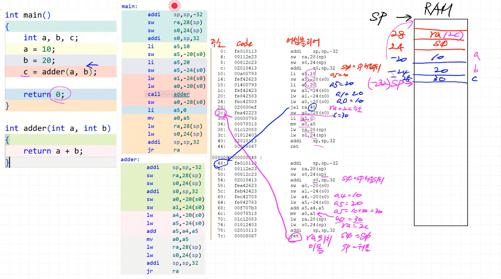

### RV32I_All_Type Single_Cycle

완성

### RV32I_All_Type Multi_Cycle

I-Type path 가장 오래 걸림, 여러 클럭에 나눠서 처리

온라인 C-Compiler : https://godbolt.org/
(좌) C / (우) RISC-V (32-bits) gcc (trunk)

온라인 Assembler : https://riscvasm.lucasteske.dev/

RISC-V 명령어 분석기 (Decoder/Encoder) : https://luplab.gitlab.io/rvcodecjs/

동적 메모리 할당하는 영역이 heap 영역
변수나 함수는 stack 영역에 할당
메모리의 가장 꼭대기는 stack 영역
stack 영역의 시작점은 RAM의 가장 꼭대기. RAM 마지막주소 + 1 

C언어에 대한 메모리구조 파악 필요
ra : return address (함수가 끝나면 그 위치로 돌아가야함, 그 위치 저옵)
s0 를 RAM에 저장
s0에 sp 시작위치 저장

a5 = 10
s0(꼭대기)를 20 떨어트려서 10(a5 값)을 저장함

a5 = 20
s0(꼭대기)를 24 떨어트려서 20(a5 값)을 저장함

lw : a4에 10을 넣어줌
lw : a5에 20을 넣어줌
add : a5 = a4 + 15 = 30
30 넣어줌

li : a5 = 0

a0 = 0
ra = RAM에 저장된 ra값
s0 = RAM에 저장된 s0값
sp 초기위치
ra 위치로 점프

