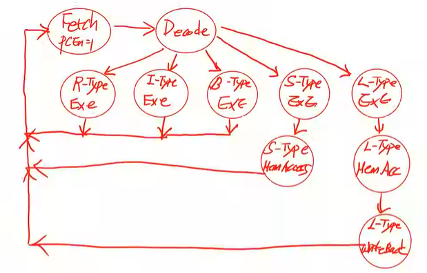

# Multi Cycle 
---
### single cycle 흐름

PC -(주소)-> ROM -(명령어)-> RegFile, ControlUnit(Decoding->SignalOut) -> ALU -> RAM -> Regfile

가장 긴 Path의 경우, 1 클럭동안 ALU 입력신호와 ControlUnit 에서 내보내는 신호를 같이 받아서 RAM 으로 가서 메모리 access 후 RAM 에서 나온 결과가 RegFile 에 들어감. -> 클럭 길이가 너무 길다

조합회로가 5개 있다고 가정하고 각 회로마다 10ns 시간이 걸린다면 클럭을 아무리 줄여도 최도한 50ns 이상 되어야한다.

중간에 FF 을 둔다고 가정하고 이는 1ns 시간이 걸린다면 전체를 통과하는데 걸리는 시간이 56ns + a 필요

Fetch : 명령어를 빼내는 동작 (ROM 입출력 + PC 출력)
Decode : opcode 분석 (ImmExtend 출력 + ControlUnit 입출력)
Excute : 실행, 연산 (ALU 입출력 + PC 입력부 gate 들과 mux, Jump 판단)
MemAccess : RAM 입력 (ALU 출력 + RAM 입력)
WriteBack : RAM 출력 (RAM 출력 + RegFile 입력)

R-Type : 34 + a ns 
S-Type : 45 + a ns
L-Type : 56 + a ns
=> Single Cycle 보다 효율이 약간 더 올라감
주의점 : Fetch 구간에서 동작까지 다음 명령어가 나오면 이건 Pipeline 구조, Fetch 구간에서 동작까지 다음 명령어가 나오지 않으면 Multi Cycle 구조

ControlUnit 에 구간별로 FSM 필요
RV32I-V 해체 작업 필요

Fetch 구간 : PC를 좀 빼서 PCEn 신호 필요
Decode 구간 : RegFile 출력, ImmExtend 출력 Reg 추가
Excute 구간 : 메모리 Access 하기 전, PC로 가기 전 Reg 추가
MemAccess 구간 : RAM 출력부분 Reg 추가
WriteBack 구간

### DataPath 코딩
RAM 출력 부분은 탑모듈(MCU)에서 CPU의 입력을 통해 DataPath로 들어감

### ControlUnit 코딩
opcode를 보고 Type 구별

### FSM

R-Type : Excute → Fetch (ALU 명령 후 RegFile 입력 대기 후 클럭이 들어오면 넘어감)
I-Type : Excute → Fetch
B-Type : Excute → Fetch
S-Type : Excute → MemAccess → Fetch
L-Type : Excute → MemAccess → WriteBack → Fetch

클럭을 통해 상태게 업데이트되게 해야함 (global signal 선언)

### PPT
각 명령어마다 한 페이지로 정리
C언어를 통한 테스트코드를 만들어서 (sort만?) 내 CPU 잘 돈다는 것 증명
트러블슈팅, 느낀점(잘적자)
FSM 타입별로 다 그려줘야됨

**Multi 짜면서 FSM 을 통해 한번더 신호에 대한 이해함**

1.표지, 제목, 발표자 이름
2.RISC-V 개요
3.개발환경, 언어, Simulation환경
4.명령 Type별 설명
 -검증내용(Timing Diagram)
5.Test Program 설명(ex:sorting)
6.트러블슈팅
7.느낀점
 -배운점, 변화된점

**처음에는 스토어 경로를 부호확장 했으나 표준을 찾아보고 wdata를 시프트해서 처리함 - 둘다 될 경우**
**처음에는 스토어 경로를 부호확장을 한 번에 했으나 표준을 찾아보고 wdata를 시프트해서 처리함 이로인해 클럭문제를 해결 - 안될 경우**
