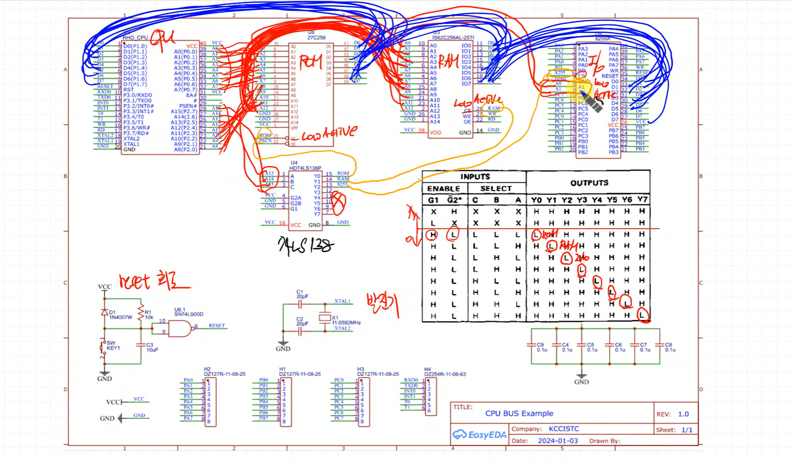
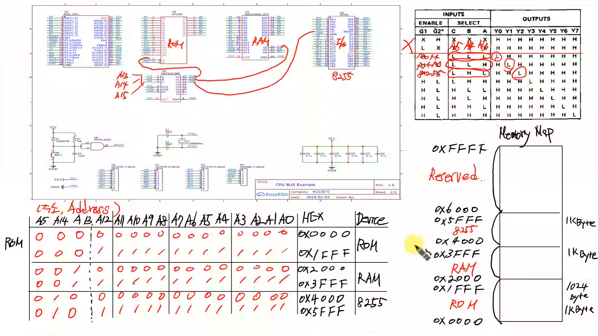
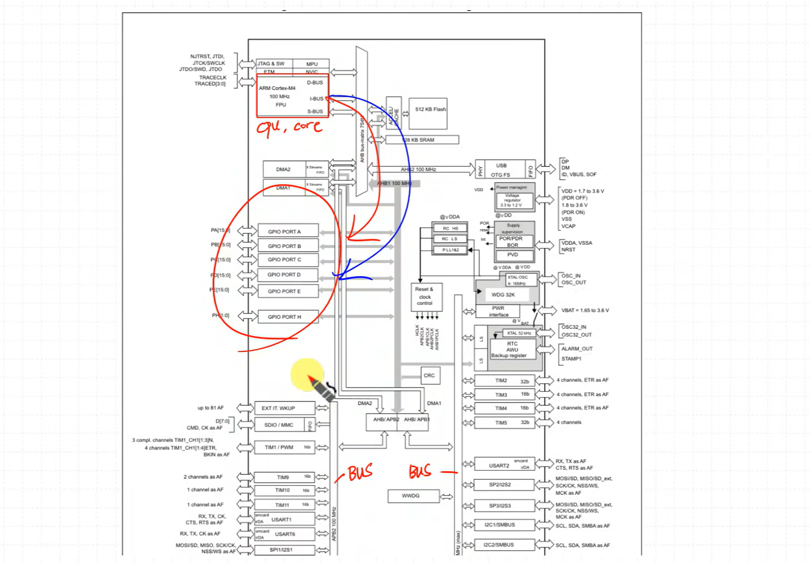
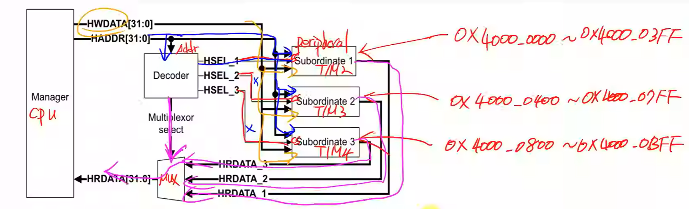
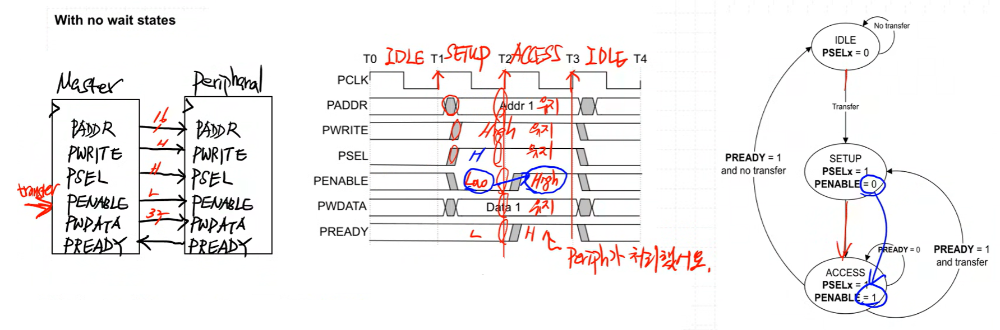
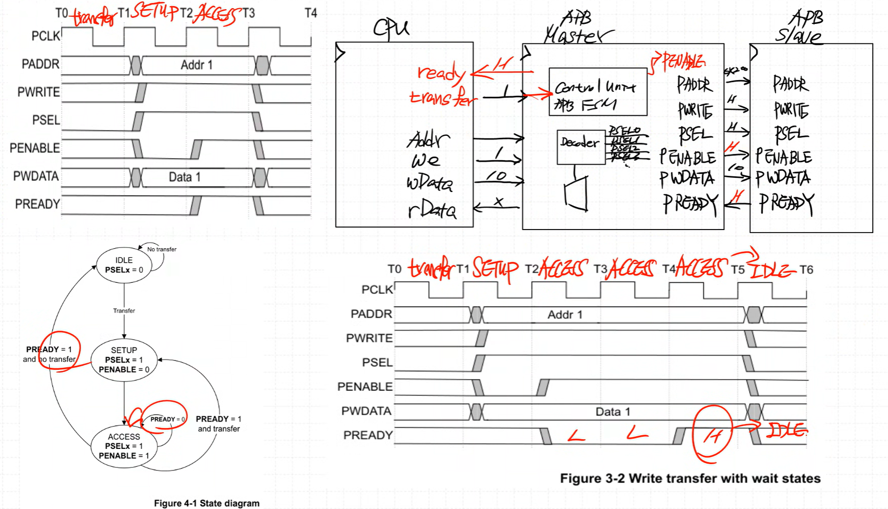

# AMBA APB 이론
---

내용

Decoder 를 통해 SELECT 주소가 L H L 가 되면 하위 비트로 어떤 수가 들어가든 8255가 선택되고 나머지는 선택되지 않음
상위 4bit = 주소 address

8255 I/O 선택된 상태에서 가장 작은 수 : 0100_0000_0000_0000 = 0x4000
8255 I/O 선택된 상태에서 가장 작은 수 : 0101_1111_1111_1111 = 0x5FFF
=> 0x4000 ~ 0x5FFF : 8255 I/O 영역
=> 0x2000 ~ 0x3FFF : RAM 영역
=> 0x0000 ~ 0x1FFF : ROM 영역
=> 할당 되지 않은 부분 : reserved 영역, 사용되지 않음

0x5FFF - 0x4000 + 1 = 0x2000 = 8192
8192 / 8 = 1024Byte = 영역별 1KB 공간이 있음

(int *)(0x2500) = 10 => X, 좌변은 주소를 의미함
*(int *)(0x2500) = 10 => O, 좌변은 주소의 값을 의미함 => RAM 만 동작 => 이후 값이 뒤따라 들어가서 10을 write

*(char *)(0x4001) = 0xFF; 결과는 0x4001 주소에 접근 => 8255 내부 레지스터 중 하나에 write (Port B에 해당) =>Port B에 0xFF를 출력

CPU 중심으로 보면 주변 Device는 Memory로 바라본다. (Memory Mapped I/O)

---

APB 버스는 주소·데이터를 모든 Slave에게 broadcast 하지만, Decoder가 주소를 해석해 특정 Slave만 선택한다

1.Memory Mapping
2.Chip Select

### About the APB protocol
복잡한 interface를 줄이는데 optimized 되어있음
low-cost : logic 갯수가 적기 때문
not pipeline (AHB는 pipeline)
synchronous protocol : 동기 protocol
every transfer takes at least two  cycle to complete : 최소 2 cycle 이상 걸림
"the programmable control registers of peripheral devices" : CPU가 레지스터에 접근해서 write/read 한다 = 해당 peripheral device를 제어한다

### Write transfer with no wait states

PADDR : 16bit Addr1 유지
PWRITE : High 유지
PSEL : High 유지
PENABLE : Low(준비단계) -> High 
PWDATA : 32bit Data1 유지
PREADY : Low -> High(Prei에서 처리했다는 뜻)
=> 이후 IDLE

cpu 에서는 sel, enable, ready 신호들이 없음
기존 cpu : Addr, we, WData, RData + ready, transfer 추가
Memory Map : 32bit = 4Gbyte

# AMBA APB 코딩
---
### Code : APB_Master
빢빢