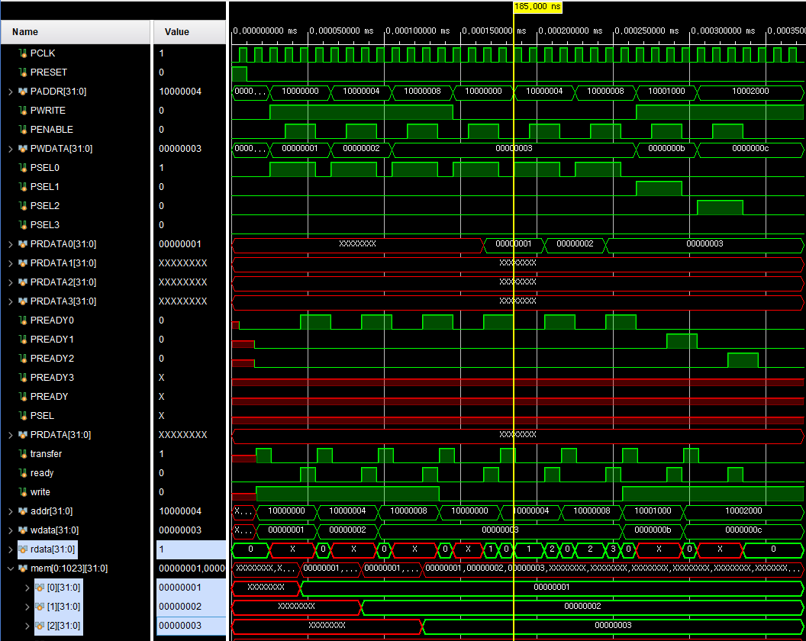
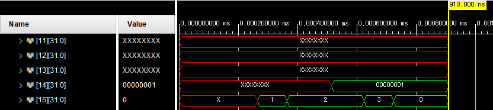
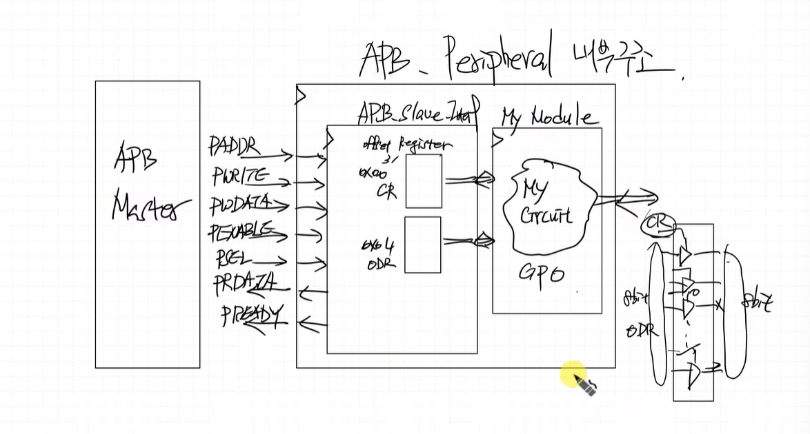
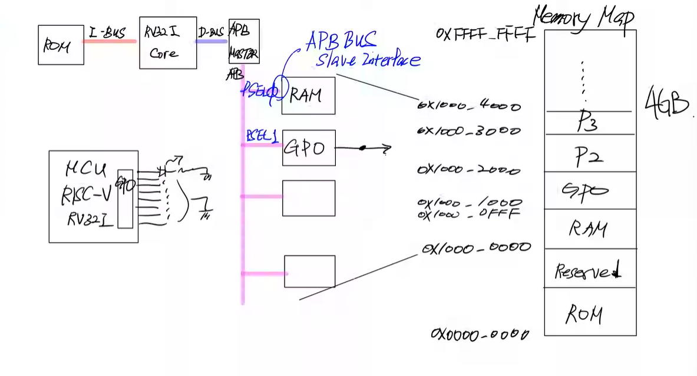
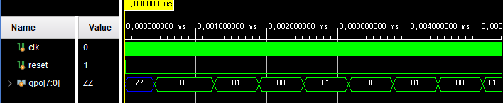
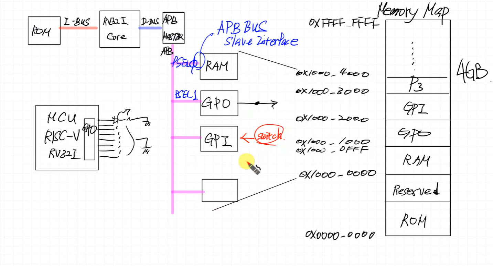

# APB Slave Interface RAM Design
---
Address 기준으로 broadcast 하는 구조 : BUS 구조

```verilog
/* APB_Slave 구조 참고 */
if (PWRITE) begin // 쓰기 동작
    case (PADDR[3:2]) // 주소에 따른
        2'd0: slv_reg0 <= PWDATA;
        2'd1: slv_reg1 <= PWDATA;
        2'd2: slv_reg2 <= PWDATA;
        2'd3: slv_reg3 <= PWDATA;
    endcase
end else begin // 읽기 동작
    case (PADDR[3:2]) // 주소에 따른
        2'd0: PRDATA <= slv_reg0;
        2'd1: PRDATA <= slv_reg1;
        2'd2: PRDATA <= slv_reg2;
        2'd3: PRDATA <= slv_reg3;
    endcase
end
```

기존의 RAM Code 변경, RAM 구조에서 reset 개념은 없음

### < Simulation >


APB는 CPU 는 ready 신호가 들어올 때까지 몇 클럭이든 대기
AHB는 파이프라인구조라서 대기하는 시간이 짧음

RAM 스택포인터 위치 0x1000_0000 ~ 0x1000_0FFF 맞춰서 

### Store, Load Test
```c
int main()
{
    int a, b, c;

    a = 1;
    b = 2;
    c = a + b;

    return 0;
}
```

```text
li      sp,0x10001000
main:
    addi    sp,sp,-32
    sw      ra,28(sp)
    sw      s0,24(sp)
    addi    s0,sp,32
    li      a5,1
    sw      a5,-20(s0)
    li      a5,2
    sw      a5,-24(s0)
    lw      a4,-20(s0)
    lw      a5,-24(s0)
    add     a5,a4,a5
    sw      a5,-28(s0)
    li      a5,0
    mv      a0,a5
    lw      ra,28(sp)
    lw      s0,24(sp)
    addi    sp,sp,32
    jr      ra
```

```text
10001137
fe010113
00112e23
00812c23
02010413
00100793
fef42623
00200793
fef42423
fec42703
fe842783
00f707b3
fef42223
00000793
00078513
01c12083
01812403
02010113
00008067
```

### < Simulation >



# GPO Design
---
### < Design Specification >
GPO 를 만들어서 연결을 원함, LED도 연결

### APB_Peripheral 내부 구조



GPO 코드 파일 업로드

### Test
```c
#include <stdint.h>

#define APB_BASE    0x10000000
#define GPO_BASE    (APB_BASE + 0x1000)
#define GPO_CR      *(uint32_t *)(GPO_BASE + 0x00)
#define GPO_ODR     *(uint32_t *)(GPO_BASE + 0x04)

int main()
{
    uint32_t data = 0;

    GPO_CR = 0xff;
    while(1)
    {
        GPO_ODR = data;
        data = GPO_ODR;
        data = data ^ 1;
    }
    return 0;
}
```

```text
		li 		sp,0x10001000
main:
        addi    sp,sp,-32
        sw      ra,28(sp)
        sw      s0,24(sp)
        addi    s0,sp,32
        sw      zero,-20(s0)
        li      a5,268439552
        li      a4,255
        sw      a4,0(a5)
.L2:
        li      a5,268439552
        addi    a5,a5,4
        lw      a4,-20(s0)
        sw      a4,0(a5)
        li      a5,268439552
        addi    a5,a5,4
        lw      a5,0(a5)
        sw      a5,-20(s0)
        lw      a5,-20(s0)
        xori    a5,a5,1
        sw      a5,-20(s0)
        j       .L2
```

```text
10001137
fe010113
00112e23
00812c23
02010413
fe042623
100017b7
0ff00713
00e7a023
100017b7
00478793
fec42703
00e7a023
100017b7
00478793
0007a783
fef42623
fec42783
0017c793
fef42623
fd5ff06f
```

### < Simulation >


### LED Shift Test
```c
#include <stdint.h>

#define APB_BASE    0x10000000
#define GPO_BASE    (APB_BASE + 0x1000)
#define GPO_CR      *(uint32_t *)(GPO_BASE + 0x00)
#define GPO_ODR     *(uint32_t *)(GPO_BASE + 0x04)

void delay(uint32_t t);

int main()
{
    uint32_t data = 1;

    GPO_CR = 0xff;
    while(1)
    {
        GPO_ODR = data;
        delay(1000);
        data = (data >> 7) | (data << 1);
    }
    return 0;
}

void delay(uint32_t t)
{
    for (uint32_t i=0; i<t; i++) {
        for (uint32_t j=0; j<1000; j++);
    }
}
```

xdc 코드 파일
동작완

# GPI Design
---


GPI 코드 파일

### LED Switching Test
```c
#include <stdint.h>

#define APB_BASE    0x10000000
#define GPO_BASE    (APB_BASE + 0x1000)
#define GPO_CR      *(uint32_t *)(GPO_BASE + 0x00)
#define GPO_ODR     *(uint32_t *)(GPO_BASE + 0x04)
#define GPI_BASE    (APB_BASE + 0x2000)
#define GPI_CR      *(uint32_t *)(GPI_BASE + 0x00)
#define GPI_IDR     *(uint32_t *)(GPI_BASE + 0x04)

//void delay(uint32_t t);

int main()
{
    uint32_t data = 0;

    GPO_CR = 0xff;
    GPI_CR = 0xff;
    while(1)
    {
        data = GPI_IDR;
        GPO_ODR = data;
        //delay(1000);
        //data = (data >> 7) | (data << 1);
    }
    return 0;
}
/*
void delay(uint32_t t)
{
    for (uint32_t i=0; i<t; i++) {
        for (uint32_t j=0; j<1000; j++);
    }
}
*/
```

xdc 코드 파일
동작완


