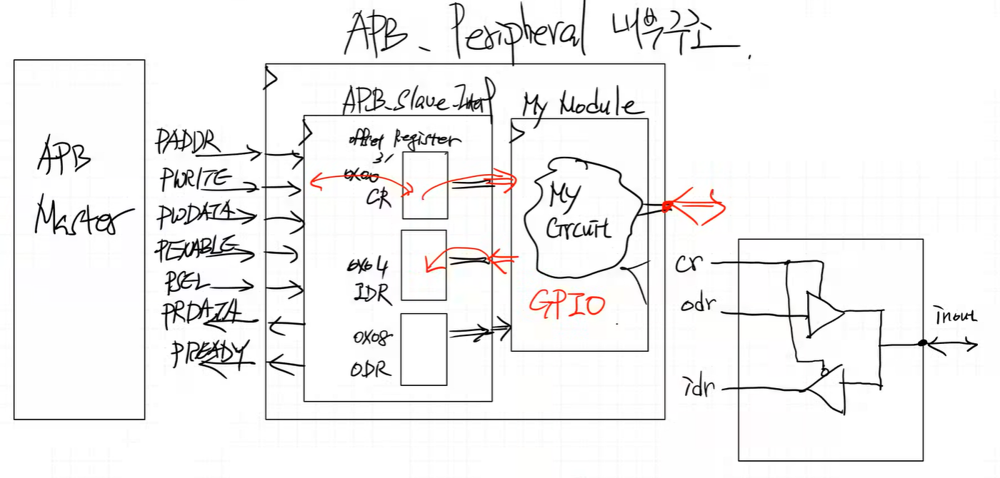

# APB Slave Interface RAM Design
---
Address 기준으로 broadcast 하는 구조 : BUS 구조

```verilog
/* APB_Slave 구조 참고 */
if (PWRITE) begin // 쓰기 동작
    case (PADDR[3:2]) // 주소에 따른
        2'd0: slv_reg0 <= PWDATA;
        2'd1: slv_reg1 <= PWDATA;
        2'd2: slv_reg2 <= PWDATA;
        2'd3: slv_reg3 <= PWDATA;
    endcase
end else begin // 읽기 동작
    case (PADDR[3:2]) // 주소에 따른
        2'd0: PRDATA <= slv_reg0;
        2'd1: PRDATA <= slv_reg1;
        2'd2: PRDATA <= slv_reg2;
        2'd3: PRDATA <= slv_reg3;
    endcase
end
```

기존의 RAM Code 변경, RAM 구조에서 reset 개념은 없음

### < Simulation >


APB는 CPU 는 ready 신호가 들어올 때까지 몇 클럭이든 대기
AHB는 파이프라인구조라서 대기하는 시간이 짧음

RAM 스택포인터 위치 0x1000_0000 ~ 0x1000_0FFF 맞춰서 

### Store, Load Test
```c
int main()
{
    int a, b, c;

    a = 1;
    b = 2;
    c = a + b;

    return 0;
}
```

```text
li      sp,0x10001000
main:
    addi    sp,sp,-32
    sw      ra,28(sp)
    sw      s0,24(sp)
    addi    s0,sp,32
    li      a5,1
    sw      a5,-20(s0)
    li      a5,2
    sw      a5,-24(s0)
    lw      a4,-20(s0)
    lw      a5,-24(s0)
    add     a5,a4,a5
    sw      a5,-28(s0)
    li      a5,0
    mv      a0,a5
    lw      ra,28(sp)
    lw      s0,24(sp)
    addi    sp,sp,32
    jr      ra
```

```text
10001137
fe010113
00112e23
00812c23
02010413
00100793
fef42623
00200793
fef42423
fec42703
fe842783
00f707b3
fef42223
00000793
00078513
01c12083
01812403
02010113
00008067
```

### < Simulation >


# GPO Design
---
### < Design Specification >
GPO 를 만들어서 연결을 원함, LED도 연결

### APB_Peripheral 내부 구조


GPO 코드 파일 업로드

### Test
```c
#include <stdint.h>

#define APB_BASE    0x10000000
#define GPO_BASE    (APB_BASE + 0x1000)
#define GPO_CR      *(uint32_t *)(GPO_BASE + 0x00)
#define GPO_ODR     *(uint32_t *)(GPO_BASE + 0x04)

int main()
{
    uint32_t data = 0;

    GPO_CR = 0xff;
    while(1)
    {
        GPO_ODR = data;
        data = GPO_ODR;
        data = data ^ 1;
    }
    return 0;
}
```

```text
		li 		sp,0x10001000
main:
        addi    sp,sp,-32
        sw      ra,28(sp)
        sw      s0,24(sp)
        addi    s0,sp,32
        sw      zero,-20(s0)
        li      a5,268439552
        li      a4,255
        sw      a4,0(a5)
.L2:
        li      a5,268439552
        addi    a5,a5,4
        lw      a4,-20(s0)
        sw      a4,0(a5)
        li      a5,268439552
        addi    a5,a5,4
        lw      a5,0(a5)
        sw      a5,-20(s0)
        lw      a5,-20(s0)
        xori    a5,a5,1
        sw      a5,-20(s0)
        j       .L2
```

```text
10001137
fe010113
00112e23
00812c23
02010413
fe042623
100017b7
0ff00713
00e7a023
100017b7
00478793
fec42703
00e7a023
100017b7
00478793
0007a783
fef42623
fec42783
0017c793
fef42623
fd5ff06f
```

### < Simulation >


### LED Shift Test
```c
#include <stdint.h>

#define APB_BASE    0x10000000
#define GPO_BASE    (APB_BASE + 0x1000)
#define GPO_CR      *(uint32_t *)(GPO_BASE + 0x00)
#define GPO_ODR     *(uint32_t *)(GPO_BASE + 0x04)

void delay(uint32_t t);

int main()
{
    uint32_t data = 1;

    GPO_CR = 0xff;
    while(1)
    {
        GPO_ODR = data;
        delay(1000);
        data = (data >> 7) | (data << 1);
    }
    return 0;
}

void delay(uint32_t t)
{
    for (uint32_t i=0; i<t; i++) {
        for (uint32_t j=0; j<1000; j++);
    }
}
```

xdc 코드 파일
동작완

# GPI Design
---


GPI 코드 파일

### LED Switching Test
```c
#include <stdint.h>

#define APB_BASE    0x10000000
#define GPO_BASE    (APB_BASE + 0x1000)
#define GPO_CR      *(uint32_t *)(GPO_BASE + 0x00)
#define GPO_ODR     *(uint32_t *)(GPO_BASE + 0x04)
#define GPI_BASE    (APB_BASE + 0x2000)
#define GPI_CR      *(uint32_t *)(GPI_BASE + 0x00)
#define GPI_IDR     *(uint32_t *)(GPI_BASE + 0x04)

//void delay(uint32_t t);

int main()
{
    uint32_t data = 0;

    GPO_CR = 0xff;
    GPI_CR = 0xff;
    while(1)
    {
        data = GPI_IDR;
        GPO_ODR = data;
        //delay(1000);
        //data = (data >> 7) | (data << 1);
    }
    return 0;
}
/*
void delay(uint32_t t)
{
    for (uint32_t i=0; i<t; i++) {
        for (uint32_t j=0; j<1000; j++);
    }
}
*/
```

xdc 코드 파일
동작완

# GPIO Design
---


양방향 구조


# HW
---
### < FND 붙히자 >
```c
#include<stdint.h>
#define APB_BASE    0x10000000
#define GPO_BASE    (APB_BASE + 0x1000)
#define GPO_CR      *(uint32_t *)(GPO_BASE + 0x00)
#define GPO_ODR     *(uint32_t *)(GPO_BASE + 0x04)
#define GPI_BASE    (APB_BASE + 0x2000)
#define GPI_CR      *(uint32_t *)(GPI_BASE + 0x00)
#define GPI_IDR     *(uint32_t *)(GPI_BASE + 0x04)
#define GPIO_BASE    (APB_BASE + 0x3000)
#define GPIO_CR      *(uint32_t *)(GPIO_BASE + 0x00)
#define GPIO_IDR     *(uint32_t *)(GPIO_BASE + 0x04)
#define GPIO_ODR     *(uint32_t *)(GPIO_BASE + 0x08)
#define FND_BASE    (APB_BASE + 0x4000)
#define FND_CR      *(uint32_t *)(FND_BASE + 0x00)
#define FND_ODR     *(uint32_t *)(FND_BASE + 0x04)  

void delay(uint32_t t);

int main()
{
    enum {LEFT, RIGHT};

    uint32_t data = 1;
    uint32_t fnd_count = 0;  // FND 카운터 추가

    GPO_CR = 0xff;
    GPI_CR = 0xff;
    GPIO_CR |= 0x0f;
    GPIO_CR &= ~(0x0f<<4);
    
    // FND 초기화
    FND_CR = 0x3FFF;  // 14비트 모두 활성화
    FND_ODR = fnd_count;  // 초기값 1 설정

    uint32_t state = LEFT;

    while (1)
    {
        switch(state)
        {
            case LEFT:
                data = (data >> 7) | (data << 1);
                if(GPIO_IDR & (1<<5)) state = RIGHT;
                break;
            case RIGHT:
                data = (data << 7) | (data >> 1);
                if(GPIO_IDR & (1<<6)) state = LEFT;
                break;
        }
        GPO_ODR = data;
        //data = GPI_IDR;
        GPIO_ODR = GPIO_IDR >>4;
        
        // FND 카운터 업데이트
        fnd_count++;
        if(fnd_count > 9999) fnd_count = 1;  // 9999 초과시 1로 리셋
        FND_ODR = fnd_count;
        
        delay(100);
    }

    return 0;
}

void delay(uint32_t t)
{
    for(uint32_t i=0;i<t;i++){
        for(uint32_t j=0;j<1000;j++);
    }
}
```

```text
main:
        addi    sp,sp,-32
        sw      ra,28(sp)
        sw      s0,24(sp)
        addi    s0,sp,32
        li      a5,1
        sw      a5,-20(s0)
        sw      zero,-24(s0)
        li      a5,268439552
        li      a4,255
        sw      a4,0(a5)
        li      a5,268443648
        li      a4,255
        sw      a4,0(a5)
        li      a5,268447744
        lw      a4,0(a5)
        li      a5,268447744
        ori     a4,a4,15
        sw      a4,0(a5)
        li      a5,268447744
        lw      a4,0(a5)
        li      a5,268447744
        andi    a4,a4,-241
        sw      a4,0(a5)
        li      a5,268451840
        li      a4,16384
        addi    a4,a4,-1
        sw      a4,0(a5)
        li      a5,268451840
        addi    a5,a5,4
        lw      a4,-24(s0)
        sw      a4,0(a5)
        sw      zero,-28(s0)
.L8:
        lw      a5,-28(s0)
        beq     a5,zero,.L2
        lw      a4,-28(s0)
        li      a5,1
        beq     a4,a5,.L3
        j       .L4
.L2:
        lw      a5,-20(s0)
        srli    a4,a5,7
        lw      a5,-20(s0)
        slli    a5,a5,1
        or      a5,a4,a5
        sw      a5,-20(s0)
        li      a5,268447744
        addi    a5,a5,4
        lw      a5,0(a5)
        andi    a5,a5,32
        beq     a5,zero,.L9
        li      a5,1
        sw      a5,-28(s0)
        j       .L9
.L3:
        lw      a5,-20(s0)
        slli    a4,a5,7
        lw      a5,-20(s0)
        srli    a5,a5,1
        or      a5,a4,a5
        sw      a5,-20(s0)
        li      a5,268447744
        addi    a5,a5,4
        lw      a5,0(a5)
        andi    a5,a5,64
        beq     a5,zero,.L10
        sw      zero,-28(s0)
        j       .L10
.L9:
        nop
        j       .L4
.L10:
        nop
.L4:
        li      a5,268439552
        addi    a5,a5,4
        lw      a4,-20(s0)
        sw      a4,0(a5)
        li      a5,268447744
        addi    a5,a5,4
        lw      a4,0(a5)
        li      a5,268447744
        addi    a5,a5,8
        srli    a4,a4,4
        sw      a4,0(a5)
        lw      a5,-24(s0)
        addi    a5,a5,1
        sw      a5,-24(s0)
        lw      a4,-24(s0)
        li      a5,8192
        addi    a5,a5,1807
        bleu    a4,a5,.L7
        li      a5,1
        sw      a5,-24(s0)
.L7:
        li      a5,268451840
        addi    a5,a5,4
        lw      a4,-24(s0)
        sw      a4,0(a5)
        li      a0,100
        call    delay
        j       .L8
delay:
        addi    sp,sp,-48
        sw      ra,44(sp)
        sw      s0,40(sp)
        addi    s0,sp,48
        sw      a0,-36(s0)
        sw      zero,-20(s0)
        j       .L12
.L15:
        sw      zero,-24(s0)
        j       .L13
.L14:
        lw      a5,-24(s0)
        addi    a5,a5,1
        sw      a5,-24(s0)
.L13:
        lw      a4,-24(s0)
        li      a5,999
        bleu    a4,a5,.L14
        lw      a5,-20(s0)
        addi    a5,a5,1
        sw      a5,-20(s0)
.L12:
        lw      a4,-20(s0)
        lw      a5,-36(s0)
        bltu    a4,a5,.L15
        nop
        nop
        lw      ra,44(sp)
        lw      s0,40(sp)
        addi    sp,sp,48
        jr      ra
```

```text
10001137
fe010113
00112e23
00812c23
02010413
00100793
fef42623
fe042423
100017b7
0ff00713
00e7a023
100027b7
0ff00713
00e7a023
100037b7
0007a703
100037b7
00f76713
00e7a023
100037b7
0007a703
100037b7
f0f77713
00e7a023
100047b7
00004737
fff70713
00e7a023
100047b7
00478793
fe842703
00e7a023
fe042223
fe442783
00078a63
fe442703
00100793
04f70063
07c0006f
fec42783
0077d713
fec42783
00179793
00f767b3
fef42623
100037b7
00478793
0007a783
0207f793
04078263
00100793
fef42223
0380006f
fec42783
00779713
fec42783
0017d793
00f767b3
fef42623
100037b7
00478793
0007a783
0407f793
00078a63
fe042223
00c0006f
00000013
0080006f
00000013
100017b7
00478793
fec42703
00e7a023
100037b7
00478793
0007a703
100037b7
00878793
00475713
00e7a023
fe842783
00178793
fef42423
fe842703
000027b7
70f78793
00e7f663
00100793
fef42423
100047b7
00478793
fe842703
00e7a023
06400513
008000ef
f09ff06f
fd010113
02112623
02812423
03010413
fca42e23
fe042623
0300006f
fe042423
0100006f
fe842783
00178793
fef42423
fe842703
3e700793
fee7f6e3
fec42783
00178793
fef42623
fec42703
fdc42783
fcf766e3
00000013
00000013
02c12083
02812403
03010113
00008067
```

### < 파일 >
> **sources** (HW)
> - [APB_Master.sv](<../../assets/source file/250828/250828_HW/APB_Master.sv>)
> - [APB_Slave.sv](<../../assets/source file/250828/250828_HW/APB_Slave.sv>)
> - [code.mem](<../../assets/source file/250828/250828_HW/code.mem>)
> - [ControlUnit.sv](<../../assets/source file/250828/250828_HW/ControlUnit.sv>)
> - [CPU_RV32I.sv](<../../assets/source file/250828/250828_HW/CPU_RV32I.sv>)
> - [DataPath.sv](<../../assets/source file/250828/250828_HW/DataPath.sv>)
> - [defines.sv](<../../assets/source file/250828/250828_HW/defines.sv>)
> - [FND.sv](<../../assets/source file/250828/250828_HW/FND.sv>)
> - [fndController.sv](<../../assets/source file/250828/250828_HW/fndController.sv>)
> - [GPI.sv](<../../assets/source file/250828/250828_HW/GPI.sv>)
> - [GPIO.sv](<../../assets/source file/250828/250828_HW/GPIO.sv>)
> - [GPO.sv](<../../assets/source file/250828/250828_HW/GPO.sv>)
> - [MCU.sv](<../../assets/source file/250828/250828_HW/MCU.sv>)
> - [RAM.sv](<../../assets/source file/250828/250828_HW/RAM.sv>)
> - [ROM.sv](<../../assets/source file/250828/250828_HW/ROM.sv>)

> **constrs** (HW)
> - [Basys-3-Master.xdc](<../../assets/source file/250828/250828_HW/Basys-3-Master.xdc>)
