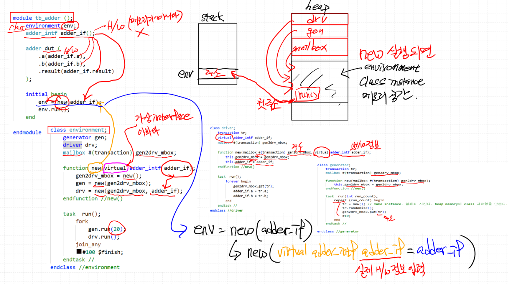
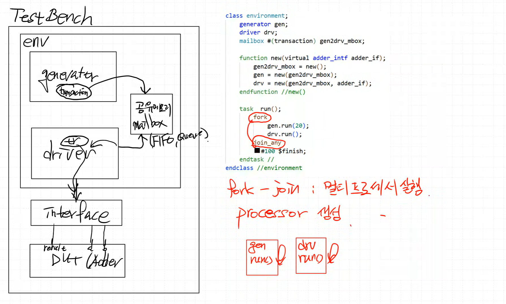

# UVM 검증
---
System Verilog : 검증에 대한 표준이 되어가고 있음
UVM : 검증 Framework, System Verilog 로 설계

| | Verilog | System Verilog |
|:--:|:--:|:--:|
| OOP(객체지향) | X<br>(Class X) | O<br>(Class 문법 사용) |
| DataType | H/W 중심 DataType | S/W 중심 DataType<br>(S/W 기능 추가) |
| interface | X | SW <=> HW 연결<br>검증용 SW <=> DUT HW |
| randomization | random<br>제한적기능 | 각 변수에 random 생성<br>constraint 기능<br>corner case 생성 |

### System Verilog Data Type
- 4-state(벡터) : 0, 1, x, z -> logic, reg, wire
- 2-state(벡터) : 0, 1 -> bit
- 4-state(정수) : integer(32bit)
- 2-state(정수) : byte(8), shortint(16), int(32), longint(64)

### 배열 (SW 자료형)


**고정 길이 배열 (fixed-size array, static array)**
- 선언 시 크기가 고정되고 runtime에 크기 변경불가
- 예:
    ```verilog
    bit  arr[8];     // 8개의 bit 원소
    byte arr2[4];    // 4개의 byte 원소
    int  arr3[16];   // 16개의 int 원소
    ```

**동적 배열 (dynamic array)**
- 선언만 해두고, runtime에 new를 통해 크기 결정
- 필요 시 크기 변경 가능 (new[] 재호출)
- 예:
    ```verilog
    bit  arr[];  
    arr = new[8];    // 크기 8로 할당

    int  arr2[];  
    arr2 = new[16];  // 크기 16으로 재할당 가능
    ```

- delete() 사용 시 메모리 해제 가능

> 고정 길이 배열은 하드웨어에 가깝고 (Verilog 스타일), 동적 배열은 소프트웨어적 성격 (테스트벤치, 검증 환경)에서 주로 활용

### Queue Type (FIFO)
- 크기가 가변적이고, 앞뒤로 push/pop 가능
- 선언:
    ```verilog
    bit que[$];   // bit 타입 queue
    int que2[$];  // int 타입 queue
    ```

- 주요 메서드:
    ```verilog
    que.push_back(1);   // 뒤에 삽입
    que.push_front(4);  // 앞에 삽입
    que.pop_front();    // 앞에서 꺼냄
    que.pop_back();     // 뒤에서 꺼냄
    ```

- 그 외 자주 쓰이는 메서드:
    ```verilog
    que.size()             // 현재 크기 반환
    que.delete()           // 모든 원소 삭제
    que.insert(idx, value) // 특정 위치에 삽입
    que.delete(idx)        // 특정 위치 원소 삭제
    ```

> Queue는 UVM testbench에서 transaction 저장/전달, mailbox 대체 용도 등으로 자주 활용

### Test Bench, UVM 구조의 System Verilog 검증 Test Bench


- generator(입력 data 생성) : stimulus 생성 (transaction 단위)
- driver(전달) : transaction을 핀 레벨 신호로 변환해 DUT 입력에 적용
- monitor(감시) : DUT 입출력을 트랜잭션으로 변환해 전달
- scoreboard(pass/fail 판단) : 예측값과 DUT 출력을 비교, 검증 수행
- interface(연결) : 신호 묶음과 방향 제어, driver/monitor와 DUT 간 연결
- DUT(HW) : testbench가 자극을 주고, 응답을 평가하는 대상

### 실습
class : generator, driver 만들고 감싸는 env 만들고 interface, dut 만들면 됨

데이터 묶음을 전달하기 위해 어떻게? 구조체를 지원하지만 class 를 쓰는 게 일반적임
- transaction = 데이터 묶음 (stimulus 단위) → 보통 class로 정의

- C언어에서 구조체(struct)는 단순 데이터 묶음에 적합
- SystemVerilog class는 변수 + 메서드를 함께 넣을 수 있어 객체지향(OOP) 스타일의 재사용·확장이 가능 → UVM 검증 환경의 기본 단위



```verilog
module tb_adder ();
    environment env; // Class
    adder_intf adder_if (); // HW(메모리가 아님)

    adder dut ( // HW
        .a(adder_if.a),
        .b(adder_if.b),
        .result(adder_if.result)
    );

    initial begin
        env = new(adder_if); // new(virtual adder_intf adder_if(실제 HW정보 입력) = adder_if) 가명에 연결한 느낌
        env.run();
    end
endmodule
```

```verilog
class environment;
    generator gen;
    driver drv;
    mailbox #(transaction) gen2drv_mbox;

    function new(virtual adder_intf adder_if); // 위의 new를 콜함. virtual(HW를 SW적으로 연결)는 가상인터페이스(HW를 그냥 전달하면 안됨, SW처럼 생각하자)
        gen2drv_mbox = new(); // 정보를 주고
        gen = new(gen2drv_mbox); // 정보를 주고
        drv = new(gen2drv_mbox, adder_if); // 정보를 주고
    endfunction

    task run();
        fork
            gen.run(20);
            drv.run();
        join_any
        #(10 * 10) $finish;
    endtask
endclass
```

```verilog
class driver;
    transaction tr;
    virtual adder_intf adder_if;
    mailbox #(transaction) gen2drv_mbox;

    function new(mailbox#(transaction) gen2drv_mbox, // 주소
                 virtual adder_intf adder_if); // HW정보
        this.gen2drv_mbox = gen2drv_mbox;
        this.adder_if = adder_if;
    endfunction

    task run();
        forever begin
            gen2drv_mbox.get(tr);
            adder_if.a = tr.a;
            adder_if.b = tr.b;
        end
    endtask
endclass
```

```verilog
class generator;
    transaction tr;  // handler
    mailbox #(transaction) gen2drv_mbox;

    function new(mailbox#(transaction) gen2drv_mbox);
        this.gen2drv_mbox = gen2drv_mbox;
    endfunction

    task run(int run_count);
        repeat (run_count) begin
            tr = new(); // make instance. 실체화 시킨다. heap memory에 class 자료형을 만든다.
            tr.randomize();
            gen2drv_mbox.put(tr); // 해당 인터페이스의 주소값(tr)을 넣어줌
            #10;
        end
    endtask
endclass
```

---


```verilog
class environment;
    generator gen;
    driver drv;
    mailbox #(transaction) gen2drv_mbox;

    function new(virtual adder_intf adder_if);
        gen2drv_mbox = new();
        gen = new(gen2drv_mbox);
        drv = new(gen2drv_mbox, adder_if);
    endfunction

    task run();
        fork // 멀티 프로세서 실행
            gen.run(20); // 독집적으로 돌아감
            drv.run(); // 독집적으로 돌아감
        join_any
        #(10 * 10) $finish;
    endtask
endclass
```

- fork-join : SW적으로 병렬 실행을 지원, gen.run(20) 과 drv.run() 이 동시에 실행 (HW always 블록 2개가 병렬로 도는 것과 유사한 개념)
- 인스턴스네임.메서드 구조 : 메서드의 기능을 호출

- fork-join : 전부 끝나야 다음으로
- fork-join_any : 하나라도 끝나면 다음으로 (나머지는 계속 실행됨)
- fork-join_none : 시작만 시키고 바로 다음으로

- forever : 조건 없는 무한 루프

# 비동기식 adder
---
### < adder.sv >
```verilog
`timescale 1ns / 1ps

module adder (
    input  logic [7:0] a,
    input  logic [7:0] b,
    output logic [8:0] result
);
    assign result = a + b;
endmodule
```

### < tb_adder.sv >
```verilog
`timescale 1ns / 1ps

interface adder_intf;
    logic [7:0] a;
    logic [7:0] b;
    logic [8:0] result;
endinterface

class transaction;
    rand bit [7:0] a;
    rand bit [7:0] b;
    bit      [8:0] result;
endclass

class generator;
    transaction tr;  // handler
    mailbox #(transaction) gen2drv_mbox; // mailbox 사용 → generator와 driver 간의 큐/통신 채널

    function new(mailbox#(transaction) gen2drv_mbox);
        this.gen2drv_mbox = gen2drv_mbox;
    endfunction

    task run(int run_count);
        repeat (run_count) begin
            tr = new(); // Heap에 transaction 객체 생성 // make instance. 실체화 시킨다. heap memory에 class 자료형을 만든다.
            tr.randomize();  // 랜덤 입력 생성
            gen2drv_mbox.put(tr);  // driver 쪽으로 전달
            #10;
        end
    endtask
endclass

class driver;
    transaction tr;
    virtual adder_intf adder_if;
    mailbox #(transaction) gen2drv_mbox;

    function new(mailbox#(transaction) gen2drv_mbox,
                 virtual adder_intf adder_if);
        this.gen2drv_mbox = gen2drv_mbox;
        this.adder_if = adder_if;
    endfunction

    task run();
        forever begin
            gen2drv_mbox.get(tr);  // generator에서 transaction 받음
            adder_if.a = tr.a;  // DUT 입력에 할당
            adder_if.b = tr.b;  // DUT 입력에 할당
        end
    endtask
endclass

class monitor;
    transaction tr;
    virtual adder_intf adder_if;
    mailbox #(transaction) mon2scb_mbox;

    function new(mailbox#(transaction) mon2scb_mbox,
                 virtual adder_intf adder_if);
        this.mon2scb_mbox = mon2scb_mbox;
        this.adder_if = adder_if;
    endfunction

    task run();
        forever begin
            #1;
            tr = new();
            tr.a = adder_if.a;
            tr.b = adder_if.b;
            tr.result = adder_if.result;
            mon2scb_mbox.put(tr);
            #10;
        end
    endtask
endclass

class scoreboard;
    transaction tr;
    mailbox #(transaction) mon2scb_mbox;
    bit [7:0] a, b;

    function new(mailbox#(transaction) mon2scb_mbox);
        this.mon2scb_mbox = mon2scb_mbox;
    endfunction

    task run();
        tr = new();
        forever begin
            mon2scb_mbox.get(tr);
            a = tr.a;
            b = tr.b;
            if (tr.result == (a + b)) begin
                $display("PASS! : %d + %d = %d", a, b, tr.result);
            end else begin
                $display("FAIL! : %d + %d = %d", a, b, tr.result);
            end
        end
    endtask
endclass

class environment; // generator, driver 등 testbench 구성 요소를 묶는 top-level class
    generator gen;
    driver drv;
    monitor mon;
    scoreboard scb;
    mailbox #(transaction) gen2drv_mbox;
    mailbox #(transaction) mon2scb_mbox;

    function new(virtual adder_intf adder_if);
        gen2drv_mbox = new();  // mailbox 생성
        mon2scb_mbox = new();  // mailbox 생성
        gen = new(gen2drv_mbox);  // generator 생성
        drv = new(gen2drv_mbox, adder_if);  // driver 생성
        mon = new(mon2scb_mbox, adder_if);  // monitor 생성
        scb = new(mon2scb_mbox);  // scoreboard 생성
    endfunction

    task run();
        fork
            gen.run(1000);  // 20개 stimulus 생성
            drv.run();  // DUT에 계속 적용
            mon.run();  // DUT에 계속 적용
            scb.run();  // DUT에 계속 적용
        join_any
        #(10 * 10) $finish;
    endtask
endclass

module tb_adder ();  // DUT와 interface 생성 → environment 실행
    environment env;
    adder_intf adder_if (); // adder_if라는 interface를 생성하여 DUT와 TB를 연결

    adder dut (
        .a(adder_if.a),
        .b(adder_if.b),
        .result(adder_if.result)
    );

    initial begin
        env = new(adder_if);  // environment 생성
        env.run();  // 시뮬레이션(generator/driver) 실행
    end
endmodule
```

# 동기식 adder
---
### < adder.sv >
```verilog
`timescale 1ns / 1ps

module adder (
    input  logic       clk,
    input  logic [7:0] a,
    input  logic [7:0] b,
    output logic [8:0] result
);
    always_ff @(posedge clk) begin
        result <= a + b;
    end
endmodule
```

### < tb_adder.sv >
```verilog
`timescale 1ns / 1ps

interface adder_intf;
    logic       clk;
    logic [7:0] a;
    logic [7:0] b;
    logic [8:0] result;
endinterface

class transaction;
    rand bit [7:0] a;
    rand bit [7:0] b;
    bit      [8:0] result;
endclass

class generator;
    transaction tr;  // handler
    mailbox #(transaction) gen2drv_mbox; // mailbox 사용 → generator와 driver 간의 큐/통신 채널

    function new(mailbox#(transaction) gen2drv_mbox);
        this.gen2drv_mbox = gen2drv_mbox;
    endfunction

    task run(int run_count);
        repeat (run_count) begin
            tr = new(); // Heap에 transaction 객체 생성 // make instance. 실체화 시킨다. heap memory에 class 자료형을 만든다.
            tr.randomize();  // 랜덤 입력 생성
            gen2drv_mbox.put(tr);  // driver 쪽으로 전달
            #10;
        end
    endtask
endclass

class driver;
    transaction tr;
    virtual adder_intf adder_if;
    mailbox #(transaction) gen2drv_mbox;

    function new(mailbox#(transaction) gen2drv_mbox,
                 virtual adder_intf adder_if);
        this.gen2drv_mbox = gen2drv_mbox;
        this.adder_if = adder_if;
    endfunction

    task run();
        forever begin
            gen2drv_mbox.get(tr);  // generator에서 transaction 받음
            adder_if.a = tr.a;  // DUT 입력에 할당
            adder_if.b = tr.b;  // DUT 입력에 할당
            @(posedge adder_if.clk);
        end
    endtask
endclass

class monitor;
    transaction tr;
    virtual adder_intf adder_if;
    mailbox #(transaction) mon2scb_mbox;

    function new(mailbox#(transaction) mon2scb_mbox,
                 virtual adder_intf adder_if);
        this.mon2scb_mbox = mon2scb_mbox;
        this.adder_if = adder_if;
    endfunction

    task run();
        forever begin
            tr = new();
            @(posedge adder_if.clk);
            #1;
            tr.a = adder_if.a;
            tr.b = adder_if.b;
            tr.result = adder_if.result;
            mon2scb_mbox.put(tr);
        end
    endtask
endclass

class scoreboard;
    transaction tr;
    mailbox #(transaction) mon2scb_mbox;
    bit [7:0] a, b;

    function new(mailbox#(transaction) mon2scb_mbox);
        this.mon2scb_mbox = mon2scb_mbox;
    endfunction

    task run();
        // tr = new();
        forever begin
            mon2scb_mbox.get(tr);
            a = tr.a;
            b = tr.b;
            if (tr.result == (a + b)) begin
                $display("PASS! : %d + %d = %d", a, b, tr.result);
            end else begin
                $display("FAIL! : %d + %d = %d", a, b, tr.result);
            end
        end
    endtask
endclass

class environment; // generator, driver 등 testbench 구성 요소를 묶는 top-level class
    generator gen;
    driver drv;
    monitor mon;
    scoreboard scb;
    mailbox #(transaction) gen2drv_mbox;
    mailbox #(transaction) mon2scb_mbox;

    function new(virtual adder_intf adder_if);
        gen2drv_mbox = new();  // mailbox 생성
        mon2scb_mbox = new();  // mailbox 생성
        gen = new(gen2drv_mbox);  // generator 생성
        drv = new(gen2drv_mbox, adder_if);  // driver 생성
        mon = new(mon2scb_mbox, adder_if);  // monitor 생성
        scb = new(mon2scb_mbox);  // scoreboard 생성
    endfunction

    task run();
        fork
            gen.run(10);  // 20개 stimulus 생성
            drv.run();  // DUT에 계속 적용
            mon.run();  // DUT에 계속 적용
            scb.run();  // DUT에 계속 적용
        join_any
        #(10 * 10) $finish;
    endtask
endclass

module tb_adder ();  // DUT와 interface 생성 → environment 실행
    environment env;
    adder_intf adder_if (); // adder_if라는 interface를 생성하여 DUT와 TB를 연결

    adder dut (
        .clk   (adder_if.clk),
        .a     (adder_if.a),
        .b     (adder_if.b),
        .result(adder_if.result)
    );

    always #5 adder_if.clk = ~adder_if.clk;

    initial begin
        adder_if.clk = 1;
    end

    initial begin
        env = new(adder_if);  // environment 생성
        env.run();  // 시뮬레이션(generator/driver) 실행
    end
endmodule
```

### < 파일 : 동기식 adder >
> **sources** (Class)
> - [text](<../../assets/source file/250902/250902_Class/adder.sv>)

> **simulation** (Class)
> - [text](<../../assets/source file/250902/250902_Class/tb_adder.sv>)