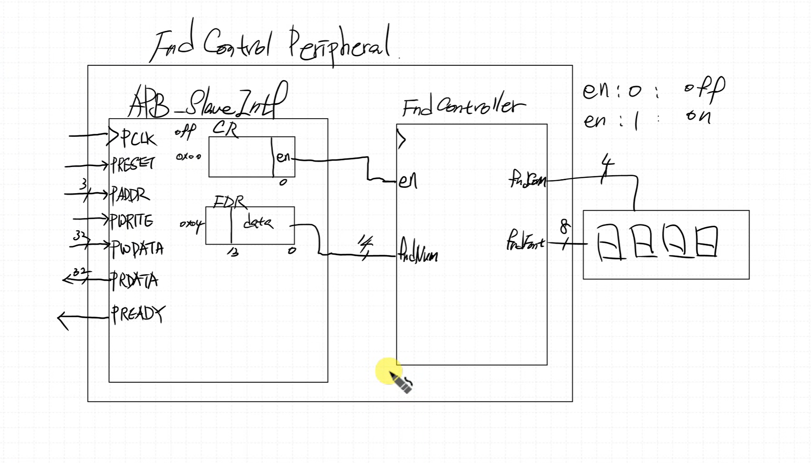

# SystemVerilog 검증 (RAM)
---
입력값에 대한 자동화, random 값 때문에 씀

Class 는 HW가 아닌 SW이므로 HW접근 X

interface 는 HW 이므로 SW처럼 주소 접근 X, virtual 이라는 가상 HW를 만들어 줘야함

블록도 이미지1

```verilog
task run();
    forever begin
        gen2drv_mbox.get(tr);
        ram_if.addr = tr.addr;
        ram_if.we   = tr.we;
        if (tr.we) ram_if.wdata = tr.wdata;
        @(posedge ram_if.clk);
    end
endtask
```

타이밍다이어그램 이미지2

=== 3개면 X값 판단 가능

ram, tb_ram 구현 완

### < 파일 >
> **sources** (Class)
> - [ram.sv](<../../assets/source file/250903/250903_Class/first/ram.sv>)

> **simulation** (Class)
> - [tb_ram.sv](<../../assets/source file/250903/250903_Class/first/tb_ram.sv>)


# FND_periph
---
### < Block Diagram >


### < fndController >
en 신호를 받아줘서 
1. clk_div_1khz 제어 -> 카운터 멈춤
2. decoder_2x4 제어 -> 디스플레이 꺼줌

.* : wildcard

### SW 검증
```c
#include<stdint.h>

typedef struct {
    uint32_t CR;
    uint32_t FDR;
} FND_TypeDef;

#define APB_BASE    0x10000000
#define FND_BASE    (APB_BASE + 0x4000)
#define FND         ((FND_TypeDef *)(FND_BASE))
// #define FND_CR      (*(uint32_t *)(FND_BASE + 0x00))
// #define FND_FDR     (*(uint32_t *)(FND_BASE + 0x04)) 

void delay(uint32_t t);

int main()
{
    // FND_CR = 0x01;
    // FND_FDR = 1234;

    FND->CR = 0x01;
    // FND->FDR = 1234;

    uint32_t data = 0;

    while (1)
    {
        FND->FDR = data;
        data++;
        delay(1000);
    }

    return 0;
}

void delay(uint32_t t)
{
    for (int i=0; i<t; i++) {
        for (int j=0; j<1000; j++);
    }
}
```

```text
		li 		sp,0x10001000
```

### < 파일 >
> **sources** (Class)
> - [APB_Master.sv](<../../assets/source file/250903/250903_Class/second/APB_Master.sv>)
> - [APB_Slave.sv](<../../assets/source file/250903/250903_Class/second/APB_Slave.sv>)
> - [code.mem](<../../assets/source file/250903/250903_Class/second/code.mem>)
> - [ControlUnit.sv](<../../assets/source file/250903/250903_Class/second/ControlUnit.sv>)
> - [CPU_RV32I.sv](<../../assets/source file/250903/250903_Class/second/CPU_RV32I.sv>)
> - [DataPath.sv](<../../assets/source file/250903/250903_Class/second/DataPath.sv>)
> - [defines.sv](<../../assets/source file/250903/250903_Class/second/defines.sv>)
> - [fndController.sv](<../../assets/source file/250903/250903_Class/second/fndController.sv>)
> - [GPI.sv](<../../assets/source file/250903/250903_Class/second/GPI.sv>)
> - [GPIO.sv](<../../assets/source file/250903/250903_Class/second/GPIO.sv>)
> - [GPO.sv](<../../assets/source file/250903/250903_Class/second/GPO.sv>)
> - [MCU.sv](<../../assets/source file/250903/250903_Class/second/MCU.sv>)
> - [RAM.sv](<../../assets/source file/250903/250903_Class/second/RAM.sv>)
> - [ROM.sv](<../../assets/source file/250903/250903_Class/second/ROM.sv>)

> **constrs** (Class)
> - [Basys-3-Master.xdc](<../../assets/source file/250903/250903_Class/second/Basys-3-Master.xdc>)