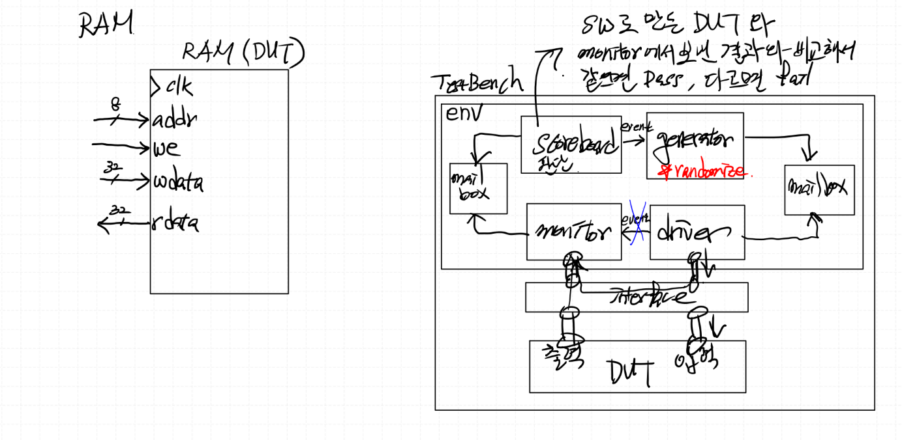

# SystemVerilog 검증 (RAM)
---
### < SystemVerilog 기반 RAM 검증의 핵심 포인트 >
1. 입력값 자동화 (randomization 활용)
- Testbench에서 Stimulus(입력값)를 자동 생성하기 위해 class + randomize() 사용
- 특히 주소, 데이터, 제어 신호(write/read enable) 등을 랜덤하게 생성해 corner case 검증 가능

2. Class의 역할 (HW 접근 불가)
- class는 소프트웨어적 개념
- transaction(데이터 묶음)을 정의하고, 랜덤 생성 및 처리하는 역할
- 직접 DUT의 핀에 접근할 수 없음
- 따라서 driver가 class 객체(transaction)를 받아서 → interface를 통해 HW 신호로 변환

3. Interface의 역할 (HW 신호 묶음)
- interface는 하드웨어적 개념
- DUT와 testbench 간의 신호(주소, 데이터, write enable 등)를 묶어주는 역할

4. Virtual Interface (SW ↔ HW 연결 다리)
- class는 HW에 직접 접근 불가 → interface 핸들을 참조해야 함
- 하지만 class 내부에서 interface 인스턴스를 바로 사용할 수 없음

### < Block Diagram >


### < Timing Diagram >
```verilog
// ram 에 write
task run();
    forever begin
        gen2drv_mbox.get(tr);
        ram_if.addr = tr.addr;
        ram_if.we   = tr.we;
        if (tr.we) ram_if.wdata = tr.wdata;
        @(posedge ram_if.clk);
    end
endtask
```


> "===" : 조건문 내에서 x(Impedance)값 판단 가능

### < 파일 >
> **sources** (Class)
> - [ram.sv](<../../assets/source file/250903/250903_Class/first/ram.sv>)

> **simulation** (Class)
> - [tb_ram.sv](<../../assets/source file/250903/250903_Class/first/tb_ram.sv>)

# FND_periph Design
---
### < Block Diagram >


### < Design Specification >
> - (en 신호) clk_div_1khz 제어 -> 카운터 멈춤
> - (en 신호) decoder_2x4 제어 -> 디스플레이 꺼줌

### < SW 검증, C언어 분석 >
```c
#include<stdint.h>

typedef struct {
    uint32_t CR;
    uint32_t FDR;
} FND_TypeDef;

#define APB_BASE    0x10000000
#define FND_BASE    (APB_BASE + 0x4000)
#define FND         ((FND_TypeDef *)(FND_BASE))
// #define FND_CR      (*(uint32_t *)(FND_BASE + 0x00))
// #define FND_FDR     (*(uint32_t *)(FND_BASE + 0x04)) 

void FND_Init(FND_TypeDef *fnd);
void FND_WriteData(FND_TypeDef *fnd, uint32_t d);

void delay(uint32_t t);

int main()
{
    // FND_CR = 0x01;
    // FND_FDR = 1234;

    // FND->CR = 0x01;
    // FND->FDR = 1234;
    FND_Init(FND);
    uint32_t data = 0;

    while (1)
    {
        // FND->FDR = data;
        FND_WriteData(FND, data);
        data++;
        delay(1000);
    }

    return 0;
}

void FND_WriteData(FND_TypeDef *fnd, uint32_t d)
{
    fnd->FDR = d;
}

void FND_Init(FND_TypeDef *fnd)
{
    fnd->CR = 0x01;
}

void delay(uint32_t t)
{
    for (int i=0; i<t; i++) {
        for (int j=0; j<1000; j++);
    }
}
```

(아래 해석은 수업중 해석이고 GPT 내용과 부분적으로 틀림)
**(int *)0x10000000**
Data Type : 자료형, Data 형태, Data 모양, Data 크기
Data : Memory 안에 있는 값
Type : int를 뜻함 (4byte)
=> int 자료형이 의미하는 주소에 4byte의 메모리 공간 할당

**(char *)0x10000008**
0x1000_0008 : 주소
=> 1Byte 만큼 할당

**(FND_Typedef *)0x10004000**
FND_Typedef : Data Type 으로 생각
4byte 2개가 붙어있는 8byte 메모리를 할당하며 CR, FDR 이라는 이름을 붙혔을 뿐

**((FND_Typedef *)(0x10004000))->CR = 0x01;**
((FND_Typedef *)(0x1000_4000)).CR : 주소를 의미함
((FND_Typedef *)(0x1000_4000))->CR : 해당 주소의 데이터를 의마함

> (FND_TypeDef *) : type 캐스팅, 주소를 해당 타입의 포인터로 해석

**포인터 이해**
+-------------------+   
|      4 byte       |  <- FDR
+-------------------+
|      4 byte       |  <- CR
+-------------------+

**이중 포인터 예시**
+-------------------+   
|        10         |  <- A
+-------------------+
|    0x1000_0000    |  <- pA
+-------------------+
|    0x1000_1000    |  <- ppA
+-------------------+   

(0x1000_0000) A = 10 값
(0x1000_1000) pA = 0x1000_0000 주소
(0x1000_2000) ppA = 0x1000_1000 주소

**ppA == 10 (A의 값)

**머신 코드로 변경 시 참고**
```text
		li 		sp,0x10001000
```

### < 파일 >
> **sources** (Class)
> - [APB_Master.sv](<../../assets/source file/250903/250903_Class/second/APB_Master.sv>)
> - [APB_Slave.sv](<../../assets/source file/250903/250903_Class/second/APB_Slave.sv>)
> - [code.mem](<../../assets/source file/250903/250903_Class/second/code.mem>)
> - [ControlUnit.sv](<../../assets/source file/250903/250903_Class/second/ControlUnit.sv>)
> - [CPU_RV32I.sv](<../../assets/source file/250903/250903_Class/second/CPU_RV32I.sv>)
> - [DataPath.sv](<../../assets/source file/250903/250903_Class/second/DataPath.sv>)
> - [defines.sv](<../../assets/source file/250903/250903_Class/second/defines.sv>)
> - [fndController.sv](<../../assets/source file/250903/250903_Class/second/fndController.sv>)
> - [GPI.sv](<../../assets/source file/250903/250903_Class/second/GPI.sv>)
> - [GPIO.sv](<../../assets/source file/250903/250903_Class/second/GPIO.sv>)
> - [GPO.sv](<../../assets/source file/250903/250903_Class/second/GPO.sv>)
> - [MCU.sv](<../../assets/source file/250903/250903_Class/second/MCU.sv>)
> - [RAM.sv](<../../assets/source file/250903/250903_Class/second/RAM.sv>)
> - [ROM.sv](<../../assets/source file/250903/250903_Class/second/ROM.sv>)

> **constrs** (Class)
> - [Basys-3-Master.xdc](<../../assets/source file/250903/250903_Class/second/Basys-3-Master.xdc>)
