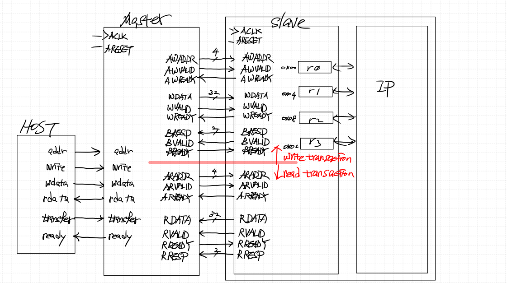
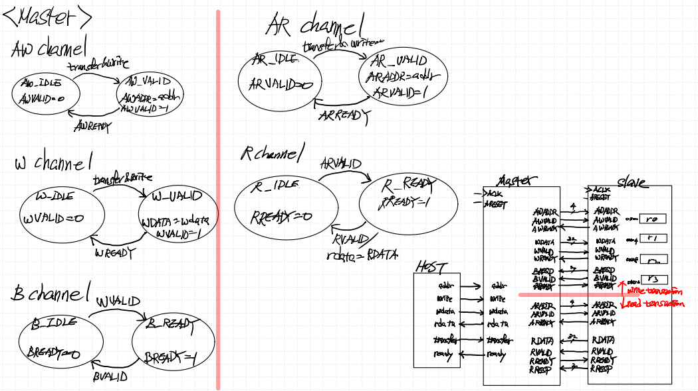
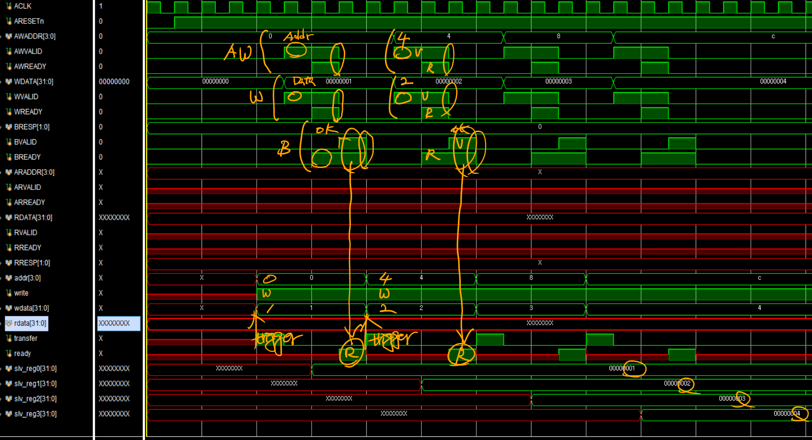

# AXI_Introduction_to_AMBA_AXI
---

- RISC-V 직접 사용과는 별개로, Xilinx Vivado에서는 MicroBlaze soft CPU + AXI Interconnect (Switch) 구조를 기본으로 제공.
- FPGA에 올릴려면 마이크로 블레이즈, AXI 스위치 사용

### < AXI protocol overview >
- AXI는 BUS가 아니라 protocol → 용어상 "AXI bus"라 하지 않고 AXI protocol이라고 함.
- Point-to-Point 연결: Master와 Slave가 직접 연결되며, Interconnect가 중재 역할을 함.
- 따라서 Master1–Slave1 통신과 동시에 Master2–Slave2 통신 가능 → 병렬성 보장.

### < AXI Channels 정리 >

**AXI 인터페이스 기본 구조**
- AXI는 point-to-point protocol
- Master ↔ Slave 간 통신은 5개의 채널을 통해 이루어짐:
    - Write Address (AW)
    - Write Data (W)
    - Write Response (B)
    - Read Address (AR)
    - Read Data (R)

**Write Operation (쓰기 동작)**
- Master → Slave:
    - AW 채널: 쓰기 주소 전달
    - W 채널: 실제 데이터 전달
- Slave → Master:
    - B 채널: 쓰기 완료 후 응답(Return message)

**Read Operation (읽기 동작)**

- Master → Slave:
    - AR 채널: 읽고 싶은 주소 전달
- Slave → Master:
    - R 채널: 요청된 주소의 데이터 반환
    - 오류 시 → Read Data 채널에서 에러 메시지 전달 (주소 무효, 데이터 오류, 권한 없음 등)

**채널 특성**
- 각 채널은 단방향(unidirectional) 구조.
- 따라서 Write Response(B) 채널이 별도로 필요함.
- 반면 읽기에는 별도의 Response 채널이 필요 없음 → Read Data(R)에 포함됨.
- Read 채널과 Write 채널은 서로 독립 → 동시에 동작 가능 → 대역폭 최적화.

**신호 접두(prefix)**
- AW : Write Address 채널 신호
- AR : Read Address 채널 신호
- W : Write Data 채널 신호
- R : Read Data 채널 신호
- B : Write Response 채널 신호
    - B = buffered → Slave가 모든 Write 완료 후 응답하는 의미

### < Channel handshake 정리 >

**기본 개념**
- AXI4의 모든 5개 채널은 VALID/READY 핸드셰이크 메커니즘을 사용.
- VALID: Source(송신자 → Master or Slave)에서 Destination으로 전송.
- READY: Destination(수신자 → Master or Slave)에서 Source로 전송.
- 두 신호가 모두 High일 때 데이터 전송이 유효하게 이루어짐.

**동작 방식**
1. Source 역할
    - 유효한 데이터가 준비되면 VALID=1로 설정.
    - Destination이 수락할 때까지 VALID는 유지해야 함.
    - 이렇게 유지되는 VALID를 "sticky signal"이라고 부름.

2. Destination 역할
    - 데이터를 받을 수 있으면 READY=1로 설정.
    - READY는 Destination → Source로 전달됨.

3. 데이터 전송 조건
    - VALID=1 & READY=1 → rising edge에서 데이터 전송 성공.

**Master / Slave의 위치**
- Master/Slave가 Source인지 Destination인지는 채널에 따라 다름.
    - 예: Read Address 채널에서는 Master가 Source, Slave가 Destination.
    - 예: Read Data 채널에서는 Slave가 Source, Master가 Destination.

**특성**
- 이 메커니즘은 비동기(asynchronous) 핸드셰이크가 아님.
- 클록의 상승 에지(rising edge)에서 전송이 확정됨.

### < Transfers vs Transactions 정리 >

**Transfer**
- VALID + READY 핸드셰이크 한 번으로 이루어지는 단일 데이터 교환.
- 구성:
    - Source → Destination : VALID + INFO(데이터/주소 등)
    - Destination → Source : READY
- 즉, 하나의 데이터 전송 단위.

**Transaction**
- 여러 개의 Transfer 묶음 → 하나의 전체 동작.
- 예시: Write Transaction

1. Address Transfer  
    - Write Address 채널: Master가 주소 전달 (VALID + ADDRESS)  
    - Slave가 수락 시 READY  
2. Data Transfer(s)  
    - Write Data 채널: Master가 실제 데이터 전송 (VALID + DATA)  
    - Slave가 수락 시 READY  
    - 데이터는 여러 개의 burst transfer 가능  
3. Response Transfer  
    - Write Response 채널: Slave → Master 응답 (VALID + RESPONSE)  
    - Master가 수락 시 READY  

**핵심 차이**
- Transfer = 단일 교환 (VALID/READY 1번)
- Transaction = 여러 Transfer의 집합 (Address + Data + Response로 구성, burst도 포함 가능)

VALID 신호가 들어오면 MASTER 쪽에 READY를 다시 줌 -> HAND SHAKE가 이루어지고 난 후에 떨어짐

화살표 2개 : 반드시 있어야함
화살표 1개 : 옵션 느낌

버스트신호가 없는 것이 Lite 

더 정리?
타이밍별로
기다리는 입장 등등

### < Block Diagram >

### < FSM >

### < Simulation >

### < 파일 >
> **sources** (Class)
> - [AXI4_Lite_Master.sv](<../../assets/source file/250904/250904_Class/AXI4_Lite_Master.sv>)
> - [AXI4_Lite_Slave.sv](<../../assets/source file/250904/250904_Class/AXI4_Lite_Slave.sv>)

> **simulation** (Class)
> - [tb_AXI4_Lite.sv](<../../assets/source file/250904/250904_Class/tb_AXI4_Lite.sv>)
