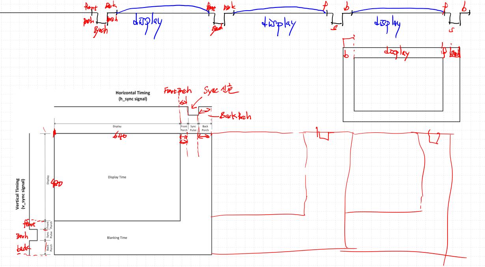

# VGA(Video Graphics Array)
---
### Cathode Ray Tube

화면이 나오는 기본적인 원리(브라운관, Cathode Ray Tube) : 편향판(+)에 전압을 인가하여 통과하는 전자를 특정 방향(상/하/좌/우)으로 끌어당겨서 형광물질이 발려진 화면의 원하는 위치에 전자가 도착함

- Heater : 열을 발생시킴 (전자의 이동도 증가), electronic gun 역할을 함
- Cathode : 전자가 모임
- accelerating anode / focusing anode : 전자의 이동을 가속시킴, 전자의 이동 속도에 따른 명암 조절이 가능(밝기)
- plates for horizontal deflection / plates for vertical deflection : +전압을 인가하여 전자의 이동 경로를 조절

1 픽셀 당 8bit 짜리 R, G, B 묶음

### VGA (640x480 size)

편향판의 오른쪽으로 갈수록 강도가 세짐 = 전류가 세짐
Display Surface 에 왼쪽에서 오른쪽으로 전자가 도착함. 오른쪽에 다다르면 다시 왼쪽으로 돌아가야함. 이때 전류의 세기를 낮춰서 돌아감. 전류의 세기가 스무스하게 떨어지는 구간에는 마진이 필요하게 됨 -> porch
porch : 옛날 Tv의 가장자리 부분(가려놓음), 돌아오는 구간(Retrace), 편향판 방전

front porch : sync 신호 앞에 있음
back porch : sync 신호 뒤에 있음

Display -> Front Portch -> Sync Pulse -> Back Porch 전원을 주면 신호 무한 반복

VGA Signal 640x480 들어가면 사이즈 나옴
한 프레임을 찍기 위해800, 525 만큼의 점/시간이 필요함
1초 : 800Pix * 525Line * 60Frame = 25.2MHz =~ 25MHz

| Scanline part | Pixels | Frame part | Lines |
| :--: | :--: | :--: | :--: |
| Visible area | 640 | Visible area | 480 |
| Front porch | 16 | Front porch | 10 |
| Sync pulse | 96 | Sync pulse | 2 |
| Back porch | 48 | Back porch | 33 |

포트와 구조는 이런 식으로 display 설계 가능

### < Block Diagram >

VGA 에서 sync를 맞추는 신호가 필요함. pixels 같은 경우 640+16 까지 High, 96 까지 Low, 48 까지 High
x, y 좌표에 맞는 display를 할 수 있게 해야함 (640 x 840 영역에서만!)

pixel clock 을 받아서 영상처리에 대한 모듈을 동작시키는 경우가 많음

pixel_counter에서 pclk 에 대해 negedge 일때 처리하는 이유는? 안정적으로 RGB Data를 읽기 위함

추후 ISP 설계시 posedge, regedge를 적절히 분배할 필요가 있음 (Timing 고려)

### < Simulation >

### < 파일 >
> **sources** (Class)
> - [VGA_Display_Switch.sv](<../../assets/source file/250908/250908_Class/VGA_Display_Switch.sv>)
> - [VGA_Decoder.sv](<../../assets/source file/250908/250908_Class/VGA_Decoder.sv>)
> - [VGA_RGB_SWITCH.sv](<../../assets/source file/250908/250908_Class/VGA_RGB_SWITCH.sv>)

> **sim** (Class)
> - [tb_vga_sw.sv](<../../assets/source file/250908/250908_Class/tb_vga_sw.sv>)

> **constrs** (Class)
> - [tb_vga_sw.sv](<../../assets/source file/250908/250908_Class/tb_vga_sw.sv>)

# HW
---
### < Design Specification >

### < Result >

### < 파일 >
> **sources** (HW)
> - [VGA_Display_Switch.sv](<../../assets/source file/250908/250908_HW/VGA_Display_Switch.sv>)
> - [VGA_Decoder.sv](<../../assets/source file/250908/250908_HW/VGA_Decoder.sv>)
> - [VGA_RGB_SWITCH.sv](<../../assets/source file/250908/250908_HW/VGA_RGB_SWITCH.sv>)

> **constrs** (HW)
> - [Basys-3-Master.xdc](<../../assets/source file/250908/250908_HW/Basys-3-Master.xdc>)
