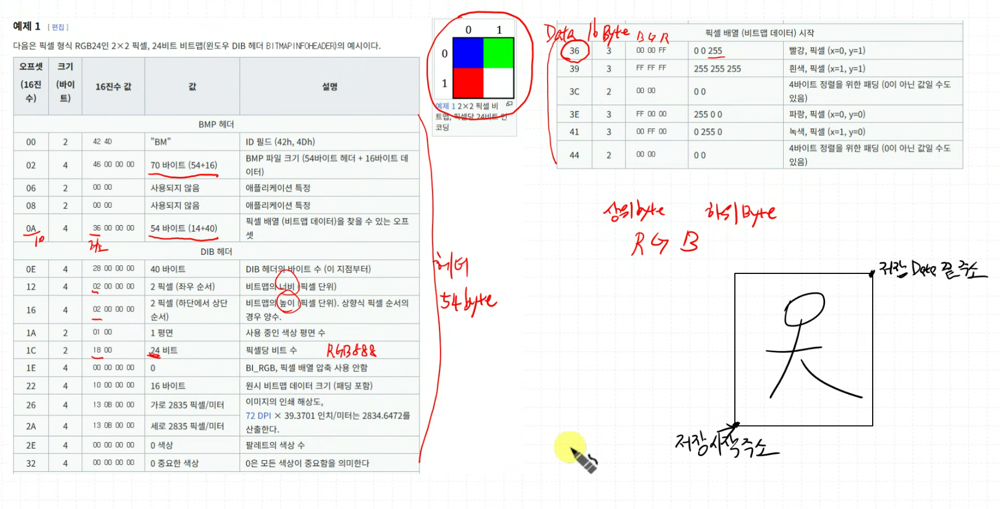

# MUX -> Switch Color / Color Bar
---
### < Block Diagram>


color bar 모듈 따로 만들고 탑에서 먹스추가해서 결과잘나옴

### < 파일 >
> **sources** (Class)
> - [VGA_Display_Switch.sv](<../../assets/source file/250909/250909_Class/first/VGA_Display_Switch.sv>)
> - [VGA_Decoder.sv](<../../assets/source file/250909/250909_Class/first/VGA_Decoder.sv>)
> - [VGA_RGB_SWITCH.sv](<../../assets/source file/250909/250909_Class/first/VGA_RGB_SWITCH.sv>)
> - [VGA_Color_Bar.sv](<../../assets/source file/250909/250909_Class/first/VGA_Color_Bar.sv>)

> **constrs** (Class)
> - [Basys-3-Master.xdc](<../../assets/source file/250909/250909_Class/first/Basys-3-Master.xdc>)

# ROM 에 이미지 넣어서 고고
---
이미지 데이터는 16bit data, 보통 RGB888 RGB565 씀

1. 알씨 다운로드
2. ezBMP.exe Tool 다운로드

### < ImgROM 추가 >
(0,0) ... (639,0)
(0,2) ... (639,1)

### < ImgReader 추가 >
RGB565 -> RGB444로 하위비트를 잘라줘야 함 (빛 data 적음)
또한 ROM 사이즈 640x480 가 안나와서 320x240 로 자르거나 낮춰야함

### < 알씨 >
- 꾸미기
- 자르기 4:3 적용 (자르기 비율 유지, 가로로 길게)
- 크기변경 320x240 적용 (해상도로 조절)
- 모두 저장

### < ezBMP >
- 그림읽기
- RGB565 변환
- 저장
- 파일이름 변경후 저장(c파일)

### < .c 파일 수정 >
- 16bit 부분만 남기고 삭제 (imgReader 입력데이터 16bit)
- "0x" -> "" (공백)
- "," -> " "
- Vivado -> Memory File 추가 후 파일 내용 붙여넣기

### < imgReader 수정 >
```verilog
//assign addr   = DE ? (320 * y + x) : 17'bz;
assign addr   = (DE && (x < 320) && (y < 240)) ? (320 * y + x) : 17'bz;
```

화면에서 사진외에 나머지 부분에도 data가 들어가므로 코드 수정

```verilog
logic img_show;

assign img_show = (DE && (x < 320) && (y < 240));
assign addr     = img_show ? (320 * y + x) : 17'bz;

assign r_port   = img_show ? data[15:12] : 4'bz;
assign g_port   = img_show ? data[10:7] : 4'bz;
assign b_port   = img_show ? data[4:1] : 4'bz;
```

나머지 부분에 검은색이 아닌 레나색으로 채워치므로 코드 수정

### < ImgROM >


LUT로 잡힌 거는 회로가 자동으로 생성된거임
    - 비동기식 회로로 만들면 LUT 회로 생성
    - clk을 받아줘서 동기식 회로로 만들면 BRAM으로 회로가 생성됨

VGA_Decoder 에서 pclk 를 뽑아서, ImgROM 의 clk 으로 넣어줌


BRAM 을 잡음으로 LUT에 회로를 더 구성할 수 있음

### < Result >


# 영상처리와 함께 필터 고안
---
RAM에 주기적으로 계속 읽고 써주면서 memory 업데이트
이후 필터의 수학적 알고리즘을 추가할 수 있음

### < 색상 필터 구현 >


RGB_OnOff_Filter 모듈 설계 !

### < Gray Filter >


GrayScaleFilter 모듈 설계, 상위 4비트만 사용

# 매번 비트스트림하기 빡세니까 bmp 파일 읽고 쓰는거 해보자



### < 알씨 >
- 꾸미기
- 자르기 4:3 적용 (자르기 비율 유지, 가로로 길게)
- 크기변경 640x480 적용
- 모두 저장 -> BMP 형식으로 저장 (24bit)

### < TestBench 작성 (SW) >

이후 sim 동작되는 위치에 bmp 파일을 넣어야함 -> ProjectName.sim/sim_1/behav/xsim/ 여기에넣고 시뮬레이션


```verilog
`timescale 1ns / 1ps

module tb_VGA ();

    byte bmp_total[640*480*3+54];
    byte bmp_header[54];
    byte bmp_data[640*480*3];

    int bmp_size, bmp_data_offset, bmp_width, bmp_height, biBitCount;
    string sourcefileName = "Rengoku_640x480.bmp";
    string targetfileName = "target_640x480.bmp";

    task ReadBMP();
        int fileID, readSize;

        fileID = $fopen(sourcefileName, "rb");
        if (!fileID) begin
            $display("Open [%s] BMP File Error!", sourcefileName);
            $finish;
        end

        readSize = $fread(bmp_total, fileID);
        $fclose(fileID);

        $display("[%s] read size : %0d", sourcefileName, readSize);

        bmp_size = {bmp_total[5], bmp_total[4], bmp_total[3], bmp_total[2]};
        $display("[%s] bmp size : %0d", sourcefileName, bmp_size);

        bmp_data_offset = {
            bmp_total[13], bmp_total[12], bmp_total[11], bmp_total[10]
        };
        $display("[%s] bmp image offset : %0d", sourcefileName,
                 bmp_data_offset);

        bmp_width = {
            bmp_total[21], bmp_total[20], bmp_total[19], bmp_total[18]
        };
        bmp_height = {
            bmp_total[25], bmp_total[24], bmp_total[23], bmp_total[22]
        };
        $display("[%s] bmp image %0d x %0d", sourcefileName, bmp_width,
                 bmp_height);

        biBitCount = {bmp_total[29], bmp_total[28]};
        $display("[%s] bmp bit %0d", sourcefileName, biBitCount);

        if (biBitCount != 24) begin
            $display("[%s] biBitCount need to be 24bit", sourcefileName);
            $finish;
        end

        if (bmp_width % 4) begin
            $display("[%s] bmp width %% 4 need to be zero!", sourcefileName);
            $finish;
        end

        // copy header
        for (int i = 0; i < bmp_data_offset; i++) begin
            bmp_header[i] = bmp_total[i];
        end

        // copy image
        for (int i = bmp_data_offset; i < 640 * 480 * 3; i++) begin
            bmp_data[i-bmp_data_offset] = bmp_total[i];
        end

    endtask

    task WriteBMP();
        int fileID;
        fileID = $fopen(targetfileName, "wb");

        for (int i = 0; i < bmp_data_offset; i++) begin
            $fwrite(fileID, "%c", bmp_header[i]);
        end

        for (int i = 0; i < bmp_size - bmp_data_offset; i++) begin
            $fwrite(fileID, "%c", bmp_data[i]);
        end
        $fclose(fileID);
        $display("Write BMP File Done!");
    endtask

    initial begin
        ReadBMP();
        WriteBMP();
    end

endmodule
```

> Class 로 TestBench 수정
```verilog
// 안됨
```

### < 파일 >
> **sources** (Class)
> - [imgReader.sv](<../../assets/source file/250909/250909_Class/second/imgReader.sv>)
> - [ImgROM.sv](<../../assets/source file/250909/250909_Class/second/ImgROM.sv>)
> - [VGA_Display_Switch.sv](<../../assets/source file/250909/250909_Class/second/VGA_Display_Switch.sv>)
> - [GrayScaleFilter.sv](<../../assets/source file/250909/250909_Class/second/GrayScaleFilter.sv>)
> - [RGB_OnOff_Filter.sv](<../../assets/source file/250909/250909_Class/second/RGB_OnOff_Filter.sv>)
> - [VGA_Color_Bar.sv](<../../assets/source file/250909/250909_Class/second/VGA_Color_Bar.sv>)
> - [VGA_Decoder.sv](<../../assets/source file/250909/250909_Class/second/VGA_Decoder.sv>)
> - [VGA_RGB_SWITCH.sv](<../../assets/source file/250909/250909_Class/second/VGA_RGB_SWITCH.sv>)
> - [Lenna.mem](<../../assets/source file/250909/250909_Class/second/Lenna.mem>)
> - [Rengoku.mem](<../../assets/source file/250909/250909_Class/second/Rengoku.mem>)

> **sim** (Class)
> - [tb_VGA.sv](<../../assets/source file/250909/250909_Class/second/tb_VGA.sv>)

> **constrs** (Class)
> - [Basys-3-Master.xdc](<../../assets/source file/250909/250909_Class/second/Basys-3-Master.xdc>)