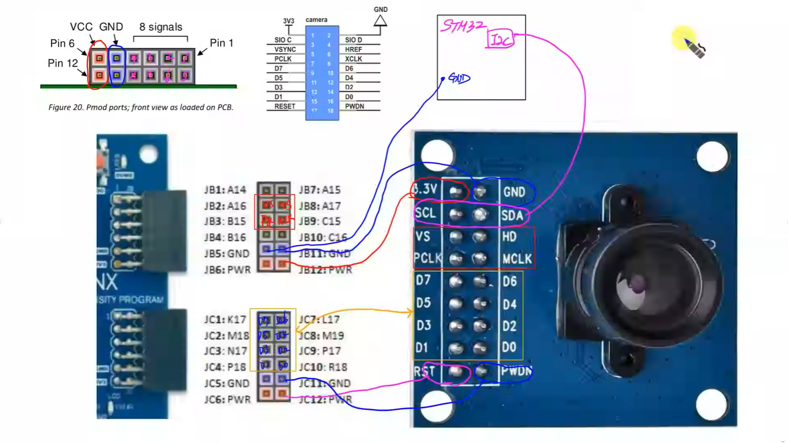
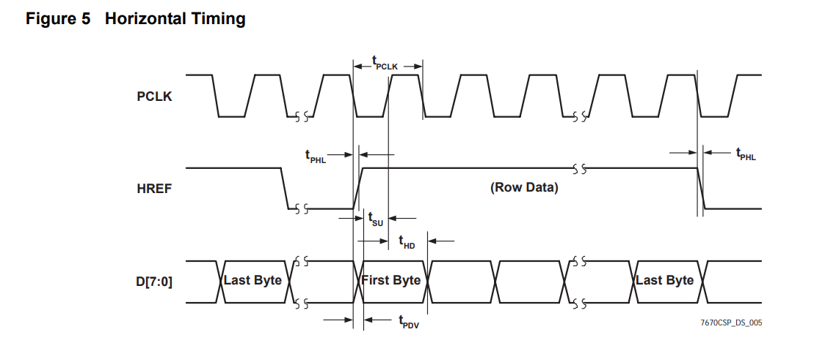
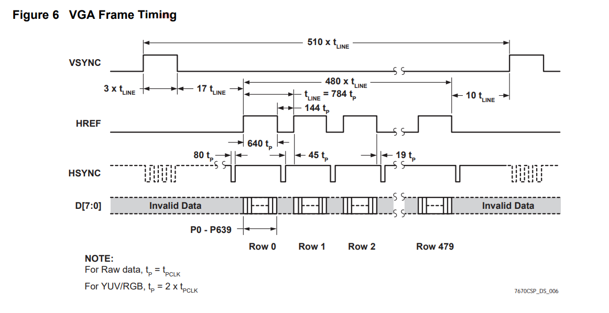
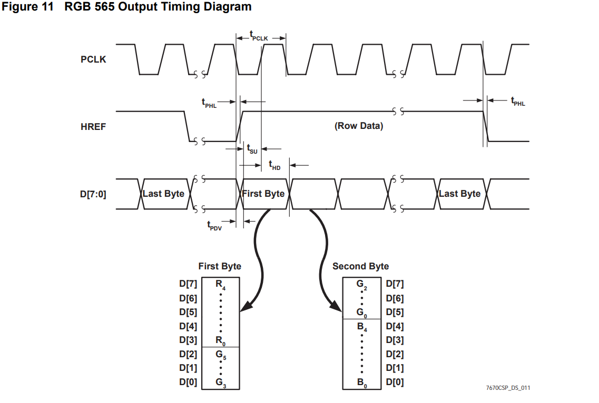
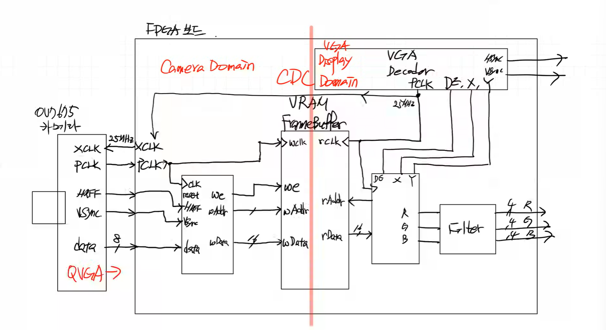
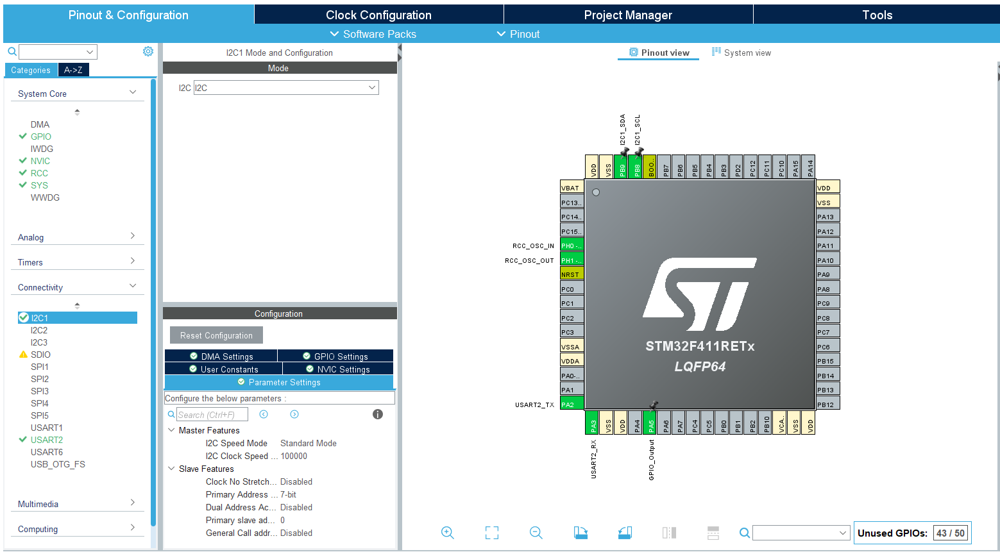
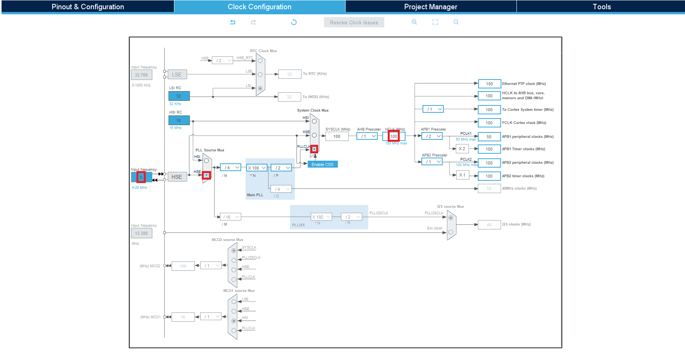

# HW Setting
---


### < ov7670 datasheet >
SCCB 인터페이스로 통신 = I2C
최대 30 frames
RGB565/555/444 지원
자체 Clock이 없기 때문에 외부 Clock을 써야함 (XCLK)


porch가 없음. posedge에서 HREF = 1 이고 이때 나오는 Data 유효


640, 480 라인존재
VSYNC=H : 1 Frame이 끝나고 다음 Line을 받음
Back Porch, Front Porch 사이의 영상처리를 끝내야 함, Line Buffer 필요


RGB565 : 16bit Data Format
First Byte(8bit) + Second Byte(8bit) = Pixel Data(16bit)
Pixel Data Bit = | 76543 | 210 / 765 | 43210 |

HREF=H, VSYNC=L 일때 Data 받음

### < Block Diagram>
수정 필요함

Data 2번 받아서 Memory 에 1번 저장 (8bit, 8bit 받아서 16bit 저장)
각 Data 마다 구분이 필요함
16bit 를 다 받았을 때 Address와 Data, WriteEnable 신호를 내보냄

한 Frame 에 대해 내보낸 신호를 처리할 때는 VGA Decoder 에서 Pclk을 받아서 Frame Buffer 에서 Read Clock 으로 사용
Frame Buffer 를 기준으로 좌, 우는 다른 클럭이다.(Camera Domain, VGA Display Domain) -> CDC (Clock Domain Crossing)
카메라에서는 QVGA로 들어옴

### < STM32 CubeIDE >
초반에 카메라 내부 설정을 STM32에서 내려주기 위해 작업
STM32 create Project
f411re 검색 후 STM32F411RETx LQFP64

< 기본설정 >


System Core -> RCC (Clock 설정) : HSE = Crystal/Ceramic Resonator
Connectivity -> USART2 (Uart 설정) : Mode = Asynchronous
Connectivity -> I2C1 (I2C 설정) : I2C = I2C


Clock Configuration 들어가서 설정

톱니바퀴모양 클릭 -> C코드가 자동으로 생성됨
```c
/* USER CODE BEGIN Header */
/**
  ******************************************************************************
  * @file           : main.c
  * @brief          : Main program body
  ******************************************************************************
  * @attention
  *
  * Copyright (c) 2025 STMicroelectronics.
  * All rights reserved.
  *
  * This software is licensed under terms that can be found in the LICENSE file
  * in the root directory of this software component.
  * If no LICENSE file comes with this software, it is provided AS-IS.
  *
  ******************************************************************************
  */
/* USER CODE END Header */
/* Includes ------------------------------------------------------------------*/
#include "main.h"

/* Private includes ----------------------------------------------------------*/
/* USER CODE BEGIN Includes */

/* USER CODE END Includes */

/* Private typedef -----------------------------------------------------------*/
/* USER CODE BEGIN PTD */

/* USER CODE END PTD */

/* Private define ------------------------------------------------------------*/
/* USER CODE BEGIN PD */

/* USER CODE END PD */

/* Private macro -------------------------------------------------------------*/
/* USER CODE BEGIN PM */

/* USER CODE END PM */

/* Private variables ---------------------------------------------------------*/
I2C_HandleTypeDef hi2c1;

UART_HandleTypeDef huart2;

/* USER CODE BEGIN PV */

/* USER CODE END PV */

/* Private function prototypes -----------------------------------------------*/
void SystemClock_Config(void);
static void MX_GPIO_Init(void);
static void MX_I2C1_Init(void);
static void MX_USART2_UART_Init(void);
/* USER CODE BEGIN PFP */

/* USER CODE END PFP */

/* Private user code ---------------------------------------------------------*/
/* USER CODE BEGIN 0 */

/* USER CODE END 0 */

/**
  * @brief  The application entry point.
  * @retval int
  */
int main(void)
{

  /* USER CODE BEGIN 1 */

  /* USER CODE END 1 */

  /* MCU Configuration--------------------------------------------------------*/

  /* Reset of all peripherals, Initializes the Flash interface and the Systick. */
  HAL_Init();

  /* USER CODE BEGIN Init */

  /* USER CODE END Init */

  /* Configure the system clock */
  SystemClock_Config();

  /* USER CODE BEGIN SysInit */

  /* USER CODE END SysInit */

  /* Initialize all configured peripherals */
  MX_GPIO_Init();
  MX_I2C1_Init();
  MX_USART2_UART_Init();
  /* USER CODE BEGIN 2 */

  /* USER CODE END 2 */

  /* Infinite loop */
  /* USER CODE BEGIN WHILE */
  while (1)
  {
	  HAL_GPIO_TogglePin(GPIOA, GPIO_PIN_5);
	  HAL_Delay(300);
    /* USER CODE END WHILE */

    /* USER CODE BEGIN 3 */
  }
  /* USER CODE END 3 */
}

/**
  * @brief System Clock Configuration
  * @retval None
  */
void SystemClock_Config(void)
{
  RCC_OscInitTypeDef RCC_OscInitStruct = {0};
  RCC_ClkInitTypeDef RCC_ClkInitStruct = {0};

  /** Configure the main internal regulator output voltage
  */
  __HAL_RCC_PWR_CLK_ENABLE();
  __HAL_PWR_VOLTAGESCALING_CONFIG(PWR_REGULATOR_VOLTAGE_SCALE1);

  /** Initializes the RCC Oscillators according to the specified parameters
  * in the RCC_OscInitTypeDef structure.
  */
  RCC_OscInitStruct.OscillatorType = RCC_OSCILLATORTYPE_HSE;
  RCC_OscInitStruct.HSEState = RCC_HSE_ON;
  RCC_OscInitStruct.PLL.PLLState = RCC_PLL_ON;
  RCC_OscInitStruct.PLL.PLLSource = RCC_PLLSOURCE_HSE;
  RCC_OscInitStruct.PLL.PLLM = 4;
  RCC_OscInitStruct.PLL.PLLN = 100;
  RCC_OscInitStruct.PLL.PLLP = RCC_PLLP_DIV2;
  RCC_OscInitStruct.PLL.PLLQ = 4;
  if (HAL_RCC_OscConfig(&RCC_OscInitStruct) != HAL_OK)
  {
    Error_Handler();
  }

  /** Initializes the CPU, AHB and APB buses clocks
  */
  RCC_ClkInitStruct.ClockType = RCC_CLOCKTYPE_HCLK|RCC_CLOCKTYPE_SYSCLK
                              |RCC_CLOCKTYPE_PCLK1|RCC_CLOCKTYPE_PCLK2;
  RCC_ClkInitStruct.SYSCLKSource = RCC_SYSCLKSOURCE_PLLCLK;
  RCC_ClkInitStruct.AHBCLKDivider = RCC_SYSCLK_DIV1;
  RCC_ClkInitStruct.APB1CLKDivider = RCC_HCLK_DIV2;
  RCC_ClkInitStruct.APB2CLKDivider = RCC_HCLK_DIV1;

  if (HAL_RCC_ClockConfig(&RCC_ClkInitStruct, FLASH_LATENCY_3) != HAL_OK)
  {
    Error_Handler();
  }
}

/**
  * @brief I2C1 Initialization Function
  * @param None
  * @retval None
  */
static void MX_I2C1_Init(void)
{

  /* USER CODE BEGIN I2C1_Init 0 */

  /* USER CODE END I2C1_Init 0 */

  /* USER CODE BEGIN I2C1_Init 1 */

  /* USER CODE END I2C1_Init 1 */
  hi2c1.Instance = I2C1;
  hi2c1.Init.ClockSpeed = 100000;
  hi2c1.Init.DutyCycle = I2C_DUTYCYCLE_2;
  hi2c1.Init.OwnAddress1 = 0;
  hi2c1.Init.AddressingMode = I2C_ADDRESSINGMODE_7BIT;
  hi2c1.Init.DualAddressMode = I2C_DUALADDRESS_DISABLE;
  hi2c1.Init.OwnAddress2 = 0;
  hi2c1.Init.GeneralCallMode = I2C_GENERALCALL_DISABLE;
  hi2c1.Init.NoStretchMode = I2C_NOSTRETCH_DISABLE;
  if (HAL_I2C_Init(&hi2c1) != HAL_OK)
  {
    Error_Handler();
  }
  /* USER CODE BEGIN I2C1_Init 2 */

  /* USER CODE END I2C1_Init 2 */

}

/**
  * @brief USART2 Initialization Function
  * @param None
  * @retval None
  */
static void MX_USART2_UART_Init(void)
{

  /* USER CODE BEGIN USART2_Init 0 */

  /* USER CODE END USART2_Init 0 */

  /* USER CODE BEGIN USART2_Init 1 */

  /* USER CODE END USART2_Init 1 */
  huart2.Instance = USART2;
  huart2.Init.BaudRate = 115200;
  huart2.Init.WordLength = UART_WORDLENGTH_8B;
  huart2.Init.StopBits = UART_STOPBITS_1;
  huart2.Init.Parity = UART_PARITY_NONE;
  huart2.Init.Mode = UART_MODE_TX_RX;
  huart2.Init.HwFlowCtl = UART_HWCONTROL_NONE;
  huart2.Init.OverSampling = UART_OVERSAMPLING_16;
  if (HAL_UART_Init(&huart2) != HAL_OK)
  {
    Error_Handler();
  }
  /* USER CODE BEGIN USART2_Init 2 */

  /* USER CODE END USART2_Init 2 */

}

/**
  * @brief GPIO Initialization Function
  * @param None
  * @retval None
  */
static void MX_GPIO_Init(void)
{
  GPIO_InitTypeDef GPIO_InitStruct = {0};
  /* USER CODE BEGIN MX_GPIO_Init_1 */

  /* USER CODE END MX_GPIO_Init_1 */

  /* GPIO Ports Clock Enable */
  __HAL_RCC_GPIOH_CLK_ENABLE();
  __HAL_RCC_GPIOA_CLK_ENABLE();
  __HAL_RCC_GPIOB_CLK_ENABLE();

  /*Configure GPIO pin Output Level */
  HAL_GPIO_WritePin(GPIOA, GPIO_PIN_5, GPIO_PIN_RESET);

  /*Configure GPIO pin : PA5 */
  GPIO_InitStruct.Pin = GPIO_PIN_5;
  GPIO_InitStruct.Mode = GPIO_MODE_OUTPUT_PP;
  GPIO_InitStruct.Pull = GPIO_NOPULL;
  GPIO_InitStruct.Speed = GPIO_SPEED_FREQ_LOW;
  HAL_GPIO_Init(GPIOA, &GPIO_InitStruct);

  /* USER CODE BEGIN MX_GPIO_Init_2 */

  /* USER CODE END MX_GPIO_Init_2 */
}

/* USER CODE BEGIN 4 */

/* USER CODE END 4 */

/**
  * @brief  This function is executed in case of error occurrence.
  * @retval None
  */
void Error_Handler(void)
{
  /* USER CODE BEGIN Error_Handler_Debug */
  /* User can add his own implementation to report the HAL error return state */
  __disable_irq();
  while (1)
  {
  }
  /* USER CODE END Error_Handler_Debug */
}
#ifdef USE_FULL_ASSERT
/**
  * @brief  Reports the name of the source file and the source line number
  *         where the assert_param error has occurred.
  * @param  file: pointer to the source file name
  * @param  line: assert_param error line source number
  * @retval None
  */
void assert_failed(uint8_t *file, uint32_t line)
{
  /* USER CODE BEGIN 6 */
  /* User can add his own implementation to report the file name and line number,
     ex: printf("Wrong parameters value: file %s on line %d\r\n", file, line) */
  /* USER CODE END 6 */
}
#endif /* USE_FULL_ASSERT */
```

망치질 하면 깜빡거림
재생버튼, OK 누르면 다운로드함 (Upgrage)

보드동작완!

drag and drop : OV7670.c -> 250910_OV7670/Core/Src
drag and drop : OV7670.h, OV7670_REG.h -> 250910_OV7670/Core/Src

```c
/* USER CODE BEGIN Includes */
#include "OV7670.h"

// ...

/* USER CODE BEGIN 2 */
OV7670_Init(&hi2c1);
OV7670_ResetSW();
OV7670_SetResolution(QVGA);
OV7670_SetColorFormat(RGB565);
OV7670_ShowColorBar(1);
```
main.c 에 코드 추가 후 프로그램 올리고

Vivado 로 돌아와서 xdc 파일 생성
**xdc 파일에서 ov7670_pclk을 JB10 으로 옮기고 다시 Bitstream**

