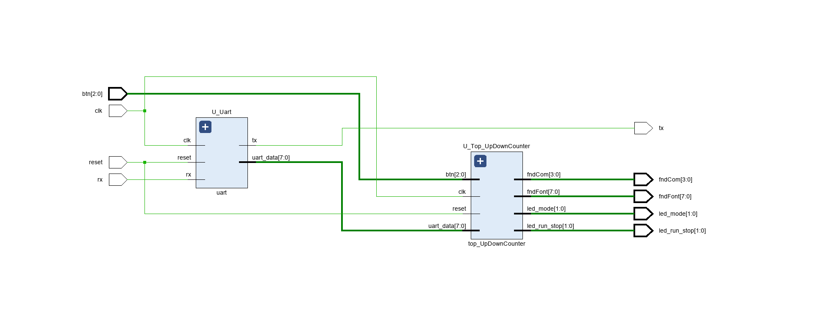

# Serial 통신 프로토콜
---
### 1. UART
**비동기** 통신 방식
borate(정해진 시간, 주파수, bit per sec - bps) 기준으로 데이터를 송수신
에러율이 높아질 수 있음
시간설정 잘못하면 송수신이 안됨
송수신 속도에 제한이 있음
1:1 통신으로 다른 디바이스와 연결이 안됨
시간체크용 내부 클럭을 생성해줘야됨

### 2. I2C
**동기** 통신 방식
클럭을 기준으로 데이터를 송수신
클럭에 맞게 빠르게 동작 가능
데이터 주소를 확인해야 해서 SPI 대비 느림
N:N 통신
chip slecet 없음
송신 할 때는 송신만, 수신할 때는 수신만 가능

### 3. SPI
**동기** 통신 방식으로
클럭을 기준으로 데이터를 송수신
클럭에 맞게 빠르게 동작 가능
젤 빠름
1:N 통신
chip slecet 있음

UART 만들자
시작비트, 데이터비트(1대N 통8bit)
FSM을 ASM으로 수정하고 시작하면 편행

# Uart Design
---
### < FSM : Transmitter >
사진

### < ASM : Transmitter >
사진

### < Code : Uart >
```verilog
`timescale 1ns / 1ps

module uart (
    input  logic       clk,
    input  logic       reset,
    input  logic       start,
    input  logic [7:0] tx_data,
    output logic       tx,
    output logic       tx_busy,
    output logic       tx_done
);

    logic br_tick;

    baudrate_gen U_Baudrate_Gen (
        .clk    (clk),
        .reset  (reset),
        .br_tick(br_tick)
    );

    transmitter U_Transmitter (
        .clk    (clk),
        .reset  (reset),
        .br_tick(br_tick),
        .start  (start),
        .tx_data(tx_data),
        .tx_busy(tx_busy),
        .tx_done(tx_done),
        .tx     (tx)
    );

endmodule


module baudrate_gen (
    input  logic clk,
    input  logic reset,
    output logic br_tick
);

    //logic [$clog2(100_000_000/9600/16)-1:0] br_counter;
    logic [3:0] br_counter;

    always_ff @(posedge clk, posedge reset) begin
        if (reset) begin
            br_counter <= 0;
            br_tick <= 1'b0;
        end else begin
            //if (br_counter == 100_000_000 / 9600 / 16 - 1) begin  // 9600hz 9600bps
            if (br_counter == 10 - 1) begin
                br_counter <= 0;
                br_tick <= 1'b1;
            end else begin
                br_counter <= br_counter + 1;
                br_tick <= 1'b0;
            end
        end
    end

endmodule


module transmitter (
    input  logic       clk,
    input  logic       reset,
    input  logic       br_tick,
    input  logic       start,
    input  logic [7:0] tx_data,
    output logic       tx_busy,
    output logic       tx_done,
    output logic       tx
);

    typedef enum {
        IDLE,
        START,
        DATA,
        STOP
    } tx_state_e;

    tx_state_e tx_state, tx_next_state;
    
    logic [7:0] temp_data_next, temp_data_reg;
    logic tx_reg, tx_next;
    logic [3:0] tick_cnt_reg, tick_cnt_next;
    logic [2:0] bit_cnt_reg, bit_cnt_next;
    logic tx_done_reg, tx_done_next;
    logic tx_busy_reg, tx_busy_next;

    assign tx = tx_reg;
    assign tx_busy = tx_busy_reg;
    assign tx_done = tx_done_reg;

    always_ff @(posedge clk, posedge reset) begin
        if (reset) begin
            tx_state      <= IDLE;
            temp_data_reg <= 0;
            tx_reg        <= 1'b1;
            tick_cnt_reg  <= 0;
            bit_cnt_reg   <= 0;
            tx_done_reg   <= 0;
            tx_busy_reg   <= 0;
        end else begin
            tx_state      <= tx_next_state;
            temp_data_reg <= temp_data_next;
            tx_reg        <= tx_next;
            tick_cnt_reg  <= tick_cnt_next;
            bit_cnt_reg   <= bit_cnt_next;
            tx_done_reg   <= tx_done_next;
            tx_busy_reg   <= tx_busy_next;
        end
    end

    always_comb begin
        tx_next_state  = tx_state;
        temp_data_next = temp_data_reg;
        tx_next        = tx_reg;
        tick_cnt_next  = tick_cnt_reg;
        bit_cnt_next   = bit_cnt_reg;
        tx_done_next   = tx_done_reg;
        tx_busy_next   = tx_busy_reg;
        case (tx_state)
            IDLE: begin
                tx_next = 1'b1;
                tx_done_next = 0;
                tx_busy_next = 0;
                if (start) begin
                    tx_next_state  = START;
                    temp_data_next = tx_data;
                    tick_cnt_next  = 0;
                    bit_cnt_next   = 0;
                    tx_busy_next   = 1;
                end
            end
            START: begin
                tx_next = 1'b0;
                if (br_tick) begin
                    if (tick_cnt_reg == 15) begin
                        tx_next_state = DATA;
                        tick_cnt_next = 0;
                    end else begin
                        tick_cnt_next = tick_cnt_reg + 1;
                    end
                end
            end
            DATA: begin
                tx_next = temp_data_reg[0];
                if (br_tick) begin
                    if (tick_cnt_reg == 15) begin
                        tick_cnt_next = 0;
                        if (bit_cnt_reg == 7) begin
                            tx_next_state = STOP;
                            bit_cnt_next  = 0;
                        end else begin
                            temp_data_next = {1'b0, temp_data_reg[7:1]};
                            bit_cnt_next   = bit_cnt_reg + 1;
                        end
                    end else begin
                        tick_cnt_next = tick_cnt_reg + 1;
                    end
                end
            end
            STOP: begin
                tx_next = 1'b1;
                if (br_tick) begin
                    if (tick_cnt_reg == 15) begin
                        tx_next_state = IDLE;
                        tx_done_next  = 1;
                        tx_busy_next  = 0;
                        tick_cnt_next = 0;
                    end else begin
                        tick_cnt_next = tick_cnt_reg + 1;
                    end
                end
            end
        endcase
    end

endmodule
```

### < Comment >
> **baudrate_gen**
> 

> **transmitter**
> 

# Homework
---
### < Design Specification >
> - receiver 설계 → uart 구현
> - uart + up down counter → PC 제어 (ComPortMaster)
> - "r" : run 상태
> - "s" : stop 상태
> - "c" : clear 상태
> - "m" : mode변경

### < Code : uart >
```verilog
`timescale 1ns / 1ps

module uart (
    input  logic       clk,
    input  logic       reset,
    input  logic       rx,
    output logic       tx,
    output logic [7:0] uart_data
);

    logic br_tick;
    logic rx_done;
    logic [7:0] rx_data;

    assign uart_data = rx_done ? rx_data : 8'b0;

    baudrate_gen U_Baudrate_Gen (
        .clk    (clk),
        .reset  (reset),
        .br_tick(br_tick)
    );

    receiver U_Receiver (
        .clk    (clk),
        .reset  (reset),
        .br_tick(br_tick),
        .rx     (rx),
        .rx_data(rx_data),
        .rx_done(rx_done)
    );

    transmitter U_Transmitter (
        .clk    (clk),
        .reset  (reset),
        .br_tick(br_tick),
        .start  (rx_done),
        .tx_data(rx_data),
        .tx_busy(),
        .tx_done(),
        .tx     (tx)
    );

endmodule


module baudrate_gen (
    input  logic clk,
    input  logic reset,
    output logic br_tick
);

    logic [$clog2(100_000_000/9600/16)-1:0] br_counter;
    // logic [3:0] br_counter;

    always_ff @(posedge clk, posedge reset) begin
        if (reset) begin
            br_counter <= 0;
            br_tick <= 1'b0;
        end else begin
            if (br_counter == 100_000_000 / 9600 / 16 - 1) begin  // 9600hz 9600bps
                // if (br_counter == 10 - 1) begin
                br_counter <= 0;
                br_tick    <= 1'b1;
            end else begin
                br_counter <= br_counter + 1;
                br_tick    <= 1'b0;
            end
        end
    end

endmodule


module receiver (
    input  logic       clk,
    input  logic       reset,
    input  logic       br_tick,
    input  logic       rx,
    output logic [7:0] rx_data,
    output logic       rx_done
);

    typedef enum {
        IDLE,
        START,
        DATA,
        STOP
    } rx_state_e;

    rx_state_e rx_state, rx_next_state;

    logic [7:0] rx_data_reg, rx_data_next;
    logic [4:0] tick_cnt_reg, tick_cnt_next;
    logic [2:0] bit_cnt_reg, bit_cnt_next;
    logic rx_done_reg, rx_done_next;

    assign rx_done = rx_done_reg;
    assign rx_data = rx_data_reg;

    always_ff @(posedge clk, posedge reset) begin
        if (reset) begin
            rx_state     <= IDLE;
            rx_data_reg  <= 0;
            tick_cnt_reg <= 0;
            bit_cnt_reg  <= 0;
            rx_done_reg  <= 0;
        end else begin
            rx_state     <= rx_next_state;
            rx_data_reg  <= rx_data_next;
            tick_cnt_reg <= tick_cnt_next;
            bit_cnt_reg  <= bit_cnt_next;
            rx_done_reg  <= rx_done_next;
        end
    end

    always_comb begin
        rx_next_state = rx_state;
        rx_data_next  = rx_data_reg;
        tick_cnt_next = tick_cnt_reg;
        bit_cnt_next  = bit_cnt_reg;
        rx_done_next  = rx_done_reg;
        case (rx_state)
            IDLE: begin
                rx_done_next = 0;
                if (rx == 0) begin
                    rx_next_state = START;
                    rx_data_next  = 0;
                    tick_cnt_next = 0;
                    bit_cnt_next  = 0;
                end
            end
            START: begin
                if (br_tick) begin
                    if (tick_cnt_reg == 7) begin
                        rx_next_state = DATA;
                        tick_cnt_next = 0;
                    end else begin
                        tick_cnt_next = tick_cnt_reg + 1;
                    end
                end
            end
            DATA: begin
                if (br_tick) begin
                    if (tick_cnt_reg == 15) begin
                        tick_cnt_next = 0;
                        rx_data_next  = {rx, rx_data_reg[7:1]};
                        if (bit_cnt_reg == 7) begin
                            rx_next_state = STOP;
                            bit_cnt_next  = 0;
                        end else begin
                            bit_cnt_next = bit_cnt_reg + 1;
                        end
                    end else begin
                        tick_cnt_next = tick_cnt_reg + 1;
                    end
                end
            end
            STOP: begin
                if (br_tick) begin
                    if (tick_cnt_reg == 23) begin
                        rx_next_state = IDLE;
                        rx_done_next  = 1;
                        tick_cnt_next = 0;
                    end else begin
                        tick_cnt_next = tick_cnt_reg + 1;
                    end
                end
            end
        endcase
    end

endmodule


module transmitter (
    input  logic       clk,
    input  logic       reset,
    input  logic       br_tick,
    input  logic       start,
    input  logic [7:0] tx_data,
    output logic       tx_busy,
    output logic       tx_done,
    output logic       tx
);

    typedef enum {
        IDLE,
        START,
        DATA,
        STOP
    } tx_state_e;

    tx_state_e tx_state, tx_next_state;

    logic [7:0] temp_data_next, temp_data_reg;
    logic tx_reg, tx_next;
    logic [3:0] tick_cnt_reg, tick_cnt_next;
    logic [2:0] bit_cnt_reg, bit_cnt_next;
    logic tx_done_reg, tx_done_next;
    logic tx_busy_reg, tx_busy_next;

    assign tx = tx_reg;
    assign tx_busy = tx_busy_reg;
    assign tx_done = tx_done_reg;

    always_ff @(posedge clk, posedge reset) begin
        if (reset) begin
            tx_state      <= IDLE;
            temp_data_reg <= 0;
            tx_reg        <= 1'b1;
            tick_cnt_reg  <= 0;
            bit_cnt_reg   <= 0;
            tx_done_reg   <= 0;
            tx_busy_reg   <= 0;
        end else begin
            tx_state      <= tx_next_state;
            temp_data_reg <= temp_data_next;
            tx_reg        <= tx_next;
            tick_cnt_reg  <= tick_cnt_next;
            bit_cnt_reg   <= bit_cnt_next;
            tx_done_reg   <= tx_done_next;
            tx_busy_reg   <= tx_busy_next;
        end
    end

    always_comb begin
        tx_next_state  = tx_state;
        temp_data_next = temp_data_reg;
        tx_next        = tx_reg;
        tick_cnt_next  = tick_cnt_reg;
        bit_cnt_next   = bit_cnt_reg;
        tx_done_next   = tx_done_reg;
        tx_busy_next   = tx_busy_reg;
        case (tx_state)
            IDLE: begin
                tx_next = 1'b1;
                tx_done_next = 0;
                tx_busy_next = 0;
                if (start) begin
                    tx_next_state  = START;
                    temp_data_next = tx_data;
                    tick_cnt_next  = 0;
                    bit_cnt_next   = 0;
                    tx_busy_next   = 1;
                end
            end
            START: begin
                tx_next = 1'b0;
                if (br_tick) begin
                    if (tick_cnt_reg == 15) begin
                        tx_next_state = DATA;
                        tick_cnt_next = 0;
                    end else begin
                        tick_cnt_next = tick_cnt_reg + 1;
                    end
                end
            end
            DATA: begin
                tx_next = temp_data_reg[0];
                if (br_tick) begin
                    if (tick_cnt_reg == 15) begin
                        tick_cnt_next = 0;
                        if (bit_cnt_reg == 7) begin
                            tx_next_state = STOP;
                            bit_cnt_next  = 0;
                        end else begin
                            temp_data_next = {1'b0, temp_data_reg[7:1]};
                            bit_cnt_next   = bit_cnt_reg + 1;
                        end
                    end else begin
                        tick_cnt_next = tick_cnt_reg + 1;
                    end
                end
            end
            STOP: begin
                tx_next = 1'b1;
                if (br_tick) begin
                    if (tick_cnt_reg == 15) begin
                        tx_next_state = IDLE;
                        tx_done_next  = 1;
                        tx_busy_next  = 0;
                        tick_cnt_next = 0;
                    end else begin
                        tick_cnt_next = tick_cnt_reg + 1;
                    end
                end
            end
        endcase
    end

endmodule
```

### < Comment >
> **uart**
>

> **receiver**
> 

### < Code : top_Uart_UpDownCounter >
```verilog
`timescale 1ns / 1ps

module top_Uart_UpDownCounter (
    input  logic       clk,
    input  logic       reset,
    input  logic [2:0] btn,
    input  logic       rx,
    output logic       tx,
    output logic [1:0] led_mode,
    output logic [1:0] led_run_stop,
    output logic [3:0] fndCom,
    output logic [7:0] fndFont
);

    logic [7:0] uart_data;

    uart U_Uart (
        .clk      (clk),
        .reset    (reset),
        .rx       (rx),
        .tx       (tx),
        .uart_data(uart_data)
    );

    top_UpDownCounter U_Top_UpDownCounter (
        .clk         (clk),
        .reset       (reset),
        .btn         (btn),
        .uart_data   (uart_data),
        .led_mode    (led_mode),
        .led_run_stop(led_run_stop),
        .fndCom      (fndCom),
        .fndFont     (fndFont)
    );

endmodule
```

### < Code : UpDownCounter (control_unit) >
```verilog
// ...
module control_unit (
    input  logic       clk,
    input  logic       reset,
    input  logic       btn_mode,
    input  logic       btn_run_stop,
    input  logic       btn_clear,
    input  logic [7:0] uart_data,
    output logic       mode,
    output logic       run_stop,
    output logic       clear,
    output logic [1:0] led_mode,
    output logic [1:0] led_run_stop
);
    /******************** MODE FSM ********************/

    typedef enum {
        UP,
        DOWN
    } state_mode_e;

    state_mode_e state_mode, next_state_mode;

    // state memory
    always_ff @(posedge clk, posedge reset) begin
        if (reset) begin
            state_mode <= UP;
        end else begin
            state_mode <= next_state_mode;
        end
    end

    // transition logic
    always_comb begin
        next_state_mode = state_mode;
        mode = 0;
        led_mode = 2'b00;
        case (state_mode)
            UP: begin
                led_mode = 2'b01;
                if (btn_mode || (uart_data == "m")) begin
                    next_state_mode = DOWN;
                end
            end
            DOWN: begin
                mode = 1;
                led_mode = 2'b10;
                if (btn_mode || (uart_data == "m")) begin
                    next_state_mode = UP;
                end
            end
        endcase
    end

    /******************** RUN STOP CLEAR FSM ********************/

    typedef enum {
        STOP,
        RUN,
        CLEAR
    } state_counter_e;

    state_counter_e state_counter, next_state_counter;

    always_ff @(posedge clk, posedge reset) begin
        if (reset) begin
            state_counter <= STOP;
        end else begin
            state_counter <= next_state_counter;
        end
    end

    always_comb begin
        next_state_counter = state_counter;
        run_stop = 0;
        clear = 0;
        led_run_stop = 2'b00;
        case (state_counter)
            STOP: begin
                led_run_stop = 2'b01;
                if (btn_run_stop || (uart_data == "r"))
                    next_state_counter = RUN;
                else if (btn_clear || (uart_data == "c"))
                    next_state_counter = CLEAR;
            end
            RUN: begin
                run_stop = 1;
                led_run_stop = 2'b10;
                if (btn_run_stop || (uart_data == "s"))
                    next_state_counter = STOP;
            end
            CLEAR: begin
                clear = 1;
                next_state_counter = STOP;
            end
        endcase
    end

endmodule
```

### < Schematic >


### < Video >
<video controls src="../../assets/img/Noh_Jinho/250808/250808_hw.mp4" title="Title"></video>

### < 고찰 >
> 써야돼

### < 파일 >
> **sources** (Class)
> - [uart.sv](<../../assets/source file/250808/250808_Class/uart.sv>)

> **sim** (Class)
> - [uart_tb.sv](<../../assets/source file/250808/250808_Class/uart_tb.sv>)

> **sources** (Homework)
> - [top_Uart_UpDownCounter.sv](<../../assets/source file/250808/250808_HW/top_Uart_UpDownCounter.sv>)
> - [uart.sv](<../../assets/source file/250808/250808_HW/uart.sv>)
> - [top_UpDownCounter.sv](<../../assets/source file/250808/250808_HW/top_UpDownCounter.sv>)
> - [button_detector.sv](<../../assets/source file/250808/250808_HW/button_detector.sv>)
> - [UpDownCounter.sv](<../../assets/source file/250808/250808_HW/UpDownCounter.sv>)
> - [fndController.sv](<../../assets/source file/250808/250808_HW/fndController.sv>)

> **constrs** (Homework)
> - [Basys-3-Master.xdc](<../../assets/source file/250808/250808_HW/Basys-3-Master.xdc>)