# 📌 OpenCV란?
---
OpenCV(Open Source Computer Vision Library)는 **실시간 컴퓨터 비전** 및 **머신러닝**을 위한 오픈소스 라이브러리입니다.  
다양한 이미지/비디오 처리 기능을 제공하며, Python, C++, Java 등 다양한 언어에서 사용 가능합니다.

# 🚀 CUDA 모듈의 역할
---
- GPU 가속을 활용한 **고속 이미지 처리** 수행
- OpenCV의 일부 함수들은 CUDA를 통해 **병렬 처리**되어 성능을 향상시킴
- 사용 예: `cv2.cuda.GpuMat`, `cv2.cuda.filter2D()`, `cv2.cuda.resize()` 등

# 🛠️ 작업할 디렉토리 생성 및 환경 설정
---

```bash
# 1. 작업 디렉토리 생성
mkdir opencv                 # 디렉토리 이름: opencv
cd opencv                   # 해당 디렉토리로 이동

# 2. 가상 환경 생성 및 활성화
python3 -m venv .env        # 가상 환경 생성 (폴더 이름: .env)
source .env/bin/activate    # 가상 환경 활성화

# 3. 패키지 설치
pip install opencv-python          # OpenCV 기본 기능(core, imgproc 등)
pip install opencv-contrib-python # 추가 모듈(contrib 포함)
pip install -U pip                 # pip 최신 버전으로 업그레이드
```

# ✅ 설치 확인 (Python 인터프리터 실행)
---

```py
>>> import numpy as np
>>> import cv2

>>> np.__version__
'2.2.6'          # 설치된 NumPy 버전 출력

>>> cv2.__version__
'4.11.0'         # 설치된 OpenCV 버전 출력

>>> exit()       # Python 인터프리터 종료
```

# 🎨 색상 정보
---

### 🔗 참고 사이트
- [W3Schools - RGB Colors](https://www.w3schools.com/colors/colors_rgb.asp)

---

### 🌈 RGB (Red, Green, Blue)
- 각 색상 채널: **0~255 (8bit)**
  - R (Red): 8bit
  - G (Green): 8bit
  - B (Blue): 8bit
- 픽셀 1개 = **24bit (8bit × 3)**

---

### 🎨 HSL (Hue, Saturation, Lightness)
- **H**: 색상 (Hue) → 0 ~ 360°
- **S**: 채도 (Saturation) → 0 ~ 100%
- **L**: 밝기 (Lightness) → 0 ~ 100%

---

### 🔄 RGB vs HSL 차이점

| 항목 | RGB | HSL |
| :--: | :--: | :--: |
| 구성 | Red, Green, Blue (각 0~255) | Hue (0~360), Saturation & Lightness (0~100%) |
| 직관성 | 컴퓨터에서 사용하기 적합 | 사람이 색을 이해하기 쉬움 |
| 색 조절 | 색상 조정이 복잡함 | 채도/밝기 조절이 용이함 |
| 용도 | 디스플레이, 이미지 처리 등 | 디자인, 색상 선택 도구 등에 유용 |

---

### ✅ **요약**:  
- RGB는 화면 출력/처리에 적합한 **디지털 색 표현 방식**  
- HSL은 색상 구성요소를 분리해 **사람이 이해하거나 조절하기 쉬운 방식**

---

### 📝 메모
- vi ex1.py : python 스크립트 생성
- python ex1.py : 생성된 스크립트 실행
- jpg : 파일이 작고 속도가 빠르며, 주로 사진이나 웹 배경 이미지에 사용
- png : 화질 보존, 투명 배경이 필요한 경우 사용

# 👨‍💻 실습
---

### 💡 이미지 Read / Write / Display

```py
# ex1.py
import numpy as np
import cv2

# 이미지 파일을 Read
img = cv2.imread("Rengoku.jpg")

# Image 란 이름의 Display 창 생성
cv2.namedWindow("image", cv2.WINDOW_NORMAL)

# Numpy ndarray H/W/C order
print(img.shape)

# Read 한 이미지 파일을 Display
cv2.imshow("image", img)

# 별도 키 입력이 있을때 까지 대기
cv2.waitKey(0)

# ex1_output.jpg 로 읽은 이미지 파일을 저장
cv2.imwrite("ex1_output.jpg", img)

# Destory all windows
cv2.destroyAllWindows()
```

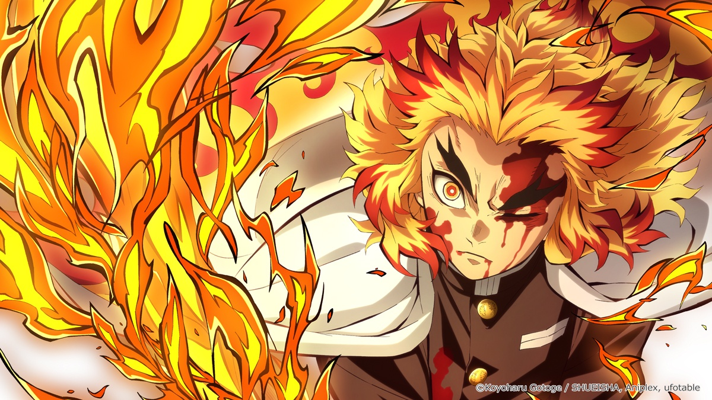

### ❓ Quiz: 이미지 Read / Write / Display

```
1. print(img.shape)의 출력 결과는 무슨 의미일까?

2. 본인이 좋아하는 사진을 web 에서 다운받아서 OpenCV API를 사용해서 Display 및 파일로 저장해보자.

3. 현재는 별도의 키 입력이 있을 때까지 cv2.waitKey(0) 함수에서 대기하게 된다. 코드를 추가해서 소문자 “s” 키를 입력받을 때만 이미지 파일을 저장하고 다른 키가 입력되면 이미지 파일을 저장하지 않게 수정해보자.
```

---

### 💡 RGB/HSV Color Space (색 공간)

```py
# ex2.py
import numpy as np
import cv2

# 이미지 파일을 Read 하고 Color space 정보 출력
color = cv2.imread("Rengoku.jpg", cv2.IMREAD_COLOR)
print(color.shape)

height,width,channels = color.shape
cv2.imshow("Original Image", color)

# Color channel 을 B,G,R 로 분할하여 출력
b,g,r = cv2.split(color)
rgb_split = np.concatenate((b,g,r),axis=1)
cv2.imshow("BGR Channels",rgb_split)

# 색공간을 BGR 에서 HSV 로 변환
hsv = cv2.cvtColor(color, cv2.COLOR_BGR2HSV)

# Channel 을 H,S,V 로 분할하여 출력
h,s,v = cv2.split(hsv)
hsv_split = np.concatenate((h,s,v),axis=1)
cv2.imshow("Split HSV", hsv_split)
```

### ❓ Quiz : RGB/HSV Color Space (색 공간)

```
1. 위 색공간 이미지의 링크로 이동해서 각 색 공간의 표현 방법을 이해해 보자.

2. HSV color space가 어떤 경우에 효과적으로 사용될까?

3. HSV로 변환된 이미지를 BGR이 아닌 RGB로 다시 변환해서 출력해 보자.

4. COLOR_RGB2GRAY를 사용해서 흑백으로 변환해 출력해 보자.
```

---

### 💡 Crop / Resize (자르기 / 크기 조정)

```py
# ex3.py
import numpy as np
import cv2

# 이미지 파일을 Read
img = cv2.imread("Rengoku.jpg")

# Crop 300x400 from original image from (100, 50)=(x, y)
# 세로(y): 100:500 →  500 - 100 = 400픽셀
# 가로(x): 500:1200 → 1200 - 500 = 700픽셀
cropped = img[100:500, 500:1200]

# Resize cropped image from 300x400 to 400x200
resized = cv2.resize(cropped, (800,200))

# Display all
cv2.imshow("Original", img)
cv2.imshow("Cropped image", cropped)
cv2.imshow("Resized image", resized)
cv2.imwrite("ex3_cropped.jpg", cropped)
cv2.imwrite("ex3_resized.jpg", resized)

cv2.waitKey(0)
cv2.destroyAllWindows()
```

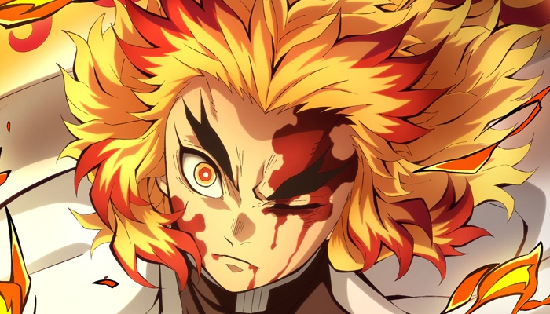


### ❓ Quiz : Crop / Resize (자르기 / 크기 조정)

```
1. Input image 를 본인이 좋아하는 인물 사진으로 변경해서 적용하자. 그리고 본인이 사용한 input image 의 size 를 확인해 보자.

2. 본인이 사용한 이미지의 얼굴 영역만 crop 해서 display 해 보자.

3. 원본 이미지의 정확히 1.5배만큼 이미지를 확대해서 파일로 저장해 보자.

4. openCV 의 rotate API 를 사용해서 우측으로 90도만큼 회전된 이미지를 출력해 보자.
```

---

### 💡 역상 (Reverse Image)

```py
# ex4.py
import numpy as np
import cv2

src = cv2.imread("Rengoku.jpg", cv2.IMREAD_COLOR)
dst = cv2.bitwise_not(src)

cv2.imshow("src", src)
cv2.imshow("dst", dst)
cv2.imwrite("ex4_reverse.jpg", dst)

cv2.waitKey()
cv2.destroyAllWindows()
```

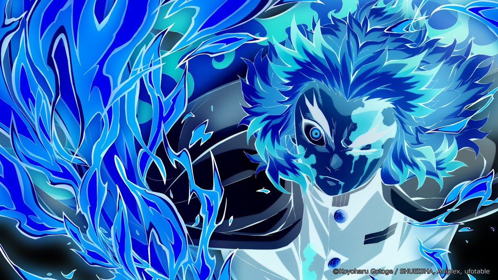

### ❓ Quiz : 역상 (Reverse Image)

```
1. AND, OR, XOR 연산에 대해서 확인해 보자.
```

---

### 💡 이진화 (Binary)

```py
# ex5.py
import numpy as np
import cv2

src = cv2.imread("Rengoku.jpg", cv2.IMREAD_COLOR)
gray = cv2.cvtColor(src, cv2.COLOR_BGR2GRAY)

ret, dst = cv2.threshold(gray, 150, 255, cv2.THRESH_BINARY)

cv2.imshow("dst", dst)
cv2.imwrite("ex5_binary.jpg", dst)

cv2.waitKey()
cv2.destroyAllWindows()
```

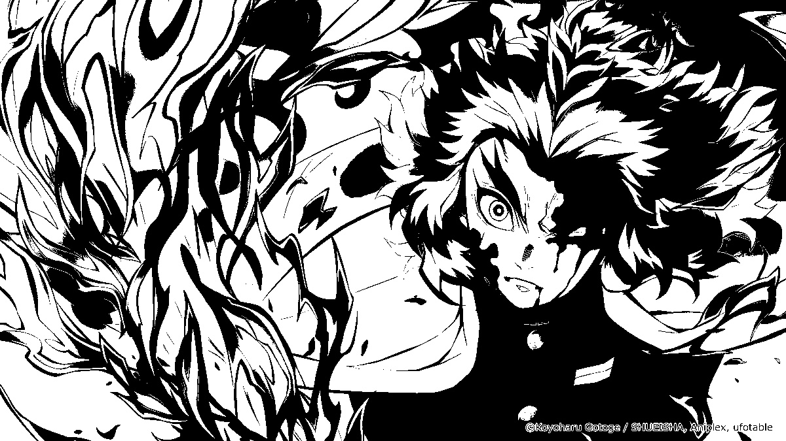

### ❓ Quiz : 이진화 (Binary)

```
1. 임계값을 변화시켜 보자.
```

---

### 💡 흐림효과 (Blur)

```py
# ex6.py
import numpy as np
import cv2

src = cv2.imread("Rengoku.jpg", cv2.IMREAD_COLOR)
dst = cv2.blur(src, (9, 9), anchor=(-1,- 1), borderType=cv2.BORDER_DEFAULT)

cv2.imshow("dst", dst)
cv2.imwrite("ex6_blur.jpg", dst)

cv2.waitKey()
cv2.destroyAllWindows()
```

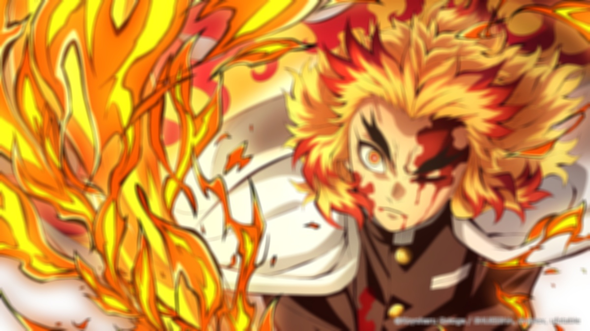

### ❓ Quiz : 흐림효과 (Blur)

```
1. Kernel Size를 변경하여 보자.

2. borderType을 변경하여 보자.(cv2.BORDER_REFLECT)
```

---

### 💡 가장자리 검출 (Edge)

```py
# ex7.py
import numpy as np
import cv2

src = cv2.imread("Rengoku.jpg", cv2.IMREAD_COLOR)
gray = cv2.cvtColor(src, cv2.COLOR_BGR2GRAY)

sobel = cv2.Sobel(gray, cv2.CV_8U, 1, 0, 3)

cv2.imshow("sobel", sobel)
cv2.imwrite("ex7_edge.jpg", sobel)

cv2.waitKey()
cv2.destroyAllWindows()
```

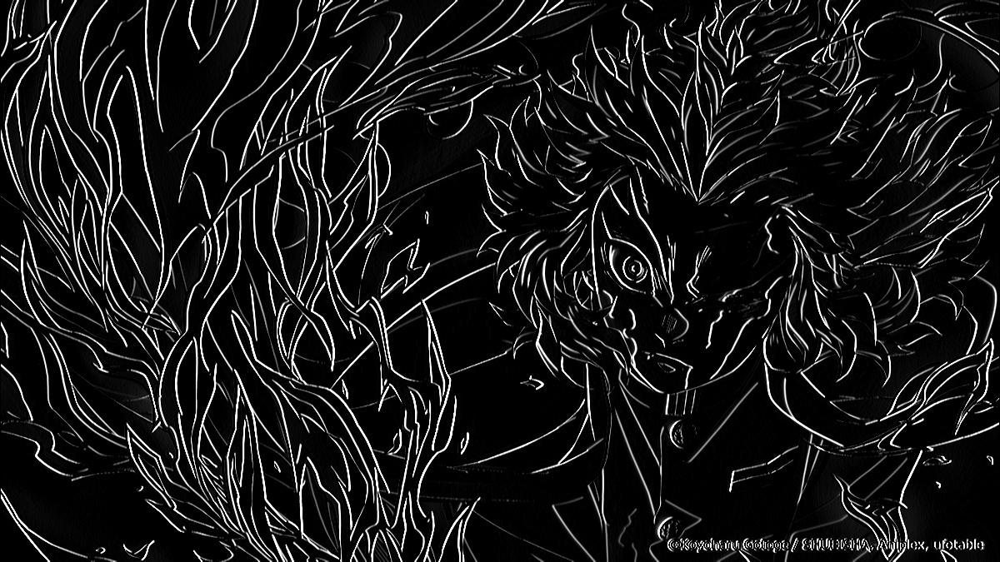

### ❓ Quiz : 가장자리 검출 (Edge)

```
1. Laplacian 변환을 적용해 보자.

2. Canny Edge Detection을 적용해 보자.
```

---

### 💡 배열 병합 (add Weighted)

```py
# ex8.py
import numpy as np
import cv2

src = cv2.imread("RGB.png", cv2.IMREAD_COLOR)
hsv = cv2.cvtColor(src, cv2.COLOR_BGR2HSV)

# 1. Red 마스크 생성
lower_red = cv2.inRange(hsv, (0, 100, 100), (5, 255, 255))
upper_red = cv2.inRange(hsv, (170, 100, 100), (180, 255, 255))
mask_red = cv2.addWeighted(lower_red, 1.0, upper_red, 1.0, 0.0)

# 2. Green 마스크 생성
mask_green = cv2.inRange(hsv, (40, 100, 100), (85, 255, 255))

# 3. Blue 마스크 생성
mask_blue = cv2.inRange(hsv, (100, 100, 100), (130, 255, 255))

# 4. 각 색상 추출 (HSV → BGR 변환 포함)
red = cv2.bitwise_and(hsv, hsv, mask=mask_red)
green = cv2.bitwise_and(hsv, hsv, mask=mask_green)
blue = cv2.bitwise_and(hsv, hsv, mask=mask_blue)

red = cv2.cvtColor(red, cv2.COLOR_HSV2BGR)
green = cv2.cvtColor(green, cv2.COLOR_HSV2BGR)
blue = cv2.cvtColor(blue, cv2.COLOR_HSV2BGR)

# 5. 화면 출력
cv2.imshow("Original", src)
cv2.imshow("Red", red)
cv2.imshow("Green", green)
cv2.imshow("Blue", blue)

cv2.imwrite("ex8_original.png", src)
cv2.imwrite("ex8_red.png", red)
cv2.imwrite("ex8_green.png", green)
cv2.imwrite("ex8_blue.png", blue)


cv2.waitKey()
cv2.destroyAllWindows()
```

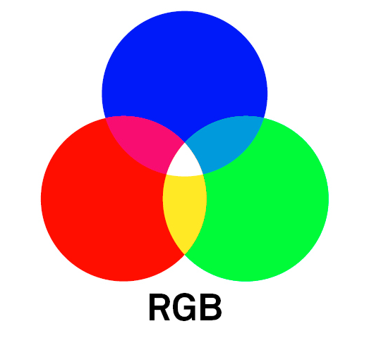
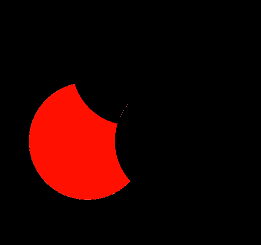
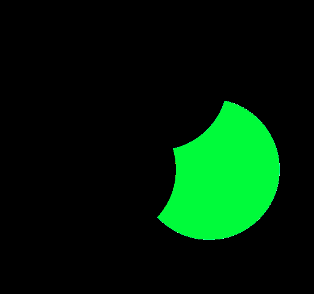
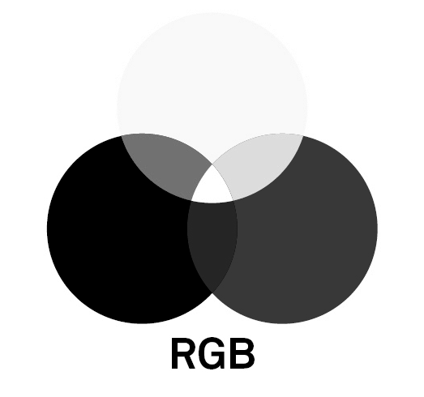

### ❓ Quiz : 배열 병합 (add Weighted)

```
1. lower_red 값의 범위를 변경해 보자.

2. upper_red 값의 범위를 변경해 보자.

3. addWeighted의 gamma 값을 변경해 보자.
```

---

### 💡 채널 분리 및 병합

```py
# ex9.py
import numpy as np
import cv2

# 이미지 읽기
src = cv2.imread("RGB.png", cv2.IMREAD_COLOR)

# 채널 분리
b, g, r = cv2.split(src)

# 채널 순서 변경 (RGB처럼 보이게)
inverse = cv2.merge((r, g, b))

# 화면 출력
cv2.imshow("b", b)
cv2.imshow("g", g)
cv2.imshow("r", r)
cv2.imshow("inverse", inverse)

# 이미지 저장
cv2.imwrite("ex9_blue_gray.png", b)
cv2.imwrite("ex9_green_gray.png", g)
cv2.imwrite("ex9_red_gray.png", r)
cv2.imwrite("ex9_inverse.png", inverse)

cv2.waitKey()
cv2.destroyAllWindows()
```


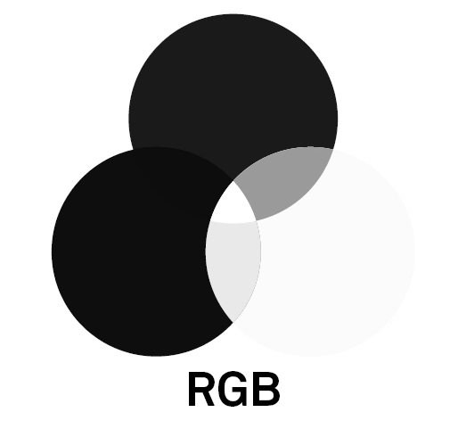
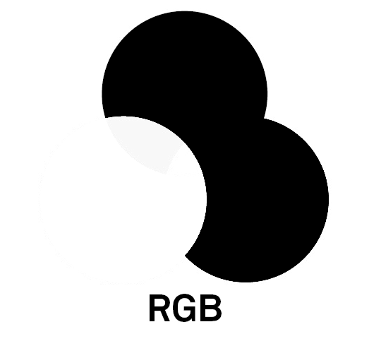
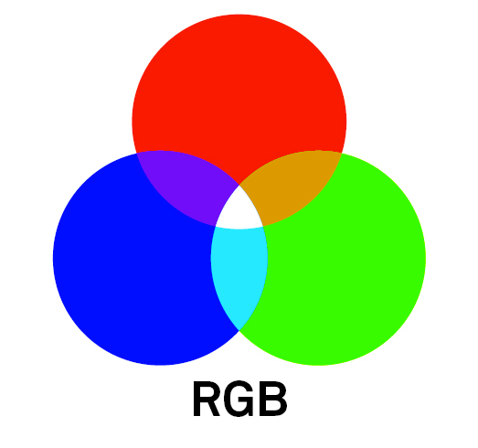

### ❓ Quiz : 채널 분리 및 병합

```
1. Numpy 형태의 채널 분리를 적용해 보자.
b = src[:, :, 0]
g = src[:, :, 1]
r = src[:, :, 2]

2. 빈 이미지를 적용해 보자.
height, width, channel = src.shape
zero = np.zeros((height, width, 1), dtype=np.uint8)
bgz = cv2.merge((b, g, zero))
```

---

### 💡 기동영상 파일을 읽고 보여주기

```py
# ex10.py
import numpy as np
import cv2

cap = cv2.VideoCapture("son.mp4")
save_count = 1  # 저장할 이미지 번호 초기화

while cap.isOpened():
    ret, frame = cap.read()

    # (2) 프레임 읽기 실패 → 영상 끝 → 처음부터 다시
    if not ret:
        print("Restarting video...")
        cap.set(cv2.CAP_PROP_POS_FRAMES, 0)
        continue

    # (3) 프레임 크기 50% 축소
    resized = cv2.resize(frame, (0, 0), fx=0.5, fy=0.5)

    # 출력
    cv2.imshow("Resized Frame", resized)

    # (1) 고정된 속도로 재생 (약 30fps)
    key = cv2.waitKey(90)

    # (4) 'c' 키 입력 시 이미지 저장
    if key & 0xFF == ord('c'):
        filename = f"{save_count:03}.jpg"
        cv2.imwrite(filename, resized)
        print(f"Saved {filename}")
        save_count += 1

    # 'q' 키 입력 시 종료
    if key & 0xFF == ord('q'):
        break

cap.release()
cv2.destroyAllWindows()
```

### ❓ Quiz : 동영상 파일을 읽고 보여주기

```
1. 동영상이 너무 빠르게 재생된다. 이유를 찾아보고 정상적인 속도로 재생될 수 있도록 수정해 보자.

2. 동영상이 끝까지 재생되면 더 이상 frame을 읽지 못해 종료된다. 동영상이 끝까지 재생되면 다시 처음부터 반복될 수 있도록 수정해 보자.

3. 동영상 크기를 반으로 resize해서 출력해 보자.

4. 동영상 재생 중 'c' 키 입력을 받으면 해당 프레임을 이미지 파일로 저장하는 코드를 작성해 보자. 파일 이름은 001.jpg, 002.jpg 등으로 overwrite 되지 않게 하자.
```

---

### 💡 카메라로부터 input 을 받아 보여주고 동영상 파일로 저장하기

```py
# ex11.py
import numpy as np
import cv2

# Read from the first camera device
cap = cv2.VideoCapture(0)

w = 640 #1280#1920
h = 480 #720#1080
cap.set(cv2.CAP_PROP_FRAME_WIDTH, w)
cap.set(cv2.CAP_PROP_FRAME_HEIGHT, h)

# 성공적으로 video device 가 열렸으면 while 문 반복
while(cap.isOpened()):
    # 한 프레임을 읽어옴
    ret, frame = cap.read()
    if ret is False:
        print("Can't receive frame (stream end?). Exiting ...")
        break

    # Display
    cv2.imshow("Camera", frame)

    # 1 ms 동안 대기하며 키 입력을 받고 'q' 입력 시 종료
    key = cv2.waitKey(1)
    if key & 0xFF == ord('q'):
        break

cap.release()
cv2.destroyAllWindows()
```

### ❓ Quiz : 카메라로부터 input 을 받아 보여주고 동영상 파일로 저장하기

```
1. 가지고 있는 카메라의 지원 가능한 해상도를 확인 후 카메라 해상도를 변경해 보자.

2. 카메라 Input을 "output.mp4" 동영상 파일로 저장하도록 코드를 추가해 보자.
```

### 📝 메모
- sudo apt install v4l-utils : 카메라 지원 해상도 확인용 도구 설치
- v4l2-ctl -d /dev/video0 --list-formats-ext : 해당 카메라의 해상도 및 포맷 목록 출력

---

### 💡 Text / Line / Ractangle

```py
# ex12.py
import numpy as np
import cv2

cap = cv2.VideoCapture(5)

# 동그라미를 그릴 좌표를 저장할 리스트
circle_centers = []

def draw_circle(event, x, y, flags, param):
    if event == cv2.EVENT_LBUTTONDOWN:
        # 마우스 왼쪽 버튼 클릭 시 좌표 저장
        circle_centers.append((x, y))

cv2.namedWindow("Camera")
cv2.setMouseCallback("Camera", draw_circle)

topLeft = (50, 50)
bottomRight = (300, 300)

while cap.isOpened():
    ret, frame = cap.read()
    if not ret:
        break

    # Line
    cv2.line(frame, topLeft, bottomRight, (0, 255, 0), 3)

    # Rectangle
    cv2.rectangle(frame,
                  [pt+30 for pt in topLeft], [pt-30 for pt in bottomRight], (255, 0, 255), 3)

    # Text
    font = cv2.FONT_ITALIC
    cv2.putText(frame, 'me',
                [pt+40 for pt in bottomRight], font, 2, (255, 0, 255), 5)

    # 저장된 좌표에 동그라미 그리기
    for center in circle_centers:
        cv2.circle(frame, center, 30, (255, 255, 0), 3)  # 반지름 30, 두께 3, 색상 (BGR)

    cv2.imshow("Camera", frame)
    key = cv2.waitKey(1)
    if key & 0xFF == ord('q'):
        break

cap.release()
cv2.destroyAllWindows()
```

### ❓ Quiz : Text / Line / Ractangle

```
1. Text 문구 / Font / 색상 / 크기 / 굵기 / 출력위치 등 모든 값을 변경해 보자.

2. 동그라미를 그리는 함수를 찾아서 적용해 보자.

3. 마우스 왼쪽 버튼을 click 하면 해당 위치에 동그라미가 그려지도록 코드를 추가해 보자.
(Reference : cv2.EVENT_LBUTTONDOWN)
```
