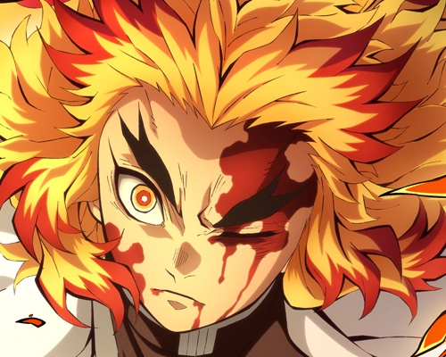
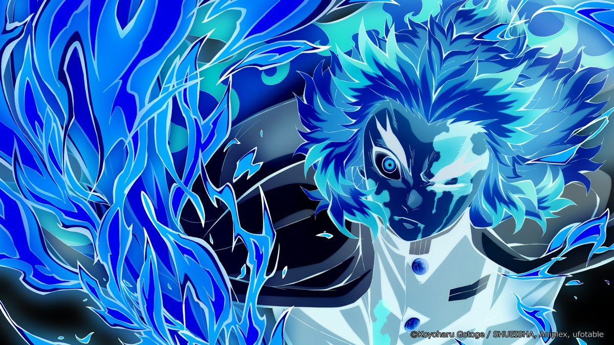
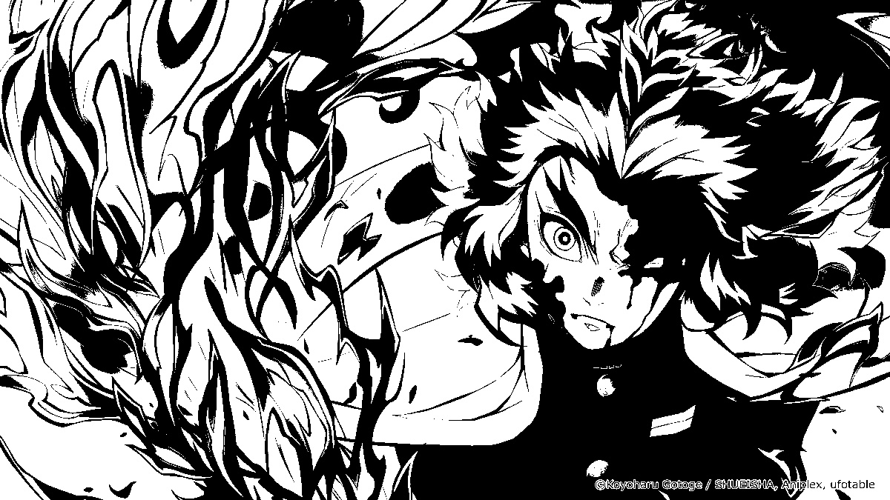
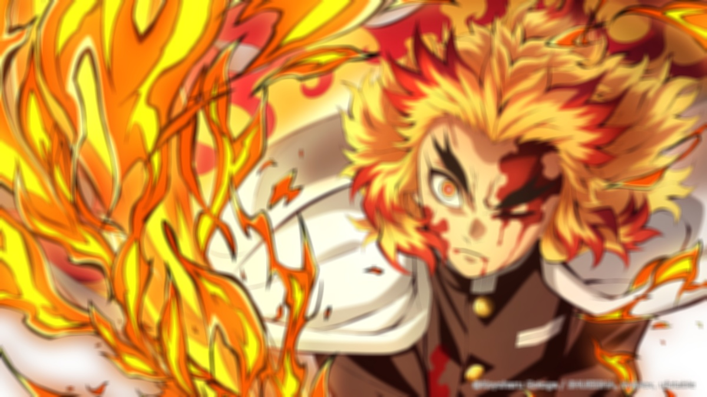
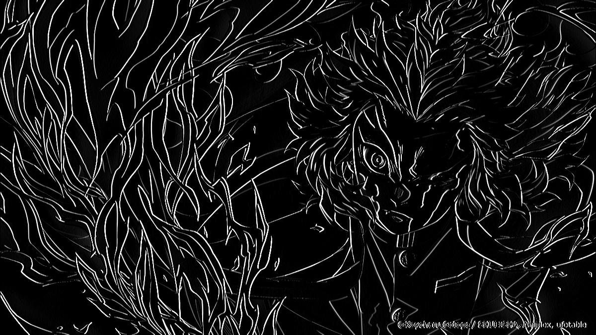

# 📌 1. OpenCV란?

OpenCV(Open Source Computer Vision Library)는 **실시간 컴퓨터 비전** 및 **머신러닝**을 위한 오픈소스 라이브러리입니다.  
다양한 이미지/비디오 처리 기능을 제공하며, Python, C++, Java 등 다양한 언어에서 사용 가능합니다.

---

## 🚀 CUDA 모듈의 역할

- GPU 가속을 활용한 **고속 이미지 처리** 수행
- OpenCV의 일부 함수들은 CUDA를 통해 **병렬 처리**되어 성능을 향상시킴
- 사용 예: `cv2.cuda.GpuMat`, `cv2.cuda.filter2D()`, `cv2.cuda.resize()` 등

---

# 🛠️ 오늘 작업할 디렉토리 생성 및 환경 설정

```bash
# 1. 작업 디렉토리 생성
mkdir opencv                 # 디렉토리 이름: opencv
cd opencv                   # 해당 디렉토리로 이동

# 2. 가상 환경 생성 및 활성화
python3 -m venv .env        # 가상 환경 생성 (폴더 이름: .env)
source .env/bin/activate    # 가상 환경 활성화

# 3. 패키지 설치
pip install opencv-python          # OpenCV 기본 기능(core, imgproc 등)
pip install opencv-contrib-python # 추가 모듈(contrib 포함)
pip install -U pip                 # pip 최신 버전으로 업그레이드
```

# ✅ 설치 확인 (Python 인터프리터 실행)

```py
>>> import numpy as np
>>> import cv2

>>> np.__version__
'2.2.6'          # 설치된 NumPy 버전 출력

>>> cv2.__version__
'4.11.0'         # 설치된 OpenCV 버전 출력

>>> exit()       # Python 인터프리터 종료
```

# 🎨 색상 정보
---

## 🔗 참고 사이트
- [W3Schools - RGB Colors](https://www.w3schools.com/colors/colors_rgb.asp)

---

## 🌈 RGB (Red, Green, Blue)
- 각 색상 채널: **0~255 (8bit)**
  - R (Red): 8bit
  - G (Green): 8bit
  - B (Blue): 8bit
- 픽셀 1개 = **24bit (8bit × 3)**

---

## 🎨 HSL (Hue, Saturation, Lightness)
- **H**: 색상 (Hue) → 0 ~ 360°
- **S**: 채도 (Saturation) → 0 ~ 100%
- **L**: 밝기 (Lightness) → 0 ~ 100%

---

## 🔄 RGB vs HSL 차이점

| 항목       | RGB                              | HSL                                      |
|------------|----------------------------------|-------------------------------------------|
| 구성       | Red, Green, Blue (각 0~255)      | Hue (0~360), Saturation & Lightness (0~100%) |
| 직관성     | 컴퓨터에서 사용하기 적합         | 사람이 색을 이해하기 쉬움                 |
| 색 조절    | 색상 조정이 복잡함               | 채도/밝기 조절이 용이함                   |
| 용도       | 디스플레이, 이미지 처리 등       | 디자인, 색상 선택 도구 등에 유용          |

---

✅ **요약**:  
- RGB는 화면 출력/처리에 적합한 **디지털 색 표현 방식**  
- HSL은 색상 구성요소를 분리해 **사람이 이해하거나 조절하기 쉬운 방식**

# Memo
---

```
vi ex1.py : python 스크립트 생성
python ex1.py : 생성된 스크립트 실행
```


# 실습
---

## ex1.py
---

```py
import numpy as np
import cv2

# 이미지 파일을 Read
img = cv2.imread("chu.jpg")

# Image 란 이름의 Display 창 생성
cv2.namedWindow("image", cv2.WINDOW_NORMAL)

# Numpy ndarray H/W/C order
print(img.shape)

# Read 한 이미지 파일을 Display
cv2.imshow("image", img)

# 별도 키 입력이 있을때 까지 대기
cv2.waitKey(0)

# output.png 로 읽은 이미지 파일을 저장
cv2.imwrite("output.png", img)

# Destory all windows
cv2.destroyAllWindows()
```

## ex2.py
---

```py
import numpy as np
import cv2

# 이미지 파일을 Read 하고 Color space 정보 출력
color = cv2.imread("str.png", cv2.IMREAD_COLOR)
print(color.shape)

height,width,channels = color.shape
cv2.imshow("Original Image", color)

# Color channel 을 B,G,R 로 분할하여 출력
b,g,r = cv2.split(color)
rgb_split = np.concatenate((b,g,r),axis=1)
cv2.imshow("BGR Channels",rgb_split)

# 색공간을 BGR 에서 HSV 로 변환
hsv = cv2.cvtColor(color, cv2.COLOR_BGR2HSV)

# Channel 을 H,S,V 로 분할하여 출력
h,s,v = cv2.split(hsv)
hsv_split = np.concatenate((h,s,v),axis=1)
cv2.imshow("Split HSV", hsv_split)

cv2.waitKey(0)
cv2.destroyAllWindows()
```

## Quiz
---

```
1. 위 색공간 이미지의 링크로 이동해서 각 색 공간의 표현 방법을 이해해 보자.

2. HSV color space 가 어떤 경우에 효과적으로 사용될까?

3. HSV 로 변환된 이미지를 BGR 이 아닌 RGB 로 다시 변환해서 출력해 보자.

4. COLOR_RBG2GARY 를 사용해서 흑백으로 변환해 출력해보자.
```

## ex3.py
---

```py
import numpy as np
import cv2

# 이미지 파일을 Read
img = cv2.imread("len.jpg")

# Crop 300x400 from original image from (100, 50)=(x, y)
# 세로(y): 100:500 →  500 - 100 = 400픽셀
# 가로(x): 600:1100 → 1100 - 600 = 500픽셀
cropped = img[100:500, 600:1100]

# Resize cropped image from 300x400 to 400x200
resized = cv2.resize(cropped, (800,200))

# Display all
cv2.imshow("Original", img)
cv2.imshow("Cropped image", cropped)
cv2.imshow("Resized image", resized)
cv2.imwrite("len_cropped.jpg", cropped)
cv2.imwrite("len_resized.jpg", resized)

cv2.waitKey(0)
cv2.destroyAllWindows()
```




## Quiz
---

```
1. Input image 를 본인이 좋아하는 인물 사진으로 변경해서 적용하자. 그리고 본인이 사용한 input image 의 size 를 확인해 보자.

2. 본인이 사용한 이미지의 얼굴 영역만 crop 해서 display 해 보자.

3. 원본 이미지의 정확히 1.5배만큼 이미지를 확대해서 파일로 저장해 보자.

4. openCV 의 rotate API 를 사용해서 우측으로 90도만큼 회전된 이미지를 출력해 보자.
```

## ex4.py
---

```py
import numpy as np
import cv2

src = cv2.imread("len.jpg", cv2.IMREAD_COLOR)
dst = cv2.bitwise_not(src)

cv2.imshow("src", src)
cv2.imshow("dst", dst)

cv2.waitKey()
cv2.destroyAllWindows()
```



## Quiz
---

```
1. AND, OR, XOR 연산에 대해서 확인해 보자. 하지말자.
```

## ex5.py
---

```py
import numpy as np
import cv2

src = cv2.imread("len.jpg", cv2.IMREAD_COLOR)
gray = cv2.cvtColor(src, cv2.COLOR_BGR2GRAY)

ret, dst = cv2.threshold(gray, 150, 255, cv2.THRESH_BINARY)

cv2.imshow("dst", dst)
cv2.imwrite("len_gray.jpg", dst)

cv2.waitKey()
cv2.destroyAllWindows()
```



## Quiz
---

```
1. 임계값을 변화시켜 보자.
```

## ex6.py
---

```py
import numpy as np
import cv2

src = cv2.imread("len.jpg", cv2.IMREAD_COLOR)
dst = cv2.blur(src, (9, 9), anchor=(-1,- 1), borderType=cv2.BORDER_DEFAULT)

cv2.imshow("dst", dst)
cv2.imwrite("len_blur.jpg", dst)

cv2.waitKey()
cv2.destroyAllWindows()
```



## Quiz
---

```
1. Kernel Size를 변경하여 보자.

2. borderType을 변경하여 보자.(cv2.BORDER_REFLECT)
```

## ex7.py
---

```py
import numpy as np
import cv2

src = cv2.imread("len.jpg", cv2.IMREAD_COLOR)
gray = cv2.cvtColor(src, cv2.COLOR_BGR2GRAY)

sobel = cv2.Sobel(gray, cv2.CV_8U, 1, 0, 3)

cv2.imshow("sobel", sobel)
cv2.imwrite("len_edge.jpg", sobel)

cv2.waitKey()
cv2.destroyAllWindows()
```



## Quiz
---

```
1. Laplacian 변환을 적용해 보자.

2. Canny Edge Detection을 적용해 보자.
```

## ex7.py
---

```py
import numpy as np
import cv2

src = cv2.imread("len.jpg", cv2.IMREAD_COLOR)
gray = cv2.cvtColor(src, cv2.COLOR_BGR2GRAY)

sobel = cv2.Sobel(gray, cv2.CV_8U, 1, 0, 3)

cv2.imshow("sobel", sobel)
cv2.imwrite("len_edge.jpg", sobel)

cv2.waitKey()
cv2.destroyAllWindows()
```


## Quiz
---

```
1. Laplacian 변환을 적용해 보자.

2. Canny Edge Detection을 적용해 보자.
```

## ex8.py
---

```py
import numpy as np
import cv2

src = cv2.imread("rain.png", cv2.IMREAD_COLOR)
b, g, r = cv2.split(src)
inverse = cv2.merge((r, g, b))

cv2.imshow("b", b)
cv2.imshow("g", g)
cv2.imshow("r", r)
cv2.imshow("inverse", inverse)

cv2.waitKey()
cv2.destroyAllWindows()
```


## Quiz
---

```
1. Numpy 형태의 채널 분리를 적용해 보자.

b = src[:, :, 0]
g = src[:, :, 1]
r = src[:, :, 2]

2. 빈 이미지를 적용해 보자.

height, width, channel = src.shape
zero = np.zeros((height, width, 1), dtype=np.uint8)
bgz = cv2.merge((b, g, zero))
```


