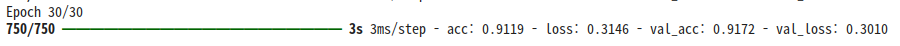
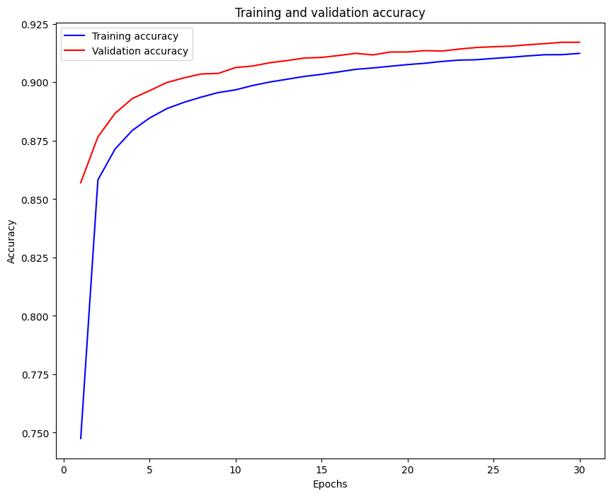
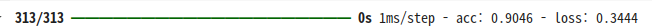
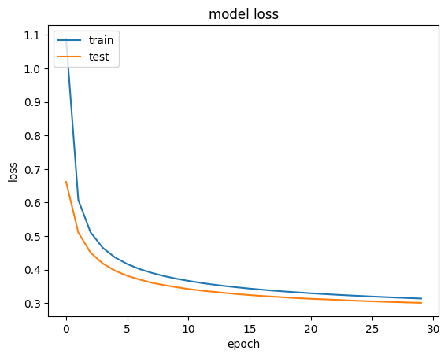

# 📘 선형 모델 요약
---

### 🧠 1. 선형 모델 개요
- 입력 데이터를 벡터 형태로 처리하는 가장 단순한 형태의 머신러닝 모델
- 선형 변환 + 간단한 결정 함수로 분류 수행

---

### 🧱 2. 벡터화 (Vectorization)
- 선형 모델은 1차원 벡터 형태의 입력만 처리 가능
- 따라서, 2D/3D 이미지를 1D 벡터로 변환해야 함  
  예: 4x4 픽셀 이미지를 (1,16) 벡터로 변환

---

### 🧮 3. 선형 분류기 - Score 함수
- 입력 벡터와 가중치 행렬의 곱으로 각 클래스의 점수(score) 계산
- Score 계산은 행렬 곱을 통해 병렬 처리 가능

---

### 📊 4. Softmax 분류기
- 각 클래스의 score를 확률 값으로 변환
- softmax 출력은 각 클래스에 대한 확률 분포를 나타냄

---

### 📉 5. 손실 함수 - Cross Entropy Loss
- 예측 확률과 정답 클래스 간의 거리 계산
- 정답 클래스에 해당하는 softmax 값에 `-log`를 취해 손실 계산

---

### ⚙️ 6. 최적화 - SGD (Stochastic Gradient Descent)
- 전체 데이터를 한 번에 학습하지 않고, 미니 배치 단위로 경사 하강법 적용
- 계산 효율성과 빠른 수렴을 위해 사용됨

---

### 🧪 7. 실습 개요 (MNIST)
- MNIST 숫자 이미지 데이터를 선형 모델에 적용하여 학습
- 정확도 및 손실 곡선을 시각화하여 학습 결과 분석

---

### ✅ 요약
- 선형 모델은 가장 기본적인 분류기이며, 기초 개념(벡터화, softmax, cross entropy, SGD 등)을 학습하는 데 중요함
- 이후 신경망 모델을 이해하기 위한 기반 지식을 제공함

# 👨‍💻 실습
---

### 💡 Code : 벡터화 코드
이미지를 벡터화할 때, numpy를 사용하는 경우 flatten 또는 reshape을 사용해 벡터화 할 수 있다.

```py
import numpy as np

# random 함수로 0~255 사이의 임의의 정수를 성분으로 갖는 4x4 행렬을 만든다.
a = np.random.randint(0, 255, (4, 4))
a
```

```
array([[ 38, 223, 157, 213],
       [104,  79, 231,  31],
       [117,  10,  48,  72],
       [128,  41,   6, 178]])
```       

---

```py
# flatten을 사용해 1차원 행렬(벡터)로 만든다.
b = a.flatten()
b
```

```
array([ 38, 223, 157, 213, 104,  79, 231,  31, 117,  10,  48,  72, 128,
        41,   6, 178])
```   

---

```py
# reshape를 사용해 행렬 크기를 바꾼다. -1은 자동으로 계산한다는 의미이고 이 경우 16을 적는 것과 같다.
# 만약 (2, 8)의 행렬로 바꾸려 한다면 reshape(2, -1) 또는 reshape(2, 8) 둘 다 같은 결과이다.
c = a.reshape(-1)
c
```

```
array([ 38, 223, 157, 213, 104,  79, 231,  31, 117,  10,  48,  72, 128,
        41,   6, 178])
```   

---

### 💡 Code : Mnist 실습

```py
# 1. 기본 라이브러리 불러오기
import numpy as np
import pandas as pd
```

```py
# 2 데이터셋 불러오기
from tensorflow.keras.datasets.mnist import load_data
(train_x, train_y), (test_x, test_y) = load_data()
```

```py
# 2-1 데이터 확인하기
train_x.shape, train_y.shape   # train 데이터 크기 확인
test_x.shape, test_y.shape     # test 데이터 크기 확인
```

```
((10000, 28, 28), (10000,))
```

```py
# 2-2 이미지 확인하기
from PIL import Image
img = train_x[0]

import matplotlib.pyplot as plt
img1 = Image.fromarray(img, mode='L')
plt.imshow(img1)

train_y[0]   # 첫번째 데이터 확인
```

```
np.uint8(5)
```


```py
# 3 데이터 전처리

# 3-1 입력 형태 변환: 3차원 → 2차원
# 데이터를 2차원 형태로 변환: 입력 데이터가 선형모델에서는 벡터 형태
train_x1 = train_x.reshape(60000, -1)
test_x1 = test_x.reshape(10000, -1)

# 3-2 데이터 값의 크기 조절: 0~1 사이 값으로 변환
train_x2 = train_x1 / 255
test_x2 = test_x1 / 255
```

```py
# 4 모델 설정

# 4-1 모델 설정용 라이브러리 불러오기
from tensorflow.keras.models import Sequential
from tensorflow.keras.layers import Dense

# 4-2 모델 설정
md = Sequential()
md.add(Dense(10, activation='softmax', input_shape=(28*28,)))

md.summary()   # 모델 요약
```

```
/usr/local/lib/python3.11/dist-packages/keras/src/layers/core/dense.py:87: UserWarning: Do not pass an `input_shape`/`input_dim` argument to a layer. When using Sequential models, prefer using an `Input(shape)` object as the first layer in the model instead.
  super().__init__(activity_regularizer=activity_regularizer, **kwargs)

Model: "sequential_6"

┏━━━━━━━━━━━━━━━━━━━━━━━━━━━━━━━━━┳━━━━━━━━━━━━━━━━━━━━━━━━┳━━━━━━━━━━━━━━━┓
┃ Layer (type)                    ┃ Output Shape           ┃       Param # ┃
┡━━━━━━━━━━━━━━━━━━━━━━━━━━━━━━━━━╇━━━━━━━━━━━━━━━━━━━━━━━━╇━━━━━━━━━━━━━━━┩
│ dense_6 (Dense)                 │ (None, 10)             │         7,850 │
└─────────────────────────────────┴────────────────────────┴───────────────┘

 Total params: 7,850 (30.66 KB)

 Trainable params: 7,850 (30.66 KB)

 Non-trainable params: 0 (0.00 B)
```

```py
# 5 모델 학습 진행

# 5-1 모델 compile: 손실 함수, 최적화 함수, 측정 함수 설정
md.compile(loss = 'sparse_categorical_crossentropy', optimizer = 'sgd', metrics = ['acc'])

# 5-2 모델 학습: 학습 횟수, batch_size, 검증용 데이터 설정
hist = md.fit(train_x2, train_y, epochs=30, batch_size=64, validation_split=0.2)
```



```py
acc = hist.history['acc']
val_acc = hist.history['val_acc']
epoch = np.arange(1, len(acc) + 1)
```

```py
# 학습결과 분석 : 학습 곡선 그리기

plt.figure(figsize=(10,8))
plt.plot(epoch, acc, 'b', label='Training accuracy')
plt.plot(epoch, val_acc, 'r', label='Validation accuracy')
plt.title('Training and validation accuracy')
plt.xlabel('Epochs')
plt.ylabel('Accuracy')
plt.legend()
plt.show()
```



```py
# 6 테스트용 데이터 평가
md.evaluate(test_x2, test_y)

# 7 가중치 저장
weight = md.get_weights()
weight
```



```
[array([[-0.01809908,  0.04423299, -0.00407743, ...,  0.06332525,
         -0.00251734,  0.00196751],
        [-0.050407  , -0.05998353, -0.07465094, ..., -0.01433843,
          0.01071206,  0.03646336],
        [ 0.06986522, -0.0116923 , -0.07076468, ...,  0.02445704,
         -0.05563192,  0.0041509 ],
        ...,
        [ 0.03118712, -0.04921252,  0.00195412, ..., -0.00605295,
         -0.00202944,  0.07754893],
        [ 0.08052733, -0.0327304 ,  0.02389491, ...,  0.00695625,
          0.06758214,  0.03055982],
        [-0.05485652,  0.03522244,  0.03506895, ...,  0.00976416,
         -0.06175685,  0.04081956]], dtype=float32),
 array([-0.23029914,  0.30129498,  0.01726046, -0.17140533,  0.06494795,
         0.772551  , -0.05629169,  0.3972938 , -0.94089097, -0.15446219],
       dtype=float32)]
```

```py
# Model Loss 시각화
plt.plot(hist.history['loss'], label='loss')
plt.plot(hist.history['val_loss'], label='val_loss')
plt.title('model loss')
plt.ylabel('loss')
plt.xlabel('epoch')
plt.legend(['train', 'test'], loc='upper left')
plt.show()
```

