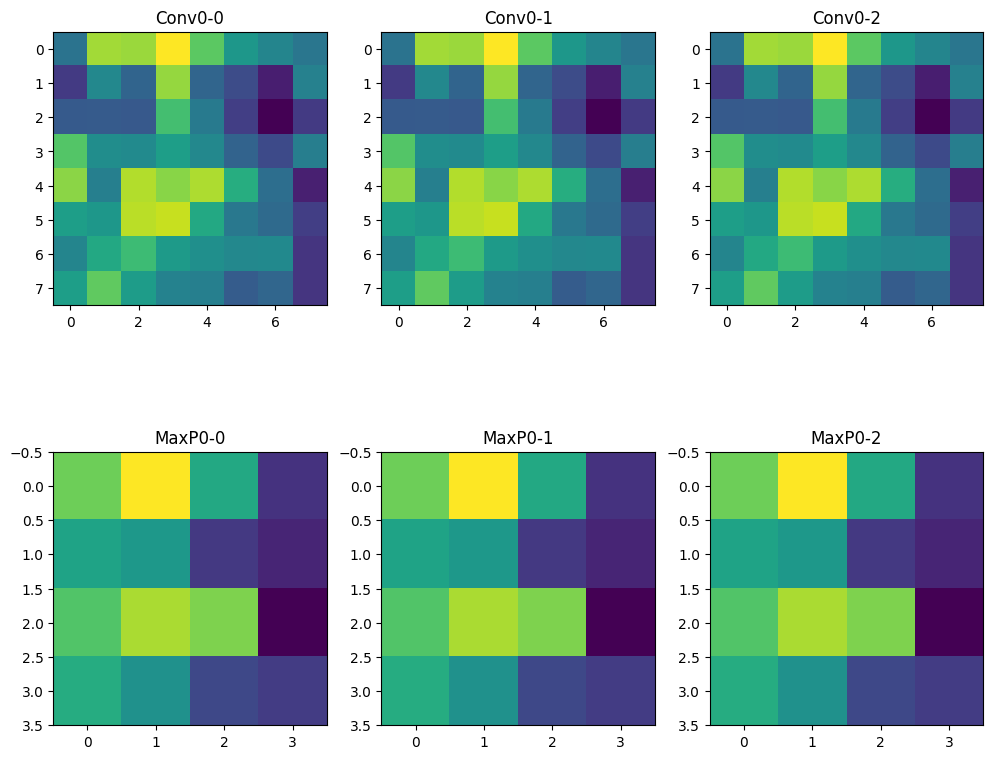

# 📌 CNN란?
---
CNN(Convolutional Neural Network)은 이미지 인식과 분류에 특화된 인공신경망으로, 사람의 시각 처리 방식과 유사하게 **국소적인 영역을 중심으로 특징(feature)**을 추출하고 학습한다. 기존의 MLP보다 이미지 구조를 더 잘 반영하며, 컴퓨터 비전(CV) 분야에서 널리 사용된다.

---

### <합성곱 층 - Convolution Layer>
- 입력 이미지에 필터(커널)를 적용해 **특징 맵(Feature Map)** 생성
- 보통 3×3 크기의 필터 사용 (VGGNet 등) → 작을수록 다양한 feature 추출 가능
- 필터의 두께는 입력 데이터(예: RGB → 3)에 자동 맞춰짐
- **Stride**: 필터 이동 간격, 작을수록 정밀하고 클수록 빠르게 처리됨
- **Padding**: 출력 feature map 크기를 유지하려면 padding=same 설정
- 합성곱 연산 뒤에는 **활성화 함수(ReLU)**를 적용해 비선형성 도입

---

### <풀링 층 - Pooling Layer>
- **MaxPooling**: 풀링 영역의 최대값 → 주요 특징만 강조
- **AveragePooling**: 영역 내 평균값 사용
- **GlobalAveragePooling**: Flatten 없이 전체 평균만 뽑아내는 방식 (GoogLeNet)
- 연산량 감소 + 과적합 방지 + 공간 구조 요약

---

### <밀집층 - Fully Connected Layer>
- Flatten 레이어로 feature map을 1차원 벡터로 변환
- 이후 Fully Connected Layer를 거쳐 **클래스별 출력값** 생성
- 주로 softmax를 출력층 활성화 함수로 사용해 확률값 도출

---

### 🧮 example flow
- 예: 최종 출력값이 (0.7, 0)이고 정답이 (1, 0)인 경우 → 0.3 오차
- 이 오차를 **역전파(backpropagation)**로 전파하며 가중치 업데이트
- **경사하강법(gradient descent)** 등 최적화 알고리즘 사용

---

### 👁️ CNN 모델과 인간 시각 처리의 유사성
- 인간의 시각 피질도 **단순한 시각 정보 → 복잡한 특징** 순으로 처리
- CNN도 층이 깊어질수록 복잡한 feature를 추출
- 저차원 edge → 고차원 패턴 추출 흐름이 시각 정보 처리와 닮음

---

### 🧠 대표 CNN 구조들
- **AlexNet (2012)**: CNN을 유명하게 만든 최초의 구조, 8층 구성
- **VGGNet (2014)**: 3×3 필터 반복 사용, 구조 단순 & 효과적
- **GoogLeNet**: Inception 구조 + Global Average Pooling 사용
- **ResNet**: Residual Block 사용 → 층이 깊어져도 성능 유지

---

### 🔁 전이학습 (Transfer Learning)
- 기존 사전학습된 모델의 **가중치를 재사용**하여 적은 데이터로도 학습 가능
- **Feature Extraction**: 기존 구조 유지, 출력층만 새로 학습
- **Fine-Tuning**: 일부 층은 고정, 나머지는 재학습
- 적은 데이터 상황에서 강력한 성능 발휘 가능

---

# 👨‍💻 실습
---

### 💡 Code : CNN Layer 구현

```py
import numpy as np
from PIL import Image
import matplotlib.pyplot as plt

# 합성곱 함수 구현
def conv(a, b): 
    c = np.array(a) * np.array(b)
    return np.sum(c)

# MaxPooling 함수 구현(한 개의 map 계산)
def MaxPooling(nimg):  # 2d input
    nimg = np.array(nimg)
    i0, j0 = nimg.shape  # i0 = nimg.shape[0], j0 = nimg.shape[1]
    i1 = int((i0 + 1) / 2)
    j1 = int((j0 + 1) / 2)
    output = np.zeros((i1, j1))

    if i0 % 2 == 1:
        i0 += 1
        tmp = np.zeros((1, j0))
        nimg = np.concatenate([nimg, tmp], axis=0)

    if j0 % 2 == 1:
        j0 += 1
        tmp = np.zeros((i0, 1))
        nimg = np.concatenate([nimg, tmp], axis=1)

    for i in range(output.shape[0]):
        for j in range(output.shape[1]):
            a = np.array(nimg[2*i:2*i+2, 2*j:2*j+2])
            output[i, j] = a.max()
    
    return output

# 합성곱 출력 층(reature map) 함수 구현(한 개의 filter 계산)
def featuring(nimg, filters):
    feature = np.zeros((nimg.shape[0] - 2, nimg.shape[1] - 2))
    for i in range(feature.shape[0]):
        for j in range(feature.shape[1]):
            a = nimg[i:i+3, j:j+3]
            feature[i, j] = conv(a, filters)
    return feature

# MaxPooling 출력 층 함수 구현(여러 map 계산)
def Pooling(nimg):
    nimg = np.array(nimg)
    pool0 = []
    for i in range(len(nimg)):
        pool0.append(MaxPooling(nimg[i]))
    return pool0

# 배열을 그림으로 변환
def to_img(nimg):
    nimg = np.array(nimg)
    nimg = np.uint8(np.round(nimg))
    fimg = []
    for i in range(len(nimg)):
        fimg.append(Image.fromarray(nimg[i]))
    return fimg

# feature map 생성(여러 filter 계산)
def ConvD(nimg, filters):
    nimg = np.array(nimg)
    feat0 = []
    for i in range(len(filters)):
        feat0.append(featuring(nimg, filters[i]))
    return feat0

# ReLU 활성화 함수
def ReLU(fo):
    fo = np.array(fo)
    fo = (fo > 0) * fo
    return fo

# CNN Layer 함수 : Conv + ReLU + MaxPooling
def ConvMax(nimg, filters):
    nimg = np.array(nimg)
    f0 = ConvD(nimg, filters)
    f0 = ReLU(f0)
    fg = Pooling(f0)
    return f0, fg

# 그림 그리기 : 합성곱 후의 상태와 MaxPooling 후의 상태를 그림으로 그리기
def draw(f0, fg0, size=(12, 8), k=-1):  # size와 k는 기본값 설정
    plt.figure(figsize=size)

    for i in range(len(f0)):
        plt.subplot(2, len(f0), i + 1)
        plt.gca().set_title('Conv' + str(k) + '-' + str(i))
        plt.imshow(f0[i])

    for i in range(len(fg0)):
        plt.subplot(2, len(fg0), len(f0) + i + 1)
        plt.gca().set_title('MaxP' + str(k) + '-' + str(i))
        plt.imshow(fg0[i])

    if k != -1:  # k=-1이 아니면 그림을 저장
        plt.savefig('conv' + str(k) + '.png')

# 3개의 activation map 합치기 : MaxPooling 후의 결과 map들을 하나의 데이터로 통합
def join(mm):
    mm = np.array(mm)
    m1 = np.zeros((mm.shape[1], mm.shape[2], mm.shape[0]))
    for i in range(mm.shape[1]):
        for j in range(mm.shape[2]):
            for k in range(mm.shape[0]):
                m1[i][j][k] = mm[k][i][j]
    return m1

# CNN Layer 과정을 계산하고 결과를 그림으로 출력
def ConvDraw(p0, filters, size=(12, 8), k=-1):
    f0, fg0 = ConvMax(p0, filters)
    f0_img = to_img(f0)
    fg1_img = to_img(fg0)
    draw(f0, fg0, size, k)
    p1 = join(fg0)
    return p1

# 테스트 실행
nimg31 = np.random.rand(10, 10)
filters = [np.ones((3, 3))] * 3

m0 = ConvDraw(nimg31, filters, (12, 10), 0)
```

### ✅ Result : CNN Layer 구현



---

# 🍓 라즈베리파이 환경 구축
---

### ✅ 설치 및 이미지 설정
- `sudo apt install rpi-imager` : 라즈베리파이 이미지 도구 설치
- `rpi-imager` : GUI 실행 후 OS 이미지 다운로드 및 설치 가능

### ⚙️ 설정 정보
- **운영체제**: Raspberry Pi OS (64-bit)
- **저장소**: Mass Storage Device - 62.5 GB


