# 🚀 Model Improvement Strategy
---
기존 CNN 모델에 다음 전략을 통합하여 성능을 향상시킨 구조를 구현함:
1. 데이터 증강 적용: 다양한 이미지 변형을 통해 학습 데이터 다양성 확보
2. 전이학습 도입: MobileNetV2의 사전학습된 특징 추출기 사용
3. Dropout 및 Dense 레이어 추가: 오버피팅 방지 및 모델 표현력 향상
4. EarlyStopping, ModelCheckpoint 적용: 과적합 방지 및 최적 모델 저장
5. 데이터 증강 강화: 회전, 이동, 확대/축소, 반전 등 복합적 증강 적용

---

### 🍬 HARIBO_Dataset Preparation

1. 5가지 하리보 젤리 종류(bear, cola, egg, heart, ring)를 직접 촬영하여 이미지 데이터셋 생성
2. 다양한 각도·조명·배경에서 수집된 이미지 총 500장 (각 클래스당 100장 내외)
3. 구글 드라이브에 업로드 후, Google Colab 환경에서 실습용으로 연동

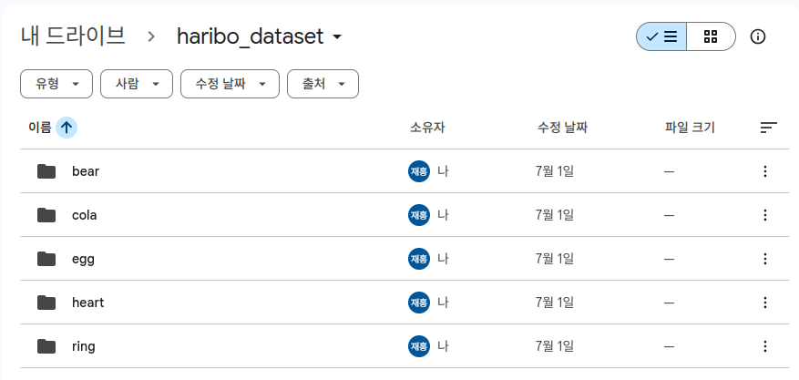

---

### 💡 Code : CNN with Transfer Learning & Augmentation

```py
import matplotlib.pyplot as plt
import numpy as np
import os
from tensorflow.keras.preprocessing.image import ImageDataGenerator
from tensorflow.keras.applications import MobileNetV2
from tensorflow.keras import models, layers
from tensorflow.keras.optimizers import RMSprop
from tensorflow.keras.callbacks import EarlyStopping, ModelCheckpoint

# ✅ 구글 드라이브 마운트
from google.colab import drive
drive.mount('/content/drive')

# ✅ 경로 설정
dataset_path = '/content/drive/MyDrive/haribo_dataset'
model_save_path = '/content/drive/MyDrive/haribo_model.h5'

# ✅ 데이터 증강 설정
datagen = ImageDataGenerator(
    rescale=1./255,              # 픽셀 값을 0~1 범위로 정규화
    validation_split=0.2,        # 전체 데이터 중 20%를 검증용으로 사용
    rotation_range=90,           # 최대 ±90도 범위 내에서 무작위 회전
    width_shift_range=0.1,       # 전체 너비의 10%만큼 좌우 이동
    height_shift_range=0.1,      # 전체 높이의 10%만큼 상하 이동
    shear_range=0.1,             # 전단 변환 (이미지를 기울이는 효과)
    zoom_range=0.1,              # 10% 범위 내 무작위 확대/축소
    horizontal_flip=True,        # 이미지를 좌우로 무작위 반전
    fill_mode='nearest'          # 변환 후 생긴 빈 영역을 가장 가까운 픽셀로 채움
)

# ✅ 데이터 로딩
train_generator = datagen.flow_from_directory(
    dataset_path,
    target_size=(96, 96),
    batch_size=32,
    class_mode='categorical',
    subset='training',
    shuffle=True
)

val_generator = datagen.flow_from_directory(
    dataset_path,
    target_size=(96, 96),
    batch_size=32,
    class_mode='categorical',
    subset='validation',
    shuffle=True
)

# ✅ 클래스 이름 자동 추출
class_names = list(train_generator.class_indices.keys())
print("클래스 인덱스:", train_generator.class_indices)

# ✅ MobileNetV2 기반 모델 구성
base_model = MobileNetV2(input_shape=(96, 96, 3), include_top=False, weights='imagenet')
base_model.trainable = False

model = models.Sequential([
    base_model,
    layers.GlobalAveragePooling2D(),
    layers.Dense(128, activation='relu'),
    layers.Dropout(0.5),
    layers.Dense(len(class_names), activation='softmax')  # 클래스 수 자동 반영
])

model.compile(optimizer=Adam(learning_rate=1e-4),
              loss='categorical_crossentropy',
              metrics=['accuracy'])

# ✅ 콜백 설정
early_stop = EarlyStopping(monitor='val_loss', patience=5, restore_best_weights=True)
checkpoint = ModelCheckpoint('best_model.h5', save_best_only=True)

# ✅ 학습 실행
history = model.fit(
    train_generator,
    validation_data=val_generator,
    epochs=50,
    callbacks=[early_stop, checkpoint],
    verbose=2
)

# ✅ 결과 시각화
acc = history.history['accuracy']
val_acc = history.history['val_accuracy']
loss = history.history['loss']
val_loss = history.history['val_loss']
epochs = range(len(acc))

plt.plot(epochs, acc, 'bo', label='Training acc')
plt.plot(epochs, val_acc, 'b', label='Validation acc')
plt.title('Training and Validation Accuracy')
plt.legend()
plt.show()

plt.plot(epochs, loss, 'bo', label='Training loss')
plt.plot(epochs, val_loss, 'b', label='Validation loss')
plt.title('Training and Validation Loss')
plt.legend()
plt.show()

# ✅ 학습 이미지 예시
x_batch, y_batch = next(train_generator)
plt.figure(figsize=(10, 10))
for i in range(25):
    plt.subplot(5, 5, i + 1)
    plt.xticks([]); plt.yticks([]); plt.grid(False)
    plt.imshow(x_batch[i])
    label_idx = np.argmax(y_batch[i])
    plt.xlabel(class_names[label_idx])
plt.tight_layout()
plt.show()

# ✅ 모델 저장 (.h5 파일)
model.save(model_save_path)
print(f"모델이 저장되었습니다: {model_save_path}")
```

---

### ✅ Result : 학습 결과 시각화 및 예측 확인

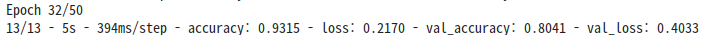


---

### 🔍 Summary
- MobileNetV2를 기반으로 한 전이학습 모델이 적은 데이터셋에서도 좋은 성능을 보임
- 실시간 예측 환경에도 최적화된 모델 구조로 전환 가능 (On-Device AI 적용 가능)

---

# 💻 Real-Time Inference Setup on Terminal
---
### 📁 1. 디렉토리 구성

```bash
mkdir haribo_cam_classifier
cd haribo_cam_classifier
```

### 🐍 2. 가상환경 생성 및 패키지 설치

```bash
python3 -m venv venv
source venv/bin/activate

pip install tensorflow opencv-python-headless numpy
```

### 📥 3. 학습한 모델(.h5)을 Google Drive에서 다운로드하여 복사

haribo_model.h5 파일을 Google Drive에서 다운받아 `haribo_cam_classifier` 디렉토리에 위치시킴

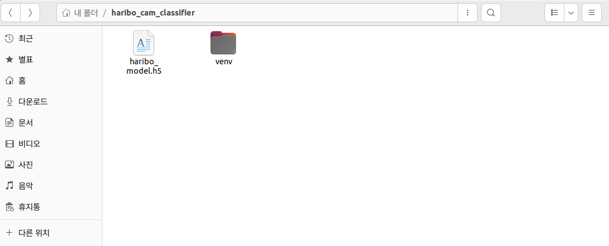

### 🧠 4. 클래스 이름 파일 생성 (class_names.json)

```json
["bear", "cola", "egg", "heart", "ring"]
```

### 💡 5. 실시간 분류 코드 작성 (predict_cam.py)

```py
import cv2
import numpy as np
import tensorflow as tf
import json

# 모델과 클래스 이름 로드
model = tf.keras.models.load_model('haribo_model.h5')

with open('class_names.json', 'r') as f:
    class_names = json.load(f)

def preprocess(frame):
    img = cv2.resize(frame, (96, 96))
    img = img.astype('float32') / 255.0
    return np.expand_dims(img, axis=0)

cap = cv2.VideoCapture(2)
if not cap.isOpened():
    print("카메라를 열 수 없습니다.")
    exit()

print("젤리 분류 시작! (Q 키를 누르면 종료)")
while True:
    ret, frame = cap.read()
    if not ret:
        break

    input_img = preprocess(frame)
    pred = model.predict(input_img)
    label = class_names[np.argmax(pred)]

    # 예측 결과 화면에 출력
    cv2.putText(frame, f'Prediction: {label}', (10, 30),
                cv2.FONT_HERSHEY_SIMPLEX, 1, (0, 255, 0), 2)
    cv2.imshow('Haribo Classifier', frame)

    if cv2.waitKey(1) & 0xFF == ord('q'):
        break

cap.release()
cv2.destroyAllWindows()
```

### 6. OpenCV 설치 (GUI 지원 포함)

```bash
pip install opencv-python
```

### ▶️ 7. 실시간 예측 실행

```bash
python3 predict_cam.py
```

### 8. ✅ 결과 정리

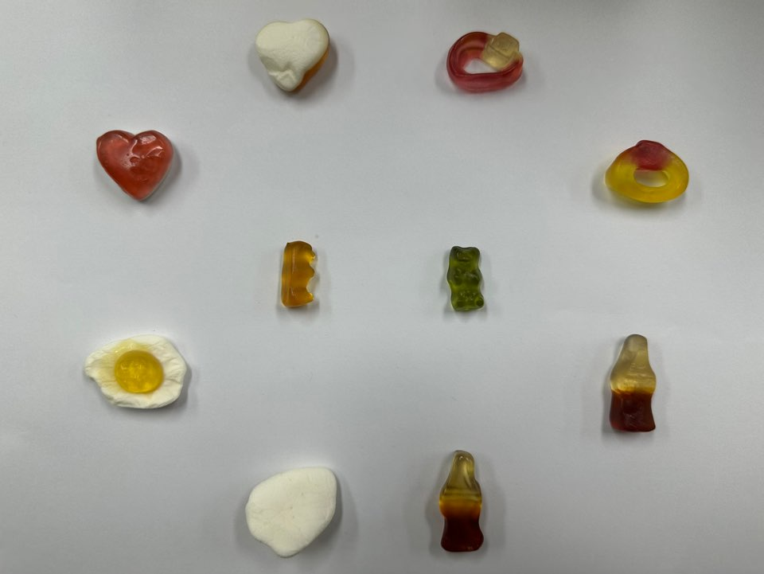

#### 🧪 예측 예시: heart

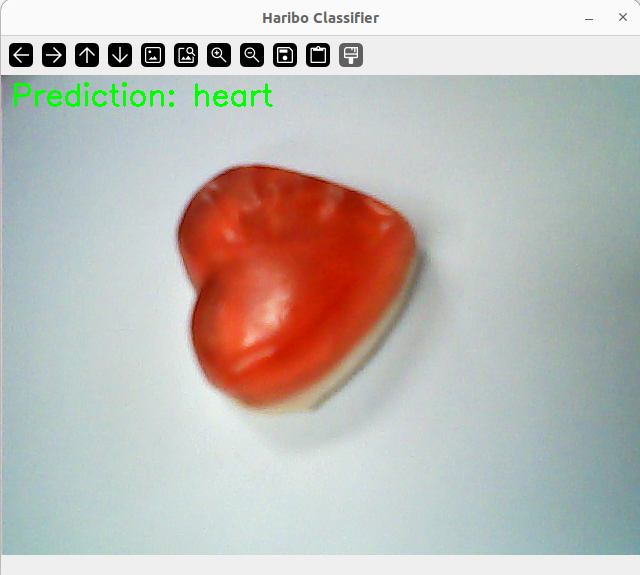
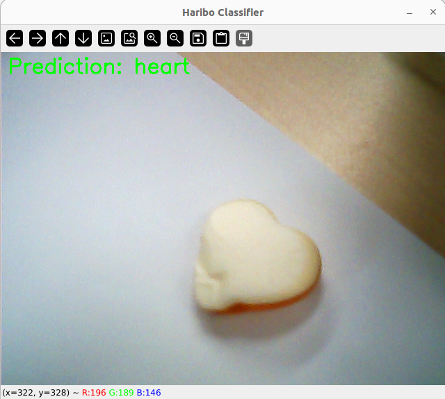

#### 🧪 예측 예시: ring
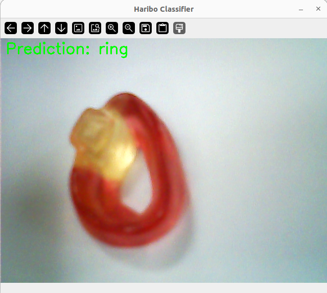
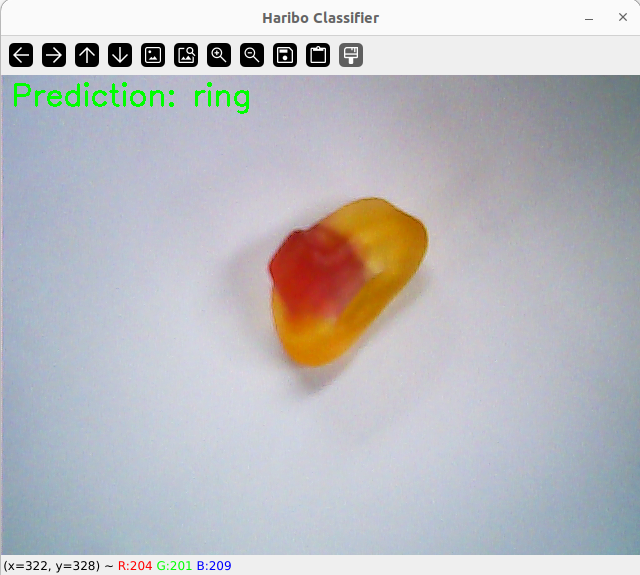

#### 🧪 예측 예시: cola
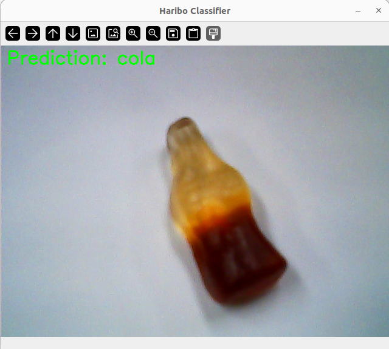
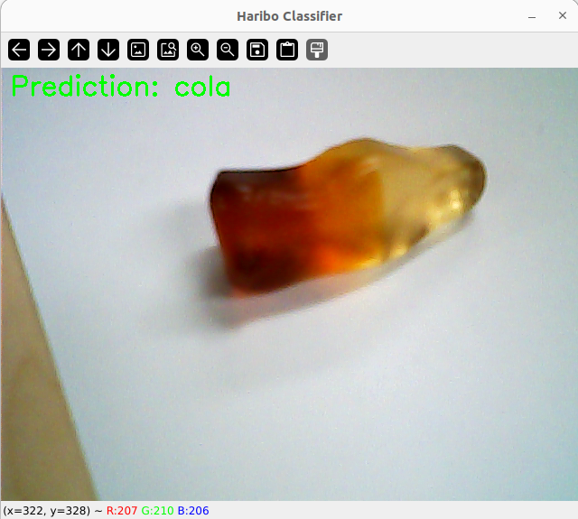

#### 🧪 예측 예시: egg


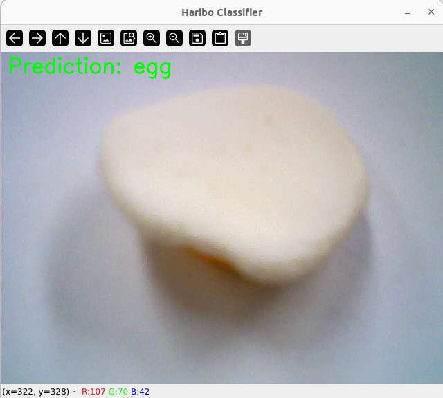

#### 🧪 예측 예시: bear

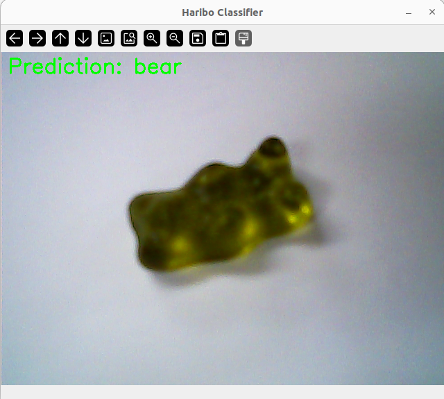

