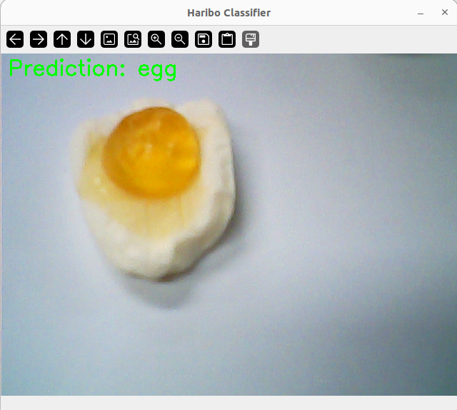

```py
# HARIBO_Mini_Project (Google Colab)
import matplotlib.pyplot as plt
import numpy as np
import os
from tensorflow.keras.preprocessing.image import ImageDataGenerator
from tensorflow.keras.applications import MobileNetV2
from tensorflow.keras import models, layers
from tensorflow.keras.optimizers import RMSprop
from tensorflow.keras.callbacks import EarlyStopping, ModelCheckpoint

# ✅ 구글 드라이브 마운트
from google.colab import drive
drive.mount('/content/drive')

# ✅ 경로 설정
dataset_path = '/content/drive/MyDrive/haribo_dataset'
model_save_path = '/content/drive/MyDrive/haribo_model.h5'

# ✅ 데이터 증강 설정
datagen = ImageDataGenerator(
    rescale=1./255,
    validation_split=0.2,
    rotation_range=90,
    width_shift_range=0.1,
    height_shift_range=0.1,
    shear_range=0.1,
    zoom_range=0.1,
    horizontal_flip=True,
    fill_mode='nearest'
)

# ✅ 데이터 로딩
train_generator = datagen.flow_from_directory(
    dataset_path,
    target_size=(96, 96),
    batch_size=32,
    class_mode='categorical',
    subset='training',
    shuffle=True
)

val_generator = datagen.flow_from_directory(
    dataset_path,
    target_size=(96, 96),
    batch_size=32,
    class_mode='categorical',
    subset='validation',
    shuffle=True
)

# ✅ 클래스 이름 자동 추출
class_names = list(train_generator.class_indices.keys())
print("클래스 인덱스:", train_generator.class_indices)

# ✅ MobileNetV2 기반 모델 구성
base_model = MobileNetV2(input_shape=(96, 96, 3), include_top=False, weights='imagenet')
base_model.trainable = False

model = models.Sequential([
    base_model,
    layers.GlobalAveragePooling2D(),
    layers.Dense(128, activation='relu'),
    layers.Dropout(0.5),
    layers.Dense(len(class_names), activation='softmax')  # 클래스 수 자동 반영
])

model.compile(optimizer=Adam(learning_rate=1e-4),
              loss='categorical_crossentropy',
              metrics=['accuracy'])

# ✅ 콜백 설정
early_stop = EarlyStopping(monitor='val_loss', patience=5, restore_best_weights=True)
checkpoint = ModelCheckpoint('best_model.h5', save_best_only=True)

# ✅ 학습 실행
history = model.fit(
    train_generator,
    validation_data=val_generator,
    epochs=50,
    callbacks=[early_stop, checkpoint],
    verbose=2
)

# ✅ 결과 시각화
acc = history.history['accuracy']
val_acc = history.history['val_accuracy']
loss = history.history['loss']
val_loss = history.history['val_loss']
epochs = range(len(acc))

plt.plot(epochs, acc, 'bo', label='Training acc')
plt.plot(epochs, val_acc, 'b', label='Validation acc')
plt.title('Training and Validation Accuracy')
plt.legend()
plt.show()

plt.plot(epochs, loss, 'bo', label='Training loss')
plt.plot(epochs, val_loss, 'b', label='Validation loss')
plt.title('Training and Validation Loss')
plt.legend()
plt.show()

# ✅ 학습 이미지 예시
x_batch, y_batch = next(train_generator)
plt.figure(figsize=(10, 10))
for i in range(25):
    plt.subplot(5, 5, i + 1)
    plt.xticks([]); plt.yticks([]); plt.grid(False)
    plt.imshow(x_batch[i])
    label_idx = np.argmax(y_batch[i])
    plt.xlabel(class_names[label_idx])
plt.tight_layout()
plt.show()

# ✅ 모델 저장 (.h5 파일)
model.save(model_save_path)
print(f"모델이 저장되었습니다: {model_save_path}")
```

Epoch 32/50
13/13 - 5s - 394ms/step - accuracy: 0.9315 - loss: 0.2170 - val_accuracy: 0.8041 - val_loss: 0.4033


# 결과





