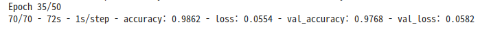
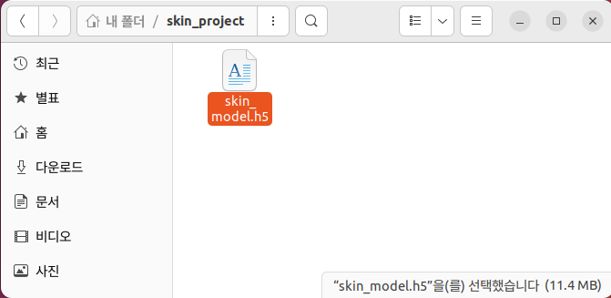

# Google Colab
---

### Dataset
구글 드라이브 > 내 드라이브 > SKIN > dataset_skin

### Code : SKIN_Project.ipynb

```py
import matplotlib.pyplot as plt
import numpy as np
import os
from tensorflow.keras.preprocessing.image import ImageDataGenerator
from tensorflow.keras.applications import MobileNetV2
from tensorflow.keras import models, layers
from tensorflow.keras.optimizers import Adam
from tensorflow.keras.callbacks import EarlyStopping, ModelCheckpoint

# ✅ Google Drive 마운트
from google.colab import drive
drive.mount('/content/drive')

# ✅ 경로 설정
dataset_path = '/content/drive/MyDrive/SKIN/dataset_skin'  # 너가 올린 경로로 수정
model_save_path = '/content/drive/MyDrive/SKIN/skin_model.h5'  # 원하는 저장 경로

# ✅ 데이터 증강 설정 (rotation_range는 15도만 줌)
datagen = ImageDataGenerator(
    rescale=1./255,
    validation_split=0.2,
    rotation_range=15,
    width_shift_range=0.05,
    height_shift_range=0.05,
    shear_range=0.1,
    zoom_range=0.1,
    brightness_range=[0.8, 1.2],
    horizontal_flip=True,
    fill_mode='nearest'
)

# ✅ 데이터 로딩
train_generator = datagen.flow_from_directory(
    dataset_path,
    target_size=(96, 96),  # MobileNetV2는 최소 96x96부터 가능
    batch_size=32,
    class_mode='categorical',
    subset='training',
    shuffle=True
)

val_generator = datagen.flow_from_directory(
    dataset_path,
    target_size=(96, 96),
    batch_size=32,
    class_mode='categorical',
    subset='validation',
    shuffle=True
)

# ✅ 클래스 이름 자동 추출
class_names = list(train_generator.class_indices.keys())
print("클래스 인덱스:", train_generator.class_indices)

# ✅ MobileNetV2 기반 모델 구성
base_model = MobileNetV2(input_shape=(96, 96, 3), include_top=False, weights='imagenet')
base_model.trainable = False

model = models.Sequential([
    base_model,
    layers.GlobalAveragePooling2D(),
    layers.Dense(128, activation='relu'),
    layers.Dropout(0.5),
    layers.Dense(len(class_names), activation='softmax')
])

model.compile(optimizer=Adam(learning_rate=1e-4),
              loss='categorical_crossentropy',
              metrics=['accuracy'])

# ✅ 콜백 설정
early_stop = EarlyStopping(monitor='val_loss', patience=5, restore_best_weights=True)
checkpoint = ModelCheckpoint('best_model.h5', save_best_only=True)

# ✅ 학습 실행
history = model.fit(
    train_generator,
    validation_data=val_generator,
    epochs=50,
    callbacks=[early_stop, checkpoint],
    verbose=2
)

# ✅ 결과 시각화
acc = history.history['accuracy']
val_acc = history.history['val_accuracy']
loss = history.history['loss']
val_loss = history.history['val_loss']
epochs = range(len(acc))

plt.plot(epochs, acc, 'bo', label='Training acc')
plt.plot(epochs, val_acc, 'b', label='Validation acc')
plt.title('Training and Validation Accuracy')
plt.legend()
plt.show()

plt.plot(epochs, loss, 'bo', label='Training loss')
plt.plot(epochs, val_loss, 'b', label='Validation loss')
plt.title('Training and Validation Loss')
plt.legend()
plt.show()

# ✅ 학습 이미지 예시
x_batch, y_batch = next(train_generator)
plt.figure(figsize=(10, 10))
for i in range(25):
    plt.subplot(5, 5, i + 1)
    plt.xticks([]); plt.yticks([]); plt.grid(False)
    plt.imshow(x_batch[i])
    label_idx = np.argmax(y_batch[i])
    plt.xlabel(class_names[label_idx])
plt.tight_layout()
plt.show()

# ✅ 모델 저장 (.h5 파일)
model.save(model_save_path)
print(f"모델이 저장되었습니다: {model_save_path}")
```

---

### Result



---

# Ubuntu
---

### Terminal

```bash
# 작업할 디렉토리 생성 후 이동
mkdir skin_project
cd skin_project
```

```bash
# 가상환경 생성 및 활성화
python3 -m venv venv
source venv/bin/activate
```

```bash
# 필요한 패키지 설치
pip install tensorflow opencv-python numpy
```



```bash
# skin_names.json 생성
vi skin_names.json
```

```json
// skin_names.json
[
  "기저세포암",
  "표피낭종",
  "혈관종",
  "비립종",
  "흑색점",
  "편평세포암",
  "사마귀"
]
```

```bash
# NanumGothic 설치
sudo apt install fonts-nanum
fc-list | grep NanumGothic

# Pillow 패키지 설치
pip install Pillow
```

```bash
# predict_cam.py 생성
vi predict_cam.py
```

```py
# predict_cam.py
import cv2
import numpy as np
import tensorflow as tf
import json
from PIL import ImageFont, ImageDraw, Image

# 클래스 이름 (한글) 불러오기
with open("skin_names.json", "r") as f:
    class_names = json.load(f)

# 모델 로드
model = tf.keras.models.load_model("skin_model.h5")

# 한글 폰트 경로 (Ubuntu에서 사용 가능)
FONT_PATH = "/usr/share/fonts/truetype/nanum/NanumGothic.ttf"
font = ImageFont.truetype(FONT_PATH, 32)

# 웹캠 시작
cap = cv2.VideoCapture(2)
print("Press 'q' to quit.")

while True:
    ret, frame = cap.read()
    if not ret:
        break

    # 예측을 위한 전처리
    img = cv2.resize(frame, (96, 96))
    img_array = np.expand_dims(img / 255.0, axis=0)
    pred = model.predict(img_array)[0]
    label = class_names[np.argmax(pred)]
    confidence = np.max(pred)

    # 원본 프레임을 Pillow 이미지로 변환
    frame_rgb = cv2.cvtColor(frame, cv2.COLOR_BGR2RGB)
    pil_img = Image.fromarray(frame_rgb)
    draw = ImageDraw.Draw(pil_img)
    text = f"{label} ({confidence*100:.1f}%)"

    # 텍스트 출력
    draw.text((10, 30), text, font=font, fill=(0, 255, 0))  # 초록색

    # 다시 OpenCV 형식으로 변환하여 출력
    frame_bgr = cv2.cvtColor(np.array(pil_img), cv2.COLOR_RGB2BGR)
    cv2.imshow("Skin Classifier", frame_bgr)

    if cv2.waitKey(1) & 0xFF == ord("q"):
        break

cap.release()
cv2.destroyAllWindows()
```

### Comment

웹캠으로 인식한 결과 흑색점을 제대로 인식하지 못해서 빼야될 것 같음

기저세포암 o
표피낭종 o
혈관종 o
비립종 o
흑색점 x
편평세포암 o
사마귀 o